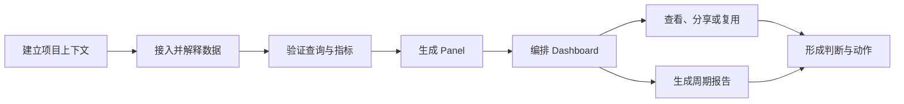
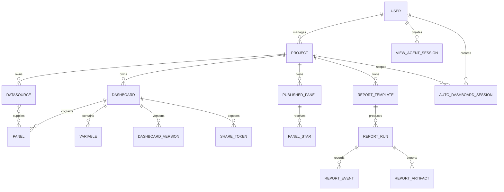

# AGIOne Dashboard 业务系统梳理

> 梳理对象：`E:\work\agione-dashboard`  
> 梳理日期：2026-07-22  
> 依据：仓库需求文档、前后端实现、数据模型、接口与迁移记录  
> 说明：本文区分“代码已实现”“需求设计意图”和“建议方向”，不把规划内容当作已上线能力。

## 1. 执行摘要

AGIOne Dashboard 已不再只是一个“精简版 Grafana”。从当前代码看，它正在形成一个以 Project 为业务边界、以 Datasource 为数据入口、以 Panel/Dashboard 为可视化资产、以 AI Agent 为生产助手、以 Report 为周期性输出的项目级数据洞察工作台。

当前最合理的产品定义是：

> 面向项目运营、技术运维和管理决策场景的 AI 辅助数据可视化与报告工作台。

系统已有较完整的功能骨架：用户与权限、项目、数据源、Dashboard、Panel、变量、分享、Panel 市场、Chat to View、Auto Dashboard、报告 Agent、模型配置及系统默认项。产品的主要问题已经从“功能是否存在”转为“产品主线是否统一、权限与生产治理是否足够、多个 AI 入口是否形成重复心智”。

最需要收敛的业务判断有三项：

1. 明确第一目标用户和第一主任务，避免 Dashboard 工具、AI 作图助手、Panel 市场、报告平台同时争夺产品中心。
2. 统一 `Chat to View` 与 `Auto Dashboard` 的职责：前者适合一次性分析/问答，后者适合将候选 Panel 编排成可保存 Dashboard，两者应是同一生产链路的不同阶段，而不是两个平行产品。
3. 在进入多团队或客户使用前补齐 Project 级成员、可见性和授权边界；当前 `admin/viewer` 是全局角色，不能承担真正的项目隔离。

## 2. 产品定位与边界

### 2.1 当前产品能力内核

系统的能力内核可归纳为五层：

| 层级 | 业务职责 | 当前承载对象 |
| --- | --- | --- |
| 治理层 | 用户、角色、系统默认项、模型配置、审计 | User、System Settings、View Agent Config、Audit Log |
| 空间层 | 组织数据资产及工作上下文 | Project |
| 数据层 | 接入、描述和查询业务/监控数据 | Datasource、Datasource Doc、Query Contract |
| 可视化层 | 形成可复用图表和看板资产 | Panel、Published Panel、Dashboard、Variable、Version、Share Token |
| 洞察输出层 | 通过对话、自动编排和定时任务生成洞察 | Chat to View、Auto Dashboard、Report Template、Report Run、Artifact |

### 2.2 当前显式边界

从需求与实现可确认的边界：

- 身份模型仅有全局 `admin` 与 `viewer`。
- Project 是 Dashboard、Datasource、Published Panel、Report 等对象的上层归属。
- Dashboard 内部以 Grafana-compatible JSON 为核心资产格式。
- 数据源目前实现 InfluxDB 与 MySQL 插件能力。
- 可视化兼容目标是 Grafana JSON，不复制 Grafana 代码或视觉资产。
- AI 模型支持 OpenAI Chat Completions、OpenAI Responses、Anthropic 三类协议。
- 公共展示通过 Dashboard 分享令牌与 IP 白名单控制。
- Report 支持模板、手动/周期运行、事件、PDF/DOCX 导出。

### 2.3 当前没有形成的业务能力

- Project 级成员、ACL 或多租户隔离。
- 审批、发布审核、资产生命周期负责人。
- Dashboard/Report 面向业务使用者的订阅和分发闭环。
- 成本、配额、模型调用预算和数据查询预算。
- 对业务结果负责的指标体系与使用效果度量。
- 正式的模板市场治理，如审核、版本、下架、兼容性和可信来源。

## 3. 目标用户与核心任务

### 3.1 已被当前实现支持的用户

| 用户 | 主要目标 | 当前核心任务 | 主要入口 |
| --- | --- | --- | --- |
| 系统管理员 | 建立可用、安全的运行环境 | 管用户、项目、数据源、模型、系统默认项 | Settings |
| 数据/运维配置者 | 把数据变成可复用监控资产 | 配数据源、写查询、建 Panel、编 Dashboard | Datasource、Dashboard Editor |
| 业务/运营查看者 | 快速理解项目状态 | 查看 Dashboard、切换变量、读取报告 | Dashboard Runtime、Reports |
| 轻量分析者 | 用自然语言获取信息或图表 | 查询项目、选择指标、生成 Panel | Chat to View |
| 报告生产者 | 周期性生成结构化结论 | 配模板、选 Panel/静态数据、运行和导出 | Reports |

### 3.2 用户任务链

用户真正需要完成的不是“管理对象”，而是以下闭环：

产品设计和后续路线应围绕这条链路收敛，而不是继续按数据库对象增加一级模块。

## 4. 核心业务对象

需要注意：Panel 与 Variable 没有独立业务表，实际嵌在 `dashboards.spec_json` 中；上图表达的是业务关系，不代表物理数据库关系。

### 4.1 对象职责

| 对象 | 业务含义 | 生命周期要点 |
| --- | --- | --- |
| Project | 工作空间和资产归属边界 | active、archived、软删除；默认 Project 不可删除 |
| Datasource | 数据连接及其语义说明 | 创建、测试、查询、维护文档；敏感凭据加密存储 |
| Dashboard | 面向查看与决策的可视化集合 | 创建/导入、编辑、版本、恢复、分享、删除 |
| Panel | 单个指标或分析视图 | 内嵌于 Dashboard；可发布到市场复用 |
| Published Panel | 可发现、收藏、复用的 Panel 资产 | private/public、星标、查询、更新、删除 |
| View Agent Session | 自然语言分析与绘图会话 | 按用户隔离，保存消息和渲染结果 |
| Auto Dashboard Session | 将候选 Panel 编排为 Dashboard 的草稿会话 | 选择市场 Panel、生成草稿、查询预览、保存 |
| Report Template | 周期性报告的生产定义 | 项目、目的、周期、引用 Panel、静态数据、输出结构、调度 |
| Report Run | 一次不可混淆的报告执行实例 | pending、running、succeeded、failed；保留事件与产物 |

## 5. 功能模块全景

### 5.1 身份与系统治理

已实现：

- 登录、当前用户、前端登出。
- `admin/viewer` 角色校验和用户启停。
- 系统语言、主题、时区默认项。
- 多套 View Agent 模型配置、默认模型、连接测试、API Key 加密与重置。
- 多类写操作审计记录。

业务判断：适合单组织、小规模可信用户环境；不适合直接作为多客户、多项目严格隔离平台。

### 5.2 Project 工作空间

已实现：

- Project 创建、编辑、归档、恢复、软删除。
- 默认 Project 和存量资产迁移兜底。
- Dashboard、Datasource 等按 Project 归属和筛选。
- 顶部项目选择上下文。

价值：Project 是当前产品从“图表工具”走向“项目工作台”的关键业务骨架。

缺口：Project 还只是资产分组，不是安全边界，也没有成员、负责人、目标、环境或业务标签等治理语义。

### 5.3 Datasource 与数据语义

已实现：

- InfluxDB、MySQL 接入、连接测试、查询。
- 数据源文档读取、维护、重置。
- Query Contract/指标索引供 Agent 理解和验证查询。
- Dashboard 与变量查询复用统一数据源查询链路。

价值：Datasource Doc 是 AI 正确理解指标的关键，不只是技术说明。它将“数据库能查”提升为“指标可被人和 Agent 正确使用”。

缺口：缺少文档质量责任人、版本、审核和数据口径变更通知；若文档失真，AI 输出和报告会同步失真。

### 5.4 Dashboard 与 Panel

已实现：

- Dashboard CRUD、Grafana-compatible JSON 导入/导出、版本与恢复。
- Panel CRUD、嵌套 Row、查询、追加。
- Dashboard Variable 管理、预览和动态选项。
- 多种 Grafana-compatible Panel 类型渲染。
- 未支持/遗留类型保留原 JSON 并给出兼容警告。
- 公开 Kiosk 分享、有效期与 IP 白名单。

价值：保留 JSON 原貌和未知字段有利于资产迁移与兼容；版本恢复降低编辑风险。

缺口：资产的“草稿—审核—发布—下线”业务状态尚未建立；当前创建后即可被使用或分享。

### 5.5 Panel Market

已实现：

- 发布 Panel、公开/私有可见性、搜索/筛选、详情、编辑、删除。
- 星标与实时查询。
- 保存 Panel JSON、变量、快照和来源引用。

业务价值：将一次性图表转为组织可复用资产，降低重复配置成本。

缺口：目前更接近共享目录，而不是成熟市场；尚缺发布审核、版本兼容、可信来源、依赖说明、废弃和使用影响分析。

### 5.6 Chat to View

已实现：

- 会话创建、列表、更新、删除与消息持久化。
- 项目上下文和历史上下文。
- 意图识别、项目查询、指标目录查询、查询验证、Panel 生成。
- 流式事件、工具调用进度、图表渲染结果。
- 三类 LLM 协议适配。

业务价值：降低从“我想看什么”到“形成可查询 Panel”的专业门槛。

关键边界：Agent 主要生成/验证查询和 Panel JSON，真实时序数据仍通过受控数据源查询链路获取。

### 5.7 Auto Dashboard

已实现：

- 创建草稿会话、选择 Panel Market 资产。
- 基于对话调整 Dashboard 草稿。
- 查询草稿 Panel、保存为正式 Dashboard。

业务价值：把单个 Panel 的生产扩展为完整 Dashboard 的编排。

产品风险：与 Chat to View 的“生成多个 Panel”功能边界高度接近。如果两者各自维护会话、提示、编排和交互，会造成用户心智与研发成本重复。

### 5.8 Report Agent

已实现：

- 报告模板 CRUD。
- 手动与周期运行。
- 运行状态、事件流、删除与导出。
- Panel 引用、静态数据、Agent 指令、输出 Schema。
- PDF、DOCX 导出。

业务价值：将 Dashboard 的“查看”转化为可归档、可传阅的周期性结论。

缺口：当前未看到订阅人、分发渠道、确认/审批、报告版本签署、失败通知和补跑策略等完整运营闭环。

## 6. 核心业务流程

### 6.1 管理员初始化

1. 配置生产密钥、数据库和默认管理员。
2. 登录后创建/确认 Project。
3. 创建 Datasource，测试连接。
4. 编写或维护 Datasource Doc 与指标口径。
5. 配置 View Agent 模型并测试。
6. 设置系统语言、主题、时区默认项。

结果：系统具备被数据配置者和查看者使用的基础环境。

### 6.2 手工构建 Dashboard

1. 选择 Project。
2. 创建 Dashboard 或导入 Grafana-compatible JSON。
3. 创建/编辑 Panel，配置 Datasource、Target、样式和布局。
4. 配置 Variable 和时间范围。
5. 查询验证并保存，形成版本。
6. 查看、导出、分享或发布其中的 Panel。

结果：形成可持续使用和版本恢复的可视化资产。

### 6.3 AI 生成 Panel

1. 用户选择/确认 Project 并描述问题。
2. Agent 判断意图并读取项目、数据源文档和指标目录。
3. 信息不足时收集指标或数据源选择。
4. Agent 生成候选查询并走真实查询验证。
5. 验证通过后生成 Grafana-compatible Panel JSON。
6. 前端展示文本与 Panel；用户继续追问或进入后续保存/编排。

结果：将自然语言意图转为可执行、可视化的 Panel 资产。

### 6.4 自动编排 Dashboard

1. 用户选择 Project 和已有 Published Panel。
2. 建立 Auto Dashboard 草稿会话。
3. Agent/用户调整标题、布局、变量和 Panel 组合。
4. 对草稿 Panel 查询预览。
5. 保存为正式 Dashboard。

结果：从复用资产快速生成项目 Dashboard。

### 6.5 周期报告

1. 管理员在 Project 下创建 Report Template。
2. 定义目的、周期、Panel 引用、静态数据、Agent 指令与输出结构。
3. 手动触发或由调度器触发 Report Run。
4. 系统采集快照、记录 Agent 事件并生成结构化内容。
5. 用户检查结果并导出 PDF/DOCX。

结果：形成一次可追踪、可导出的报告生产实例。

## 7. 权限与可见性

| 能力 | admin | viewer | 公共访问 |
| --- | --- | --- | --- |
| 用户/数据源/模型/系统配置 | 管理 | 不允许管理 | 不允许 |
| Project | 管理 | 查看与切换 | 不允许 |
| Dashboard | 管理 | 查看与查询 | 有效分享令牌 + IP 白名单 |
| Panel Market | 可发布与管理自己的资产 | 可发现、查看、星标、查询 | 未作为公共入口 |
| Chat to View | 使用并管理自己的会话 | 使用并管理自己的会话 | 不允许 |
| Auto Dashboard | 使用并保存草稿 | 需以接口具体校验为准 | 不允许 |
| Reports | 模板管理、运行、导出 | 查看/导出能力需以接口校验为准 | 不允许 |

当前权限结论：角色控制存在，但粒度主要停留在“全局管理/全局只读”。Project 不是授权边界，同一系统内的用户默认可以看到所有未删除 Project。若目标包含客户隔离、部门隔离或敏感项目，这一模型必须先升级。

## 8. 当前业务优势

1. **资产格式可迁移**：以 Grafana-compatible JSON 作为 Dashboard 核心模型，导入导出与未知字段保留策略明确。
2. **项目上下文已经建立**：核心对象逐步归属 Project，为后续治理提供了正确骨架。
3. **AI 不只是聊天壳**：Agent 已连接项目、数据源文档、指标目录、查询验证和渲染输出。
4. **从看板延伸到报告**：Report Run、事件、Artifact 让洞察具备持久化与导出形态。
5. **具备复用机制**：Panel Market 使单个图表可以跨 Dashboard 复用。
6. **合规意识明确**：对 Grafana 采取 clean-room 兼容策略，而不是复制实现。

## 9. 核心业务问题与根因

### P0：产品主线尚未收敛

表面现象：导航中同时存在 Chat to View、Auto Dashboard、Reports、Panel Market、Settings/Dashboard 等强模块。

根因：产品从 Dashboard 工具连续叠加 AI、市场和报告能力，但尚未重新定义统一工作流。

影响：新用户不容易判断应从哪里开始；团队会在多个入口重复实现项目选择、会话、Panel 预览、保存和错误处理。

建议：确定唯一主线为“数据 → Panel → Dashboard → Report”，Chat to View 作为智能生产入口，Auto Dashboard 作为编排阶段，Panel Market 作为资产来源，Reports 作为输出阶段。

### P0：Project 是分组而不是安全边界

表面现象：资产均有 Project 归属，但角色仍是全局 `admin/viewer`。

根因：Project 最初为管理数量增长而引入，而非按多团队/客户隔离设计。

影响：一旦引入多个部门、客户或敏感环境，数据可见性与操作权限不满足要求。

建议：在扩大使用范围前明确是否需要多租户；若需要，建立 Project Member、Project Role、资源继承、跨 Project 引用规则和审计查询。

### P1：AI 质量依赖的数据语义治理未产品化

表面现象：已经有 Datasource Doc 和指标索引，但缺少质量状态。

根因：数据文档目前被当作配置字段，而实际已经是 Agent 的知识输入和查询契约。

影响：过期口径会产生“技术上查询成功、业务上结论错误”的高风险结果。

建议：为数据源文档增加负责人、更新时间、审核状态、口径变更记录、查询样例验证和 Agent 可用性状态。

### P1：报告尚未形成运营闭环

表面现象：可生成和导出，但没有明确的订阅、审批、分发与确认。

根因：当前重心在生产引擎，而非报告的业务消费链路。

影响：报告可能“生成成功”但没有人使用，也无法证明对决策有价值。

建议：先确定一个真实周期报告场景，补齐接收人、送达、失败通知、重跑、确认和归档规则，再扩展模板能力。

### P1：共享与市场缺少发布治理

表面现象：Panel 可发布、Dashboard 可分享，但缺少内容审核和生命周期。

根因：复用/分享先于治理模型实现。

影响：错误查询、敏感数据或废弃资产可能持续被发现和使用。

建议：至少增加 owner、发布状态、最后验证时间、依赖 Datasource/Variable 摘要、下架和影响提示。

## 10. 建议的产品架构

### 10.1 统一产品叙事

建议统一为四个连续阶段：

| 阶段 | 用户问题 | 产品能力 |
| --- | --- | --- |
| Connect | 数据在哪里、口径是什么 | Project、Datasource、Datasource Doc |
| Create | 我需要看什么 | Chat to View、Panel Editor、Panel Market |
| Compose | 如何形成稳定视图 | Auto Dashboard、Dashboard Editor、Variables |
| Consume | 如何持续使用和传播 | Dashboard Runtime、Share、Reports |

Settings 只承载治理配置，不应承载用户每天消费 Dashboard 的主要入口。

### 10.2 AI 入口职责建议

- `Chat to View`：面向问题，输出解释、候选查询和一个或多个 Panel。
- `Auto Dashboard`：面向交付物，接收已有 Panel/对话结果，完成组合、布局、变量和保存。
- 二者共享会话上下文、项目选择、指标检索、查询验证、Panel 预览和保存服务。
- 用户从 Chat to View 生成多个 Panel 后，应有明确主操作“编排为 Dashboard”，而不是重新进入另一套流程从头选择。

## 11. 分阶段业务路线

### 第一阶段：收敛主路径

- 明确第一目标用户和一个首要场景。
- 将 Chat to View → Auto Dashboard → Save Dashboard 串成连续链路。
- 统一术语、项目上下文和资产保存结果。
- 为 Datasource Doc 增加“是否可供 Agent 使用”的质量门槛。

### 第二阶段：生产治理

- 清晰定义 Dashboard、Published Panel、Report Template 的草稿/发布/停用状态。
- 补齐资产 owner、最后验证时间和依赖关系。
- 完善分享、报告失败、调度和审计的运营规则。

### 第三阶段：组织化使用

- 根据真实客户边界决定是否引入 Project Member/ACL/多租户。
- 建立模板/Panel 的审核、版本和兼容策略。
- 增加报告订阅、分发、确认和使用反馈。

## 12. 建议度量体系

以下只定义可验证口径，不填写没有来源的目标数字。

| 目标 | 指标 | 建议计算口径 |
| --- | --- | --- |
| 缩短生产路径 | 首个有效 Panel 生成时长 | 从进入创建流程到首次查询验证成功 |
| 提高 AI 可用性 | Agent 查询验证成功率 | 验证成功的候选查询数 / 提交验证的候选查询数 |
| 提高资产复用 | Published Panel 复用率 | 被追加到新 Dashboard 的 Published Panel 数 / 被查看的 Published Panel 数 |
| 提高看板消费 | 有效 Dashboard 使用率 | 统计周期内至少被有效查看一次的 Dashboard / 已发布 Dashboard |
| 保证数据语义 | 可用 Datasource Doc 覆盖率 | 通过质量门槛的数据源 / 活跃数据源 |
| 保障报告交付 | Report Run 成功率 | succeeded Run / 已触发 Run |
| 证明业务价值 | 报告确认率 | 被目标接收人确认的报告 / 成功送达报告 |
| 控制治理风险 | 过期资产占比 | 超过验证周期未复核的已发布资产 / 已发布资产 |

## 13. 结论

### 信息架构是否成立

底层业务对象和“Project—Datasource—Panel—Dashboard—Report”主链成立，且已经有代码和数据模型支撑。

### 当前产品是否达到稳定交付形态

作为单组织、可信用户、小规模部署的 Beta 工作台，核心能力具备可用基础；作为多团队或客户级生产平台，当前权限、发布治理、调度可靠性和产品主线仍不足。

### 必须先解决的问题

优先收敛 Chat to View 与 Auto Dashboard 的关系，并明确 Project 是否承担安全隔离。若这两项不先确定，继续增加模块会放大重复实现和用户认知成本。

## 14. 证据来源

- `README.md`
- `req/001-init.md` 至 `req/005-chat-to-view.md`
- `backend/app/api/`、`backend/app/services/`、`backend/app/models/`
- `backend/alembic/versions/`
- `frontend/src/router/index.ts`
- `frontend/src/views/`、`frontend/src/api/`
- `frontend/src/components/panels/panelCatalog.ts`
- `docker-compose.yml`
