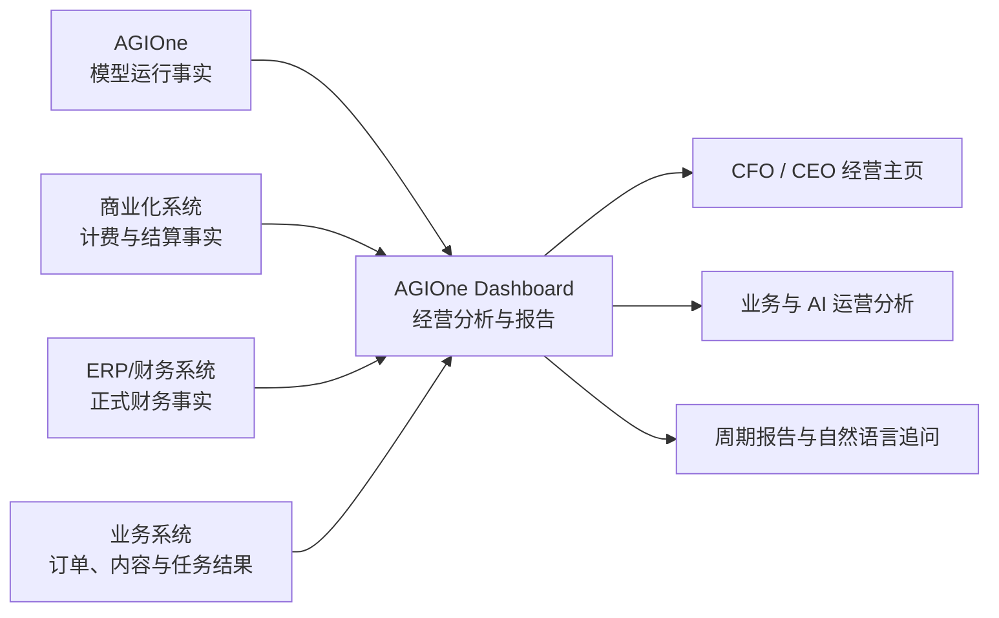

# AGIOne Dashboard 产品定位与经营分析架构

> 文档性质：产品定位与目标架构建议  
> 形成日期：2026-09-03  
> 适用范围：AGIOne、AGIOne Dashboard 及其外部数据源集成  
> 说明：本文用于统一客户定位、系统边界、指标体系和用户链路；不将建议能力描述为当前已经上线的事实。正式财务数据、计费数据和模型运行数据仍分别以各自权威系统为准。

## 1. 一句话结论

AGIOne 面向把公有或私有模型作为生产资料的组织，负责模型接入、使用和治理；AGIOne Dashboard 负责把模型消耗、业务产出、商业计费和企业财务数据连接起来，形成面向不同角色的经营分析、可视化主页和周期报告。

AGIOne Dashboard 可以服务两种经营模式：

1. **模型消费型组织**：模型是生产资料，价值体现在对外产品交付或内部业务效率中。
2. **模型销售型组织**：模型调用或 Token 是对外销售的商品，专业商业化系统负责租户、套餐、计费和结算，AGIOne Dashboard 接入其数据完成经营分析。

两种模式可以共用同一个分析平台，但不能混用同一套业务对象和经营口径。

## 2. 为什么需要重新定义产品

AGIOne Dashboard 当前具备数据源、Panel、Dashboard、Report 和 Chat to View 等通用能力。这些能力能回答“如何接入数据、生成图表和报告”，但还没有天然回答以下经营问题：

- 企业为什么要看这些指标？
- 模型消耗属于哪个部门、项目、应用、工作流、客户或订单？
- 模型产生了什么业务结果？
- 模型成本是否合理，是否影响产品毛利或组织效率？
- 财务、计费和模型运行数据由哪个系统负责？
- CFO、业务负责人、AI 负责人和平台管理员应该看到什么？

因此，产品不能只围绕 Datasource、Panel 和 Dashboard 等技术对象组织，而应围绕“模型生产资料如何进入企业经营”建立统一语义。

## 3. 目标客户

### 3.1 核心客户：模型消费型组织

模型消费型组织将模型作为生产资料。它包含两种价值实现方式，但本质上属于同一客户类型。

#### 对外产品生产

模型直接参与可销售产品或服务的生产，例如：

- AI 视频、图片、文本和音频内容产品；
- 智能客服、行业 Agent、代码生成产品；
- 文档处理、翻译、审核和知识服务；
- 基于多个公有或私有模型构建的行业 SaaS。

其经营链路为：

```text
模型资源
→ 应用与生产工作流
→ 内容、任务或服务交付
→ 客户、订单与收入
→ 成本和毛利
```

模型消耗通常可以归属到客户、订单、产品、内容或交付任务，能够直接参与单位成本和产品毛利分析。

#### 内部业务生产

模型用于企业内部研发、客服、销售、财务或运营流程，例如：

- 研发人员使用代码助手；
- 客服系统自动生成回复；
- 销售生成方案和客户材料；
- 财务或法务处理文档；
- 企业知识库和内部 Agent。

其经营链路为：

```text
模型资源
→ 部门、项目或内部工作流
→ 员工效率、任务质量或服务水平变化
→ 组织成本与经营结果变化
```

模型消耗通常归属到部门、项目、应用、工作流或成本中心，价值通过节省工时、缩短周期、提高完成率或改善质量体现。

#### 两者的共同本质

两者都遵循：

```text
模型投入 → 生产过程 → 可验证产出 → 业务结果
```

区别只在价值归因：

| 价值模式 | 结果挂载对象 | 主要判断 |
| --- | --- | --- |
| 对外产品生产 | 客户、订单、产品、交付任务 | 单位产出是否赚钱，模型成本是否侵蚀毛利 |
| 内部业务生产 | 部门、项目、应用、内部任务 | 模型是否改善效率、质量或交付周期 |

不需要为二者建设两套底层平台，只需要提供不同的结果指标、归因方式和角色视图。

### 3.2 可服务客户：模型销售型组织

模型销售型组织直接销售 Token、API 调用、模型套餐或 MaaS 服务：

```text
上游模型或自有算力
→ Token/API 商品化
→ 租户、套餐、额度和账单
→ 销售收入与结算
```

这类组织可以使用 AGIOne Dashboard，但专业商业化系统负责以下能力：

- 客户和租户；
- 模型商品与套餐；
- 定价、折扣和赠送额度；
- 预付费、后付费和余额；
- 账单、退款、结算和欠费控制；
- 客户级配额、限流和商业 SLA。

AGIOne 不重复建设这些交易能力。商业化系统作为 AGIOne Dashboard 的数据源，与 AGIOne 的模型运行数据结合，支持租户收入、调用成本、套餐毛利和回款分析。

### 3.3 不作为目标客户：脱离组织和业务场景的泛个人用户

纯个人用户可能用模型写代码、创作视频、写文章或进行普通会话，但平台通常不知道其稳定业务目标，也难以定义统一的产出价值。

仅展示 Token、请求量和成本，对个人的持续决策价值有限；视频、写作等具体任务又已有成熟的垂直产品。因此：

- 不建设泛个人消费或生活指标体系；
- 不与成熟的代码、视频、写作终端产品竞争完整创作体验；
- 个人可以作为企业组织中的员工、开发者、分析师或项目成员使用平台；
- 个人视图应围绕其责任范围，如“我的项目”“我的应用”“我的额度”和“我的任务结果”。

## 4. 系统职责边界

### 4.1 四类系统的权威事实

| 系统 | 权威事实 | 不负责 |
| --- | --- | --- |
| AGIOne | 模型、Provider、调用、Token、延迟、错误、路由、运行质量 | 正式财务记账、商业账单结算 |
| 商业化/计费系统 | 租户、商品、套餐、价格、额度、账单、退款、商业结算 | 模型运行全过程、企业总账 |
| ERP/财务系统 | 合同、订单、发票、应收应付、回款、总账、现金流、财务确认值 | 模型请求明细和实时运行治理 |
| AGIOne Dashboard | 跨源映射、指标计算、角色视图、Dashboard、报告和自然语言分析 | 替代任何权威系统写入正式事实 |

### 4.2 正确的兼容方式

系统之间应“分开负责，联合分析”：



AGIOne Dashboard 不是新的财务系统，也不是新的商业计费系统。它是分析和决策层。

### 4.3 为什么财务与模型监控既要分开又要连接

模型消耗类似水、电、云资源，是生产成本明细。模型运行系统适合记录实时用量、调用归属和预估成本，但不能替代财务系统的发票、付款、总账和审计口径。

两者通过业务对象建立联系后，CFO 才能回答：

- 模型成本占收入或成本的比例是多少？
- 哪个产品、客户、订单或部门消耗最高？
- 重试和失败是否抬高单位交付成本？
- 更换模型后，成本、质量和毛利如何变化？
- 实时预估成本与供应商结算成本为什么存在差异？

## 5. 统一业务对象模型

平台不应直接把不同数据源的表格拼成一张 Dashboard，而应先建立最小统一业务语义。

### 5.1 共用核心对象

```text
组织 Workspace
├── 组织单元 / 成本中心
├── 项目 Project
├── 应用 Application
│   └── 工作流 Workflow
│       └── 模型运行 Model Run
│           ├── 用量 Usage
│           ├── 成本 Cost
│           ├── 产出 Output
│           └── 评价 Evaluation
└── 用户与角色
```

### 5.2 模型消费型组织的扩展对象

根据业务场景关联：

- 客户；
- 合同与订单；
- 产品或服务；
- 内容或交付物；
- 内部任务；
- 部门和成本中心。

### 5.3 模型销售型组织的扩展对象

根据商业化系统关联：

- 租户和计费账户；
- 模型商品或 SKU；
- 套餐、价格和折扣；
- 用量记录和账单；
- 余额、退款和结算；
- 渠道和客户合同。

### 5.4 必要的跨系统映射

至少需要维护以下映射关系：

- AGIOne 组织与外部系统组织；
- AGIOne 项目、应用与财务成本中心；
- AGIOne 模型与计费商品 SKU；
- AGIOne 租户与计费账户、财务客户；
- 模型运行与业务任务、内容、订单或工作流；
- 运行时间、计费账期与财务期间。

没有这些映射，系统只能把财务图表和 Token 图表并排展示，无法形成可靠的投入产出分析。

## 6. 指标体系

指标不应只分为“财务指标”和“运营指标”。建议按事实域分层，并把分析维度与指标分开。

### 6.1 企业财务域

由 ERP、财务或经过确认的业务系统提供：

- 营收、回款、应收应付；
- 毛利、净利和现金流；
- 预算及预算执行；
- 产品、业务线、客户和组织贡献；
- 财务确认成本和收入。

### 6.2 业务产出域

由客户的业务系统提供，随行业和工作流变化：

- 订单、客户、任务和交付量；
- 内容生成数、有效交付数和采用率；
- 成功率、返工率、审核通过率；
- 内部任务完成率、处理时间和节省工时；
- 产品或服务的单位售价与单位综合成本。

### 6.3 模型运行域

由 AGIOne 提供，可跨行业复用：

- 请求量、输入 Token、输出 Token；
- Provider、模型和版本分布；
- 延迟、首 Token 时间、吞吐量；
- 成功率、错误率、超时率和限流；
- 重试、降级和路由结果；
- 实时预估模型成本；
- 模型质量、自动评测和人工反馈。

### 6.4 商业计费域

由专业商业化系统提供，主要用于模型销售型组织：

- 租户数、活跃租户和续费；
- 套餐销量、用量和消耗进度；
- 应计收入、折扣、赠送和退款；
- 已结算金额、余额、欠费和回款；
- 上游采购价、下游销售价和价差；
- 租户、套餐、模型和渠道毛利。

### 6.5 治理与风险域

由 AGIOne 和外部治理数据共同提供：

- 未授权模型调用；
- 超预算项目或部门；
- 高消耗低产出的应用；
- 敏感数据使用和异常请求；
- Provider 集中度和单点依赖；
- 数据新鲜度、映射完整度和未归属成本。

### 6.6 分析维度不是指标

以下内容通常是分析维度，不应和指标混为一谈：

- 时间；
- 组织、部门和成本中心；
- 项目、应用和工作流；
- Provider、模型和模型版本；
- 用户、租户和客户；
- 产品、套餐、订单和渠道；
- 环境和地域。

同一指标可以按照不同维度切分，但计算口径应保持一致。

## 7. 金额状态与口径

同一经营页面可以展示多种金额，但必须清楚标注来源和状态。

| 金额类型 | 典型来源 | 用途 |
| --- | --- | --- |
| 实时预估成本 | AGIOne 用量 × 价格规则 | 运行监控、预算预警 |
| 上游结算成本 | Provider 账单或商业化系统 | 供应商对账、实际成本分析 |
| 下游应计收入 | 商业化系统 | 当期商业运营分析 |
| 财务确认收入/成本 | ERP/财务系统 | 正式经营和财务口径 |
| 分摊值 | 分析规则 | 项目、部门、客户或订单归因 |
| 预测值 | 预测模型或预算 | 趋势判断，不作为已发生事实 |

产品必须避免：

- 把实时预估成本包装成总账成本；
- 把应计收入当成已开票或已回款收入；
- 把无法归属的模型消耗强行分配给业务对象；
- 在没有业务结果数据时声称已经计算模型产出价值。

## 8. 角色化使用体验

### 8.1 CFO / CEO

主要任务：判断经营结果、成本结构和重大偏差。

经营主页建议按因果层次组织：

```text
企业经营结果
├── 营收、毛利、现金流、预算
├── 产品、客户和业务线贡献
└── 重大风险

业务产出
├── 订单、交付、有效产出
├── 单位售价和单位综合成本
└── 失败、返工和未交付

模型生产成本
├── 模型消耗和成本
├── 单位产出的模型成本
├── 模型质量和重试成本
└── 未归属成本与预算偏差
```

CFO 可以从“毛利下降”下钻到业务产出和模型成本，但正式财务金额仍来自财务系统。

### 8.2 业务负责人

主要任务：判断所负责产品、客户、订单或工作流是否健康。

关注：

- 业务目标和完成情况；
- 单位产出成本；
- 成功交付、失败和返工；
- 模型质量对业务结果的影响；
- 需要处理的客户、订单或工作流。

### 8.3 AI 负责人 / 技术负责人

主要任务：在质量、成本、速度和稳定性之间选择合适模型。

关注：

- Provider 和模型成本对比；
- 不同任务类型的模型表现；
- 路由、降级和版本变化；
- 模型评测、失败和延迟；
- 哪些应用应该优化、迁移或限制。

### 8.4 平台管理员 / FinOps / 模型运营

主要任务：保证模型资源可用、可控并可归属。

关注：

- 接入与调用健康；
- 配额、预算、异常和未授权调用；
- 未映射、未归属和账单差异；
- 数据新鲜度和外部系统同步状态。

### 8.5 普通员工或项目成员

主要任务：在授权范围内完成工作。

关注：

- 可使用的模型和应用；
- 自己负责项目或任务的消耗；
- 额度、请求状态和任务结果。

无需看到 Provider 密钥、数据源配置、全组织成本或 Panel JSON。

## 9. 两类企业的完整链路

### 9.1 模型消费型组织

```text
管理员接入公有/私有模型
→ 为组织、项目、应用和工作流配置权限
→ 业务系统调用模型并回传业务归属
→ AGIOne 记录用量、成本、运行质量和模型结果
→ 业务系统回传任务、内容、订单或效率结果
→ 财务系统提供收入、成本和回款事实
→ Dashboard 关联模型投入、业务产出与财务结果
→ 各角色查看主页、报告并追问原因
→ 形成模型选择、预算、流程优化或经营决策
```

### 9.2 模型销售型组织

```text
管理员通过 AGIOne 接入上游或自有模型
→ 商业化系统定义租户、商品、套餐和价格
→ 租户调用模型
→ AGIOne 记录实际运行与上游消耗
→ 商业化系统记录下游用量、账单和结算
→ 财务系统记录发票、回款和正式财务结果
→ Dashboard 计算租户、套餐、模型和渠道经营表现
→ 运营、技术与财务共同优化价格、路由和客户结构
```

## 10. 数据接入与语义标准化

### 10.1 数据源接入层

AGIOne Dashboard 应支持接入：

- AGIOne 模型运行和治理数据；
- 专业商业化/计费系统；
- ERP、财务和预算系统；
- CRM、订单、内容生产和任务系统；
- 自动评测、人工反馈和质量系统。

### 10.2 数据源不是最终产品对象

管理员完成连接后，业务用户不应直接面对数据库、表结构或查询语言。数据应先映射为：

```text
外部数据源
→ 标准业务对象
→ 指标定义与口径
→ 角色视图
→ Dashboard / Report / Chat
```

### 10.3 商业化系统适配契约

为了兼容不同商业化系统，建议至少标准化以下能力域：

- 租户和账户；
- 商品、套餐和定价；
- 用量和额度；
- 账单、折扣和退款；
- 余额、充值和结算；
- 上游成本和下游收入。

不同系统可以使用不同表结构，但进入分析层后应映射为一致的业务语义。

## 11. Dashboard、Report、Panel 与 Chat 的职责

### Dashboard

面向持续观察和决策，承载角色化经营主页、运营概览和下钻路径。

### Report

面向周期性经营复盘、管理汇报和可归档结论。报告应引用指标口径和数据时间，区分估算、结算和财务确认状态。

### Panel

Panel 是指标的视觉表达，不是最终业务对象。Panel 市场应逐步从图表素材库转为经过验证的经营视图资产库，并明确引用的指标、数据源、适用角色和更新时间。

### Chat to View

Chat to View 应承担两类任务：

1. **上下文追问**：在经营主页、模型运营页或报告中询问偏差原因、贡献因素和下钻对象；
2. **分析创作**：分析师基于可信指标生成、校验和沉淀 Panel、Dashboard 或报告内容。

业务用户不应在每次追问时重新选择数据库或数据源；当前角色、组织范围、指标、时间和筛选条件应作为上下文自动携带。

### 管理配置

以下能力归入管理中心，不与日常分析入口并列：

- 数据源；
- Provider、模型、协议和密钥；
- 用户、角色和权限；
- 业务对象映射；
- 指标口径与数据质量；
- 外部系统同步状态。

## 12. 数据可用性决定产品能力

平台应按照已接入数据明确能力边界：

| 已接入数据 | 可以可靠提供 |
| --- | --- |
| 仅 AGIOne | 模型用量、运行质量、预估成本和治理分析 |
| AGIOne + 业务结果 | 单位产出成本、模型质量与业务结果关联 |
| AGIOne + 财务系统 | 模型成本与企业收入、预算、毛利的经营分析 |
| AGIOne + 商业化系统 | 租户、套餐、模型商品的用量、收入和预估毛利分析 |
| AGIOne + 商业化系统 + 财务系统 | 调用、计费、开票、回款和财务确认利润的完整链路 |

当数据不足时，页面应明确显示缺少哪类数据，不生成无法证明的产出或收益指标。

## 13. 产品设计原则

1. **模型是生产资料，不是唯一经营对象**：既分析模型本身，也分析它对业务和财务结果的影响。
2. **权威事实不迁移**：运行、计费、财务分别由各自系统负责，Dashboard 只做联合分析。
3. **先归属，后统计**：无法归属到组织、项目、应用或工作流的用量，应显示为未归属，不强行分摊。
4. **先定义产出，再谈投入产出**：没有任务或业务结果信号时，只展示消费和质量，不声称创造了价值。
5. **同一底座，按经营模式扩展**：模型消费型和模型销售型共用模型运行层，分别扩展业务产出或商业计费对象。
6. **角色决定视图，权限决定范围**：CFO、业务负责人、AI 负责人和管理员看到不同层级与粒度。
7. **Panel 服务指标，指标服务决策**：避免用图表数量代替业务价值。
8. **估算、结算和确认严格分开**：任何金额都必须展示来源、口径和状态。

## 14. 建议的阶段性建设顺序

### 阶段一：统一定位和模型运行分析

- 明确企业和组织是目标客户，泛个人不是独立市场；
- 建立组织、项目、应用、工作流和模型运行的归属关系；
- 完成模型用量、运行质量、预估成本和治理指标；
- 将数据源和模型配置收敛到管理中心。

### 阶段二：连接业务产出

- 定义 Output 和 Evaluation 的最小契约；
- 支持任务、内容、订单或内部流程结果回传；
- 建立单位产出成本、失败成本和质量成本；
- 建设面向业务负责人和 AI 负责人的角色视图。

### 阶段三：连接企业财务

- 接入 ERP、财务或预算系统；
- 建立成本中心、项目、产品、客户和订单映射；
- 明确估算、结算、财务确认和分摊口径；
- 建设 CFO 经营主页和周期经营报告。

### 阶段四：连接商业化系统

- 将已有租户商业化系统作为标准数据源；
- 建立租户、账户、模型 SKU、套餐和账单映射；
- 支持租户、套餐、模型和渠道经营分析；
- 不在 AGIOne 内重复建设交易和结算能力。

## 15. 明确不做什么

- 不建设泛个人生活或创作数据平台；
- 不替代视频、写作、编程等垂直创作产品；
- 不让 AGIOne Dashboard 成为 ERP、总账或审计系统；
- 不重复建设已有专业商业化系统的租户计费和结算能力；
- 不把 Token、请求量等消耗指标直接解释为业务价值；
- 不在缺少关联键时假装已经完成跨系统投入产出分析；
- 不针对某一个行业硬编码一套无法扩展的指标和数据表结构。

## 16. 最终产品表达

### AGIOne

> 面向使用和管理多种公有或私有模型的组织，提供模型接入、调用、路由、权限、计量、质量和治理能力。

### AGIOne Dashboard

> AGIOne 的经营分析与报告平台。它连接模型运行、业务产出、商业计费和企业财务数据，帮助组织理解模型资源花在哪里、产生了什么结果、是否值得，以及如何优化成本、质量和经营表现。

### 最核心的经营问题

```text
谁，在什么业务场景中，使用了什么模型，消耗了多少资源，产生了什么可验证结果，并最终对收入、成本、利润或组织效率造成了什么影响？
```

这应成为后续指标设计、数据接入、角色权限、Dashboard、报告和 Chat 体验共同服务的主线。
