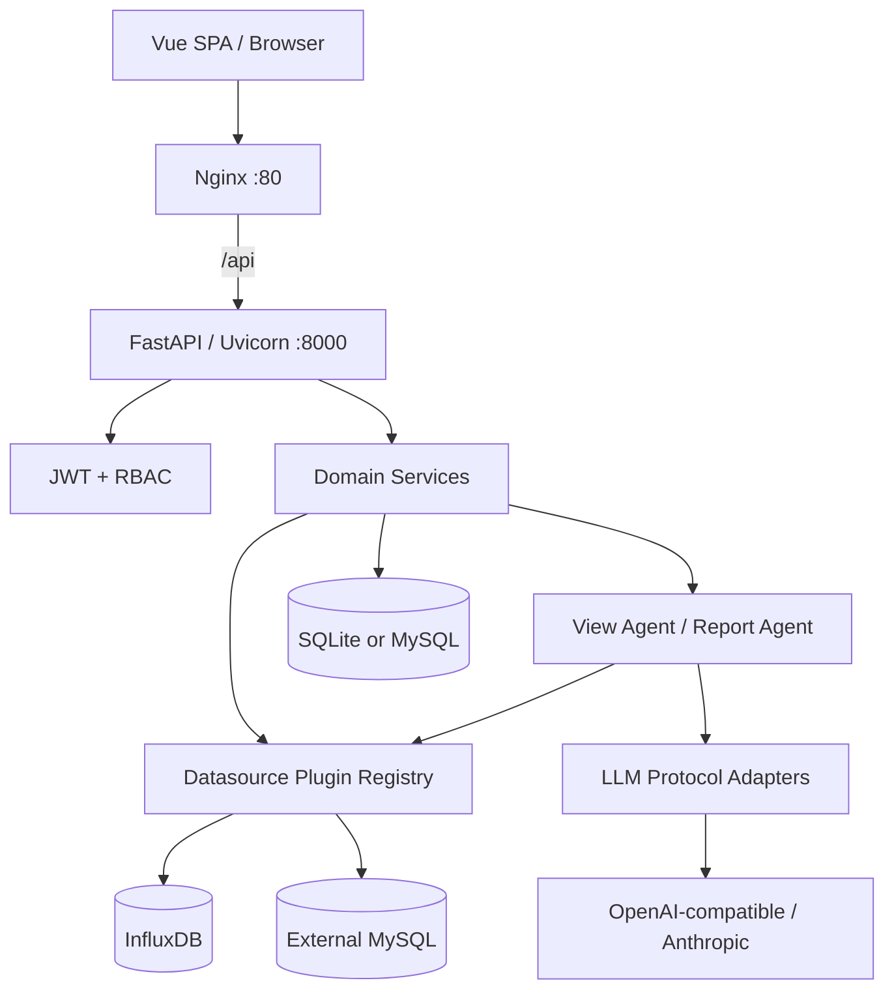
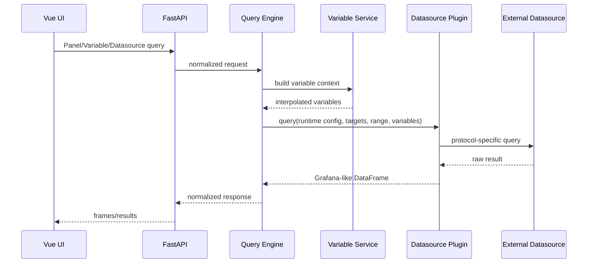
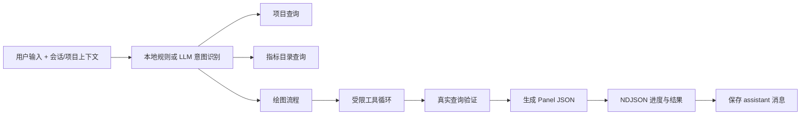
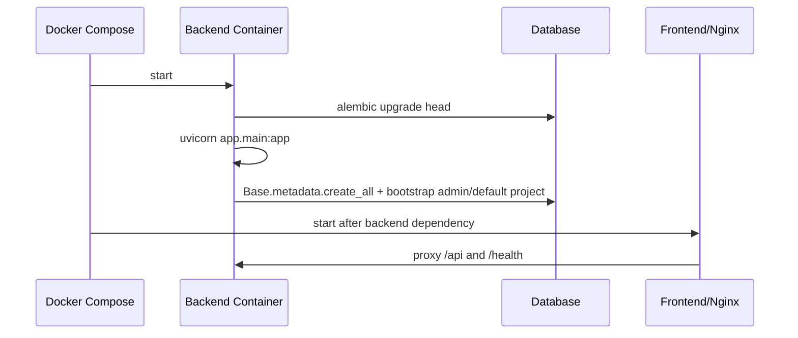
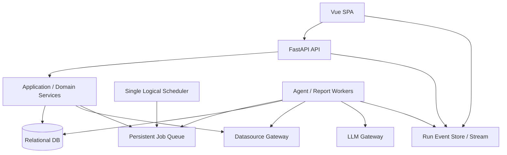

# AGIOne Dashboard 技术系统梳理

> 梳理对象：`E:\work\agione-dashboard`  
> 梳理日期：2026-07-22  
> 当前分支：`master`  
> 说明：本文是基于静态代码、配置、迁移与测试目录的架构梳理。本机没有项目要求的 Python 3.11，现有 Python 3.13 未安装 pytest，因此本次未执行后端测试；这不代表测试通过或失败。

## 1. 技术结论摘要

项目采用 Vue 3 单页应用 + FastAPI 单体后端 + SQLAlchemy 关系数据库的前后端分离架构，通过 Nginx 统一暴露前端和 `/api`。代码已覆盖 14 个 API 模块、约 99 个路由声明、19 张业务表和 11 个 Alembic 迁移，功能跨度已经达到中型应用，而部署与后台任务仍保持单进程 Beta 形态。

当前架构的优点是模块命名清晰、API/Service/Model 基本分层、Datasource 与 LLM 都有协议适配层、Dashboard JSON 兼容策略稳定。主要技术风险集中在生产安全、后台任务可靠性、迁移边界和前端可维护性：

1. `docker-compose.yml` 含明文数据库账号、密码和内网地址，配置默认值还包含弱密钥与默认管理员密码，属于必须立即处理的安全问题。
2. 报告调度、报告执行和 Agent 流式任务依赖 Web 进程内协程/线程；多实例会重复调度，进程退出会丢失在途任务。
3. 启动阶段同时执行 `alembic upgrade head` 和 `Base.metadata.create_all()`，数据库 Schema 所有权不唯一。
4. 前端核心页面和 `PanelRenderer.vue` 已成为千行级单文件模块，样式与业务逻辑高度集中，后续变更回归成本较高。
5. JWT 存储在 `localStorage`，登出没有服务端失效机制；Project 又不是权限边界，生产安全模型需要重新评估。

## 2. 代码规模快照

静态统计范围为仓库中的 Python、Vue、TypeScript、CSS 和主要配置文件，包含测试代码：

| 区域 | 文件/代码量概况 |
| --- | --- |
| 后端 | 107 个 Python 文件，约 27,236 行 |
| 前端 Vue | 18 个 Vue 文件，约 18,416 行 |
| 前端 TypeScript | 23 个 TypeScript 文件，约 2,239 行 |
| 全局 CSS | 1 个文件，约 7,953 行 |
| 后端测试 | 14 个测试文件 |
| API | 14 个路由模块，约 99 个 HTTP 路由声明 |
| 数据库 | 19 张模型表，11 个 Alembic 迁移 |

这些数字是 2026-07-22 的仓库快照，用于判断复杂度，不是产品指标。

## 3. 技术栈

### 3.1 后端

- Python 3.11.13
- FastAPI、Uvicorn
- SQLAlchemy 2.x、Alembic
- Pydantic v2、pydantic-settings
- PyJWT、passlib/bcrypt、Fernet
- httpx、PyMySQL、InfluxDB Client
- pytest、ruff（开发依赖）

### 3.2 前端

- Vue 3.5、TypeScript 5.7、Vite 6
- Vue Router、Pinia
- ECharts
- Lucide Vue
- html-to-image
- 原生 Fetch API 封装

### 3.3 运行与部署

- Docker Compose 编排前后端。
- 前端多阶段构建，Nginx 提供静态资源与 API 反向代理。
- 后端容器启动时执行 Alembic，再启动单个 Uvicorn 进程。
- 默认开发库为 SQLite，生产 Compose 指向 MySQL/MariaDB 兼容连接。

## 4. 总体架构



架构形态仍是模块化单体，不是微服务。对当前规模而言这是合理选择；问题不在是否拆服务，而在后台任务、Schema 管理和模块边界需要从单进程开发形态升级。

## 5. 仓库结构

```text
agione-dashboard/
├─ backend/
│  ├─ app/
│  │  ├─ api/                 HTTP 路由与依赖注入
│  │  ├─ core/                配置、数据库、安全
│  │  ├─ models/              SQLAlchemy 模型
│  │  ├─ schemas/             Pydantic 请求/响应模型
│  │  ├─ services/            业务服务、Agent、导出
│  │  └─ plugins/             Datasource 与 Panel 注册表
│  ├─ alembic/                数据库迁移
│  └─ tests/                  后端测试
├─ frontend/
│  ├─ src/
│  │  ├─ api/                 API Client 与共享类型
│  │  ├─ components/          App Shell、Panel Renderer 等
│  │  ├─ router/              路由与前端守卫
│  │  ├─ stores/              Auth、Project、UI 状态
│  │  └─ views/               页面级 SFC
│  ├─ nginx.conf
│  └─ Dockerfile
├─ req/                       需求与实现设计
├─ docs/diagrams/             Agent 流程图
└─ docker-compose.yml
```

## 6. 后端模块

### 6.1 API 面

| 模块 | 路由数 | 主要职责 |
| --- | ---: | --- |
| auth | 3 | 登录、当前用户、登出响应 |
| users | 4 | 用户 CRUD 与状态/角色维护 |
| projects | 7 | Project CRUD、归档、恢复 |
| datasources | 11 | 数据源 CRUD、测试、查询、文档 |
| dashboards | 9 | Dashboard CRUD、导入导出、版本恢复 |
| panels | 5 | Panel CRUD、追加、查询 |
| variables | 4 | 变量读取、更新、预览、选项查询 |
| share | 7 | 分享令牌和公共 Dashboard/查询 |
| panel_market | 8 | Published Panel CRUD、星标、查询 |
| view_agent | 7 | 对话会话、消息、Agent 运行 |
| view_agent_config | 11 | 模型配置、默认项、测试、密钥重置 |
| auto_dashboard | 7 | 草稿会话、运行、预览、保存 |
| reports | 14 | 模板、运行、事件、导出、到期触发 |
| system | 2 | 系统默认项读取与更新 |

### 6.2 服务层职责

- `dashboard_service`：Dashboard 读取、JSON 归一化、Panel 查找与版本逻辑。
- `datasource_service`：数据源配置、敏感值处理、默认文档。
- `query_engine`：Panel、Datasource、Variable 查询的统一协调。
- `variable_service`：变量上下文和插值。
- `share_service`：Token、有效期、IP 白名单和客户端地址解析。
- `panel_market_service`：发布资产与星标。
- `view_agent/*`：意图、工具、协议、会话上下文和 Panel 生成。
- `auto_dashboard_service`：市场 Panel 到 Dashboard 草稿/正式资产的编排。
- `report_service`、`report_agent_service`、`report_export_service`：模板、执行、事件、PDF/DOCX。
- `system_settings_service`：数据库持久化默认语言、主题和时区。

当前分层总体成立，但 `api/view_agent.py`、`services/view_agent/agent.py`、报告和自动 Dashboard 仍承担较多编排细节，后续需要按用例拆分，而非机械拆成更多服务。

## 7. 数据模型

### 7.1 表清单

| 领域 | 数据表 |
| --- | --- |
| 身份与治理 | `users`、`audit_logs`、`system_settings`、`view_agent_config` |
| 项目与数据 | `projects`、`datasources` |
| Dashboard | `dashboards`、`dashboard_versions`、`dashboard_share_tokens` |
| Panel Market | `published_panels`、`published_panel_stars` |
| View Agent | `view_agent_sessions`、`view_agent_messages` |
| Auto Dashboard | `auto_dashboard_sessions`、`auto_dashboard_messages` |
| Reports | `report_templates`、`report_runs`、`report_agent_events`、`report_artifacts` |

### 7.2 核心建模决策

Dashboard 的 Panel、变量、布局和大部分 Grafana 字段保存在 `dashboards.spec_json`，没有拆成 Panel/Variable 关系表。该决策带来的收益：

- 导入导出保真。
- 未知 Grafana 字段可保留。
- 降低早期关系模型复杂度。

代价：

- 无法通过普通关系查询高效分析 Panel、指标和 Datasource 依赖。
- 局部更新需要读改写整个 JSON，并处理版本和并发覆盖。
- 跨 Dashboard 的影响分析、资产索引和权限继承较难。

建议保留 JSON 作为事实源，同时建立可重建的只读索引/依赖投影，不要急于把所有 JSON 字段关系化。

### 7.3 迁移演进

11 个迁移显示的演进顺序：

1. 初始化用户、数据源、Dashboard、审计等基础表。
2. 增加 Project 归属。
3. 增加分享令牌白名单。
4. 增加 Datasource Doc。
5. 增加 View Agent 配置与会话。
6. 支持多模型配置。
7. 增加 Panel Market 与 Auto Dashboard。
8. 增加系统默认项。
9. 增加 Report Agent。
10. 增加 Published Panel Variables。

这说明业务扩展很快，迁移记录基本跟随功能，但需要避免 `create_all` 绕过迁移成为第二套 Schema 演进方式。

## 8. 数据查询架构



### 8.1 插件边界

- `registry.py` 根据 `datasource.type` 获取实现。
- InfluxDB 插件覆盖连接测试与查询协议。
- MySQL 插件使用 PyMySQL，具备单语句、只读起始关键字、危险关键字过滤和超时设置。
- 查询引擎负责根据 Dashboard Project 限定 Datasource，处理模板 Datasource UID 和变量。

### 8.2 风险

- SQL 只读校验是自研文本扫描，不应作为唯一安全边界。
- 必须继续要求数据库账号本身是最小权限只读账号。
- `query_max_rows` 在配置中存在，但应核实所有插件和所有查询路径是否一致执行行数限制。
- 对 Agent 生成的查询，应保留验证、超时、行数、审计和敏感字段策略。

## 9. Agent 架构

### 9.1 协议适配

View Agent 通过统一协议接口适配：

- OpenAI Chat Completions
- OpenAI Responses
- Anthropic Messages

模型配置包含协议、Base URL、Model ID、加密 API Key 和 client options，可配置多套并指定默认项。

### 9.2 View Agent 运行链



Agent 不是直接绕过后端连接数据源；工具和查询服务仍是数据访问边界。这一方向是正确的。

### 9.3 重复能力风险

`view_agent` 与 `auto_dashboard` 都包含会话、消息、流式运行和渲染/草稿逻辑。如果继续各自演进，容易产生：

- 两套会话模型和前端流处理。
- 两套错误恢复与中断语义。
- 两套 Project/Datasource 上下文处理。
- 同一 Panel 生成规则在不同入口不一致。

建议抽取共享的 Agent Run、Event Stream、Tool Execution、Panel Candidate 和 Validation Result 领域对象；保留不同用例编排，不必拆成独立微服务。

## 10. 报告与后台任务

### 10.1 当前实现

- FastAPI lifespan 启动循环调度器，按固定间隔扫描到期报告。
- 自动运行时选择第一个活跃 admin 作为执行和审计主体。
- 手动 Report Run 通过 daemon Thread 启动，并在新事件循环中执行异步服务。
- View Agent/Auto Dashboard 流式请求通过 `asyncio.create_task` 运行，并通过 NDJSON 推送进度。
- Report Artifact 记录元信息；导出由服务在请求时构建 PDF/DOCX。

### 10.2 生产问题

| 问题 | 影响 |
| --- | --- |
| 多 Web 实例都会启动 scheduler | 同一到期报告可能被重复扫描/执行 |
| daemon Thread 无持久队列 | 进程重启会丢失在途任务 |
| 任务状态与执行租约不清晰 | 卡死任务、重复执行、补偿困难 |
| 选择第一个 admin 作为自动主体 | 审计语义和权限归属不稳定 |
| Agent task 绑定请求进程 | 长任务容错和资源治理有限 |

建议：短期至少增加数据库锁/租约、幂等键、心跳和过期恢复；进入多实例前，将调度与执行交给独立 Worker/Queue，并建立明确的 system actor。

## 11. 前端架构

### 11.1 路由与状态

- Vue Router 全局守卫先执行 Auth bootstrap。
- `meta.admin` 控制管理页面前端访问，后端仍使用角色依赖做最终校验。
- Kiosk Dashboard 根据 query 参数走公开路由逻辑，后端再次验证 Token 与 IP。
- Pinia Store 分别管理 Auth、Project、UI 偏好。
- Token、语言、主题、时区和已选 Project 使用浏览器本地存储。

### 11.2 页面复杂度

当前最大的页面文件：

| 页面 | 约行数 |
| --- | ---: |
| `ReportsView.vue` | 2,937 |
| `AutoDashboardView.vue` | 2,400 |
| `ChatToViewView.vue` | 1,655 |
| `DashboardListView.vue` | 1,621 |
| `DashboardView.vue` | 1,471 |
| `DatasourceView.vue` | 1,214 |
| `PanelMarketView.vue` | 944 |

此外 `PanelRenderer.vue` 约 3,600 行，全局 `styles.css` 约 7,953 行。

这些文件已经越过“页面内聚”阶段，混合了状态机、API 编排、表单、流式协议、业务规则、渲染和大量样式。建议按业务职责拆分：

- 页面只负责路由上下文和用例编排。
- 抽取 composable：stream run、session、draft、report run、query preview。
- 抽取局部组件：列表、编辑面板、运行详情、事件流、导出操作。
- Panel Renderer 按可视化族拆渲染器和数据 mapper。
- 全局 CSS 拆为 tokens、shell、通用组件、页面局部样式；避免继续在单文件中叠加。

拆分目标不是追求小文件，而是让一次功能修改只触及一个清晰职责和一组可验证测试。

## 12. 认证、授权与安全

### 12.1 已有措施

- bcrypt 密码哈希。
- HS256 JWT 和过期时间。
- FastAPI 依赖执行 `admin/viewer` 角色校验。
- Datasource/LLM API Key 使用基于配置密钥派生的 Fernet 加密。
- 公共 Dashboard 使用随机 Token、有效期和 IP 白名单。
- LLM 日志测试包含 Authorization 脱敏检查。
- MySQL 查询有只读语句过滤。

### 12.2 P0 安全问题

1. `docker-compose.yml` 中提交了完整数据库连接串，包括用户名、密码和内网地址。应立即轮换凭据、从 Git 跟踪文件移除，并检查历史提交。
2. `APP_SECRET_KEY`、`DATASOURCE_SECRET_KEY` 默认是 `change-me`，默认管理员密码是 `admin123456`。生产启动应在检测到默认值时直接失败，而不是允许继续运行。
3. JWT 存在 `localStorage`，若发生 XSS 可被读取；登出接口没有服务端 Token 吊销。需要根据部署威胁模型评估 HttpOnly Cookie、短期 Access Token、Refresh Token 轮换或 Token Version。
4. Project 不是授权隔离边界；所有用户可见所有 Project 的设计不应被误认为多租户安全。

### 12.3 P1 安全问题

- CORS 正则允许任意 `192.168.x.x:5173` 开发源，生产应按显式域名配置。
- 分享 Token 出现在 URL query 中，可能进入浏览器历史、代理日志和 Referer；应评估短期交换码、Cookie 或 Header。
- `X-Forwarded-For` 可信边界取决于代理部署，IP 白名单前必须只信任受控反向代理。
- 自研 SQL 文本过滤必须配合只读账户、网络隔离、超时、行数限制和审计。
- Fernet 密钥来自单一环境变量；需要密钥轮换和旧密钥解密策略。

## 13. 配置与部署

### 13.1 当前启动链



### 13.2 需要修正

- 将 Schema 管理唯一归属 Alembic，生产不再用 `create_all` 创建缺失表。
- Bootstrap 管理员和默认 Project 应做成显式、幂等、可审计初始化流程。
- Compose 的 `depends_on` 不等于依赖健康，应使用 health condition 或外部编排 readiness。
- 增加后端非 root 用户、资源限制、只读文件系统/最小权限等容器基线。
- 明确 Artifact 的存储策略；当前模型主要保存元信息，若产物转为持久文件需对象存储和生命周期。
- 建立环境配置清单，区分 dev/test/prod，生产禁止默认值。

## 14. 测试与质量现状

### 14.1 已有测试主题

测试目录覆盖：

- OpenAI Chat、OpenAI Responses、Anthropic 协议。
- View Agent 配置、工具与编排。
- LLM 日志敏感头脱敏。
- Project。
- Report。
- System Defaults。
- Panel Market 与 Auto Dashboard。
- MySQL Datasource、InfluxDB Flux。
- Grafana Panel 兼容。

### 14.2 明显缺口

- 未看到前端单元/组件/E2E 测试配置。
- 未看到 CI 工作流。
- 公开分享、JWT、安全默认值和权限矩阵需要更系统的回归。
- 报告调度的并发、幂等、进程重启恢复缺少可靠性测试。
- Dashboard JSON 的并发编辑、版本冲突和未知字段保真需要持续回归。
- Datasource 查询应增加恶意 SQL、超时、大结果集与网络失败测试。

### 14.3 本次验证限制

仓库要求 Python 3.11.13；当前机器 Python Launcher 仅发现 Python 3.13，且该解释器没有 pytest。本次没有安装或改变环境，因此测试未运行。建议在项目标准容器或 3.11 虚拟环境执行：

```text
cd backend
python3.11 -m pytest -q
ruff check app tests
```

前端应执行不产出构建物的类型检查；具体命令可在补充独立 `typecheck` script 后运行。本文未运行 `pnpm build`。

## 15. 可维护性与技术债

### P0：立即处理

| 问题 | 建议动作 | 完成标准 |
| --- | --- | --- |
| Git 中的数据库凭据 | 轮换、移除、审计历史 | 旧凭据失效，仓库和镜像不含明文 |
| 默认弱密钥/默认密码 | 生产启动硬校验 | prod 环境使用默认值时拒绝启动 |
| 多实例重复调度 | 增加租约/幂等或独立 Worker | 同一计划周期只生成一个 Run |

### P1：近期处理

| 问题 | 建议动作 | 完成标准 |
| --- | --- | --- |
| Alembic 与 create_all 双轨 | 生产仅 Alembic 管 Schema | 空库升级和旧库升级路径一致 |
| 进程内后台任务 | 持久队列、重试、状态恢复 | 重启后任务可恢复且不重复 |
| Project 非授权边界 | 明确单组织边界或实现 Project ACL | 权限矩阵有集成测试 |
| 大型前端单文件 | 按用例/渲染族渐进拆分 | 关键流程有独立状态和组件测试 |
| 分享 Token 在 URL | 降低日志和历史泄露 | 公共访问不长期暴露原始 Token |

### P2：演进处理

| 问题 | 建议动作 |
| --- | --- |
| Dashboard JSON 难查询 | 建立可重建的依赖索引投影 |
| Agent 两套会话/流机制 | 抽取共享 Run/Event/Validation 领域层 |
| 单一大 CSS | 分层样式与设计 Token，页面样式局部化 |
| 缺少可观测性 | 结构化日志、Trace ID、任务指标、查询耗时与错误分类 |
| 缺少发布流程 | CI 执行 lint、test、迁移验证、依赖与许可证扫描 |

## 16. 推荐目标架构

保持模块化单体，但将同步请求与后台任务明确分开：



关键原则：

- Web API 不拥有长任务生命周期。
- Scheduler 只有一个逻辑所有者，所有 Run 有幂等键和租约。
- Agent 与 Report 共享运行事件基础设施。
- 数据库迁移只有 Alembic 一个事实源。
- Datasource 与 LLM 继续通过适配层隔离外部协议。
- Dashboard JSON 保持事实源，依赖索引作为可重建投影。

## 17. 建议实施顺序

### 第 1 周期：安全止血

- 轮换并移除数据库凭据。
- 添加生产配置硬校验。
- 收紧 CORS、代理信任和分享 Token 日志策略。
- 在标准 Python 3.11 环境跑全量后端测试并建立 CI。

### 第 2 周期：运行可靠性

- 给 Report Run 增加幂等键、调度租约、心跳和恢复。
- 将 daemon Thread 与进程内 scheduler 迁到持久任务执行模型。
- 定义 system actor 和自动任务审计语义。

### 第 3 周期：边界与可维护性

- 统一 View Agent 与 Auto Dashboard 的 Run/Event/Validation 基础设施。
- 拆分 Reports、Auto Dashboard、Chat to View 与 Panel Renderer 的高变更职责。
- 给 Project 权限边界做明确产品决策并补集成测试。

### 第 4 周期：资产治理与观测

- 建立 Dashboard/Panel/Report 的依赖索引。
- 增加结构化日志、请求 ID、任务指标和查询审计。
- 建立迁移验证、许可证扫描和发布基线。

## 18. 架构验收清单

### 安全

- 仓库、镜像、日志中无明文生产凭据。
- 生产环境默认密钥/密码会阻止启动。
- 分享访问、Project 权限、模型密钥有自动化测试。

### 数据

- Alembic 可从空库和上一生产版本稳定升级。
- Dashboard 导入—保存—导出不丢未知字段。
- 数据源查询执行超时、行数和只读账户限制。

### 后台任务

- 同一计划不会重复运行。
- Worker 重启后任务可恢复或明确失败。
- Report/View Agent Run 可追踪事件、错误和耗时。

### 前端

- 核心路由有权限回归。
- 流式任务具备断开、失败、重试和最终状态。
- 高频改动不再要求同时修改千行级页面、渲染器和全局 CSS。

### 运维

- 健康检查区分存活与就绪。
- 关键外部依赖失败可定位。
- 配置、迁移、任务和审计有运行手册。

## 19. 证据来源

- `backend/pyproject.toml`
- `backend/app/main.py`
- `backend/app/core/`
- `backend/app/api/`
- `backend/app/models/`
- `backend/app/services/`
- `backend/app/plugins/`
- `backend/alembic/versions/`
- `backend/tests/`
- `frontend/package.json`
- `frontend/src/router/index.ts`
- `frontend/src/api/`
- `frontend/src/views/`
- `frontend/src/components/panels/`
- `frontend/src/assets/styles.css`
- `frontend/nginx.conf`
- `backend/Dockerfile`、`frontend/Dockerfile`
- `docker-compose.yml`
