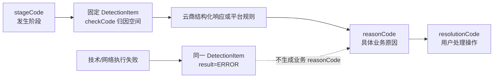
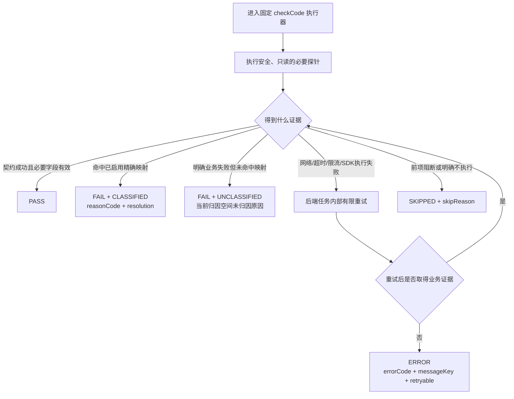

# 云账号三项检测业务归因目录

- 文档类型：业务归因单一真相源
- 适用系统：XCloud 云账号检测
- 覆盖云商：阿里云/阿里金融云 PAI/EAS、AWS SageMaker、Google Cloud Vertex AI、华为云 ModelArts，以及代码真实接入但缺少公有云官方契约的 Infracube
- 最后核验：2026-08-03
- 当前状态：已形成可开发归因目录；旧 HEAD 已有实现、当前未提交实现、官方文档确认和待生产验证已分开登记
- 配套架构：[云账号检测阶段与统一归因架构设计](./云账号检测阶段与统一归因架构设计.md)
- 部署就绪性已拆分至：[模型部署就绪性与准入归因设计](./模型部署就绪性与准入归因设计.md)

## 1. 文档职责

本文只负责云账号管理三个固定检测项的业务归因：统一原因、适用范围、resolution、XCloud 平台事实、云商官方 API 证据、证据成熟度和生产发布状态。

本文不定义检测阶段编排、请求路由、健康快照、部署门禁或前端布局，这些内容由配套架构文档负责。

本文中的 `provider`只表示归因注册表中的云商证据维度，不是云账号接口或健康快照的新字段。运行时云账号类型继续使用已有 `cloudType`，健康快照通过 `cloudAccountId`关联云账号，不重复保存云类型。

本文不把请求超时、网络连接、DNS、TLS、云商服务临时不可用、限流、SDK 初始化、响应解析失败等技术/网络失败解释为业务归因。技术失败直接放入实际执行它的`DetectionItem`，使用`result=ERROR + errorCode + messageKey + retryable + action`表达，不生成业务`reasonCode`或`resolution`。

系统技术失败是本目录的硬边界：不得回落为“凭证错误”“权限不足”等业务原因。`runStatus`只允许`RUNNING / COMPLETED`，检测项结果只允许`PASS / FAIL / ERROR / SKIPPED`。账号健康重检发生技术失败时保留上次有效健康结论；前端云账号列表只展示“健康 / 需处理 / 检测中”，内部执行状态不得扩散为新页面状态。

“全面”在本文中的边界是：

1. 收录 XCloud 当前三个账号检测项范围内，能够由平台权威规则或四家云商结构化 API 证据区分、并且客户可以采取动作的业务原因。
2. 不把所有 SDK 异常、HTTP 状态或云商全局错误码机械转换成业务原因。
3. 模型部署上下文、准入和错误归因不进入本文，统一由独立部署文档维护。
4. 云商新增 API、错误码或语义变化后，通过本文的证据成熟度、上线验证计划和运行观察增量维护；没有真实账号逐项复现不阻止合理、可实现且阶段与`checkCode`明确的条目进入开发。

## 2. 固定检测项

| `checkCode` | 中文名称 | English name | 事实 Owner |
|---|---|---|---|
| `XCLOUD_ACCOUNT_INFORMATION` | 账号信息 | Account information | XCloud |
| `CLOUD_IDENTITY_CREDENTIALS` | 云身份与凭证 | Cloud identity and credentials | XCloud + 云商身份 API |
| `CLOUD_PRODUCT_ACCESS_PERMISSIONS` | 云产品访问与权限 | Cloud product access and permissions | 云商产品 API |

具体原因必须且只能归属一个 `checkCode`。相同问题在不同页面或不同检测阶段出现时不创建新的原因编码，只通过`applicability`声明适用上下文。章节标题只用于阅读分组，不能代替统一原因记录、总表和运行时Registry中的显式`checkCode`字段。



图中的虚线表示禁止关系：技术失败必须保留实际 `stageCode + checkCode`，但不得伪装成具体业务原因。

## 3. 统一归因数据结构

归因注册表采用“一个统一业务原因，内嵌多个云商证据映射”的结构。统一原因不随云商变化；云商差异只进入 `providerMappings`。

```yaml
reasonCode: CLOUD_PRODUCT_NOT_ENABLED
checkCode: CLOUD_PRODUCT_ACCESS_PERMISSIONS

i18n:
  titleKey: cloudAccount.detection.reason.cloudProductNotEnabled.title
  messageKey: cloudAccount.detection.reason.cloudProductNotEnabled.message
  allowedMessageParams: [productName]

businessMeaning: 当前云账号尚未开通或启用目标云产品

applicability:
  - stageCode: ACCOUNT_CONFIGURATION
  - stageCode: ACCOUNT_HEALTH

result:
  itemResult: FAIL
  severity: ERROR

resolution:
  resolutionCode: ENABLE_CLOUD_PRODUCT
  interactionType: NAVIGATE_EXTERNAL
  labelKey: cloudAccount.detection.resolution.enableCloudProduct
  targetCode: CLOUD_PRODUCT_CONSOLE

decisionEffect:
  accountSavable: true
  credentialUpdateAllowed: POLICY_DEPENDENT_WHEN_ACTIVE_SERVICES
  accountHealthy: false
  deployable: false

evidenceRequirement:
  rule: 云商结构化状态或错误码明确表示产品未启用
  insufficientEvidence:
    - 产品资源列表为空
    - 普通权限拒绝
    - 请求超时或网络失败

providerMappings:
  GOOGLE_CLOUD:
    mappingId: GOOGLE_CLOUD:SERVICE_USAGE_GET:STATE_DISABLED
    checkCode: CLOUD_PRODUCT_ACCESS_PERMISSIONS
    reasonCode: CLOUD_PRODUCT_NOT_ENABLED
    probeApi: serviceusage.services.get
    requiredPermissions: [serviceusage.services.get]
    structuredEvidence:
      type: RESPONSE_FIELD
      expression: state == "DISABLED"
    evidenceStatus: [OFFICIALLY_DOCUMENTED, PRODUCTION_VALIDATION_REQUIRED]
    developmentStatus: DEVELOPMENT_READY
    officialSources:
      - https://cloud.google.com/service-usage/docs/reference/rest/v1/services/get
      - https://cloud.google.com/service-usage/docs/reference/rest/v1/services#State
```

每条具体映射必须显式携带`checkCode`和`reasonCode`。即使文档采用统一原因内嵌映射的写法，编译后的Registry也必须展开并校验这两个字段，不能只依靠所在章节或父节点位置推断。

运行时匹配链路固定为：

```text
检测计划分配 checkCode
→ checkCode 选择执行器和探测接口
→ 取得能够判断业务成败的结构化结果
→ 在当前 checkCode 归因域匹配已启用、未标记 CONFLICTED 的精确映射
    ├─ 命中失败映射：FAIL + CLASSIFIED + reasonCode + resolution
    ├─ 计划内必要探测均按接口契约成功：PASS
    ├─ 云商明确失败但未映射：FAIL + UNCLASSIFIED + 当前checkCode未归因reasonCode + 脱敏providerError
    ├─ 技术执行失败：ERROR + errorCode + messageKey + retryable + action，不生成reasonCode
    └─ 前项阻断或明确未执行：SKIPPED + skipReason
→ 固定返回账号信息、身份凭证、云产品访问三个检测项
```



请求进入检测前就失败的鉴权、JSON解析或服务整体不可用仍走普通HTTP错误；已经进入具体检测器后的技术失败进入对应`DetectionItem`。

`PASS`必须同时满足：当前`checkCode`计划内所有必要探测都已实际执行、HTTP/SDK按对应接口契约返回成功、检测所需的必要响应字段有效。接口未执行、异常被吞、返回对象为空、只完成部分必要探测或缺失必要字段，都不能因为“没有看到报错”而判定为`PASS`。云商接口按契约成功返回空资源列表时，可以证明该接口调用和对应访问权限成功，但不能额外推导产品未开通或存在资源。

具体映射的匹配键至少包含：

```text
checkCode
+ provider
+ probeApi / providerOperation
+ structuredEvidence
+ applicable stageCode / required account context
+ developmentStatus = ENABLED
+ evidenceStatus 不含 CONFLICTED
```

`checkCode`负责选择检测执行器、云商探测接口和归因命名空间，不决定是否产生归因，也不直接决定处理方式。命中的具体映射确定`reasonCode`，再由`reasonCode + 当前stageCode`确定`resolution`。

### 3.1 适用范围结构

`applicability`只声明具体原因适用于哪个检测阶段，以及命中该原因必须具备的账号事实。前端不生成、传入或接收 `operationCode / changeSet`；新增或编辑只由请求是否携带 `cloudAccountId`判断。XCloud 后端必须读取租户内权威存量账号，在合并掩码字段前派生内部强类型变更集，用于决定哪些检测需要真实执行、复用或跳过。该内部对象不是归因 Registry 协议，也不包含任何凭证明文。统一结构如下：

```yaml
applicability:
  - stageCode: ACCOUNT_CONFIGURATION
    requiredAccountContext:
      - EXISTING_ACCOUNT_WHEN_BINDING_COMPARISON_IS_REQUIRED

  - stageCode: ACCOUNT_HEALTH
```

- `stageCode`只使用三大检测阶段。
- `requiredAccountContext`只描述命中原因所需的事实，不作为检测项路由器。
- 三个检测项槽位始终存在；只修改名称时，身份凭证和云产品访问不重复调用云商并明确返回未执行。
- 只有用户明确提交完整的新AK/SK凭证组且本次凭证解析主体与已保存主体不一致时，才命中绑定主体不一致原因；掩码或空凭证表示复用存量值，不构成凭证变化，半组更新必须拒绝。
- 云商差异只写在`providerMappings`。

典型适用范围：

- `CREDENTIAL_DISABLED`可以出现在账号配置阶段提交已停用凭证，或已保存凭证后来被停用的账号健康阶段。
- `CREDENTIAL_ACCOUNT_MISMATCH`依赖“已保存主体 + 本次凭证解析主体”的比较，只适用于携带 `cloudAccountId`的账号配置请求。
- `CLOUD_ACCOUNT_ALREADY_CONNECTED`依赖未携带 `cloudAccountId`时解析出的主体与全局已有记录比较。

运行时Finding不重复保存自由文本“阶段标签”。它通过所属`DetectionItem.checkCode`和父级`DetectionRun.stageCode`获得上下文；需要比较存量账号时直接使用已校验租户归属的 `cloudAccountId`读取结果。

### 3.2 国际化约束

- `reasonCode`、`resolutionCode`是稳定业务身份，不包含语言。
- 用户文案通过 `titleKey`、`messageKey`、`labelKey` 定位 `zh-CN` 和 `en-US` 资源。
- 动态内容只通过白名单 `messageParams` 传递；产品名等参数必须来自可信业务字段。
- 禁止把任意异常文本、完整响应或异常堆栈作为用户文案或国际化参数透传。
- 未归因结果可以单独返回经过字段白名单提取、敏感信息清理、HTML转义和长度限制的`providerError`；它是云商原生错误详情，不是XCloud精确业务归因。
- 归因文档可以并列展示中英文名称供评审，但运行时权威字段仍是 code 和 i18n key。

运行时 finding 只返回命中的精简结果，不返回整个注册表：

```json
{
  "checkCode": "CLOUD_PRODUCT_ACCESS_PERMISSIONS",
  "status": "COMPLETED",
  "result": "FAIL",
  "attributionStatus": "CLASSIFIED",
  "findings": [
    {
      "reasonCode": "CLOUD_PRODUCT_NOT_ENABLED",
      "titleKey": "cloudAccount.detection.reason.cloudProductNotEnabled.title",
      "messageKey": "cloudAccount.detection.reason.cloudProductNotEnabled.message",
      "messageParams": {"productName": "Vertex AI"},
      "provider": "GOOGLE_CLOUD",
      "resolution": {
        "resolutionCode": "ENABLE_CLOUD_PRODUCT",
        "interactionType": "NAVIGATE_EXTERNAL",
        "labelKey": "cloudAccount.detection.resolution.enableCloudProduct",
        "targetCode": "CLOUD_PRODUCT_CONSOLE"
      }
    }
  ]
}
```

未命中已启用精确映射但云商已明确返回失败时，运行时返回固定的未归因Finding：

```json
{
  "checkCode": "CLOUD_PRODUCT_ACCESS_PERMISSIONS",
  "status": "COMPLETED",
  "result": "FAIL",
  "attributionStatus": "UNCLASSIFIED",
  "findings": [
    {
      "reasonCode": "CLOUD_PRODUCT_ERROR_UNCLASSIFIED",
      "titleKey": "cloudAccount.detection.reason.cloudProductErrorUnclassified.title",
      "messageKey": "cloudAccount.detection.reason.cloudProductErrorUnclassified.message",
      "providerError": {
        "provider": "AWS",
        "errorCode": "AccessDeniedException",
        "displayMessage": "User is not authorized to perform: sagemaker:ListEndpoints",
        "requestId": "***"
      },
      "resolution": null
    }
  ]
}
```

两个云商检测项分别使用自己的未归因`reasonCode`，保证每个原因仍只归属一个`checkCode`：

```text
CLOUD_IDENTITY_CREDENTIALS          → CLOUD_IDENTITY_ERROR_UNCLASSIFIED
CLOUD_PRODUCT_ACCESS_PERMISSIONS    → CLOUD_PRODUCT_ERROR_UNCLASSIFIED
```

`XCLOUD_ACCOUNT_INFORMATION`由XCloud本地确定性规则执行，不存在云商原生错误回落；无法执行本地规则时属于技术执行失败。

## 4. 证据成熟度与上线验证门禁

旧版`productionStatus`把“已经用真实账号/API完整复现”作为进入目录和生产开发的先决条件，会排除官方已确认、SDK可结构化观察且可以安全实现的合理归因。本版取消该门槛：目录准入、开发准入和上线后证据升级分开判断，不再使用`NOT_ELIGIBLE / PENDING_REVIEW / APPROVED`阻断开发。

### 4.1 `evidenceStatus`

| 状态 | 含义 | 可以进入可开发目录 | 可以声称已实证 |
|---|---|---:|---:|
| `CODE_REPRODUCED` | 旧 HEAD 或当前分支中已有确定性代码路径/测试复现；必须注明属于旧 HEAD 还是未提交实现 | 是 | 仅能声称代码路径已复现 |
| `SDK_OBSERVABLE` | 当前 SDK 暴露稳定错误码、状态字段或结构化异常，可实现精确采集 | 是 | 否 |
| `OFFICIALLY_DOCUMENTED` | 云商官方文档明确 API、权限、字段、错误码或限制 | 是 | 只能声称官方确认 |
| `PRODUCTION_VALIDATION_REQUIRED` | 归因方向合理、阶段和`checkCode`已确定，但接口级返回仍需真实账号/生产观察验证 | 是 | 否 |
| `OPERATIONALLY_OBSERVED` | 已在真实运行中取得脱敏结构化证据并复核 | 是 | 是，限记录范围 |
| `CONFLICTED` | 官方文档、SDK与真实响应冲突，或同一证据可能对应多个原因 | 暂停 | 否 |

一条映射可以同时具有多个成熟度，例如`[OFFICIALLY_DOCUMENTED, SDK_OBSERVABLE, PRODUCTION_VALIDATION_REQUIRED]`。代码分支、单测和类型检查只证明实现可观察性，不冒充真实云账号结果；没有生产复现也不把条目从可开发目录删除。

### 4.2 开发准入条件

条目满足以下全部条件即可进入实现计划：

```text
固定 stageCode
+ 固定 checkCode
+ 明确 provider / probeApi / providerOperation
+ 可判定 structuredEvidence
+ 只读无副作用（或明确标记只能在真实创建阶段观察）
+ 反向排除规则
+ 用户提示与可执行恢复操作
+ 上线验证计划
```

`CANDIDATE`式纯猜测、仅依赖异常自由文本、无法区分技术失败与业务失败、会创建/修改/计费但被包装成“预检”的条目不得进入同步预检。它们可以保留为“实际创建阶段观察项”，但不能阻止提交前准入。

### 4.3 上线验证计划

每个可开发条目至少登记：单元/契约 Fixture、成功与反向场景、未知响应回落、敏感字段清理、灰度观察字段、误归因停用条件。上线后按以下顺序升级证据：

```text
官方/SDK证据
→ 脱敏 Fixture 与适配器测试
→ 受控账号验证（具备条件时）
→ 生产灰度结构化观察
→ OPERATIONALLY_OBSERVED
```

未完成最后两步时，文档和用户文案必须写“根据云商返回判断”或“需要验证”，不得写“已在生产证明”。发现同码多义、接口不稳定或探针有副作用时立即标记`CONFLICTED`并回落为`UNCLASSIFIED + providerError`。

### 4.4 精确映射粒度

证据和停用粒度固定为：

```text
stageCode + checkCode + reasonCode + provider
+ probeApi / providerOperation + structuredEvidence
```

同一个`reasonCode`可以在某云商已观察、另一云商仅官方确认。固定未归因`reasonCode`只承载`attributionStatus=UNCLASSIFIED`和安全的`providerError`，不产生`resolution`，也不算精确业务归因。

### 4.5 当前最强可辩护声明

截至 2026-07-31：旧 HEAD 已有名称重复、主体解析和部分凭证错误处理；xcloud 工作区存在尚未提交的统一检测实现。本文未取得四云逐项生产 Fixture，因此可以形成开发目录和上线验证计划，但不能把所有云商映射声称为`OPERATIONALLY_OBSERVED`。

## 5. 统一业务原因总表

以下总表只描述统一原因本身。每条原因都必须显式列出唯一归属的`checkCode`，不得依赖5.1～5.3章节标题推断归因空间。`适用阶段`只出现账号配置和账号健康两个固定`stageCode`；账号配置适用场景只用于说明命中前提，不形成运行时 `operationCode`。云商证据的`evidenceStatus / developmentStatus`只在后续具体映射表中维护，不放入健康快照。

### 5.1 账号信息

| `reasonCode` | `checkCode` | 中文 / English | 适用阶段 | 账号配置适用场景 | 命中后的检测项结果 | `resolutionCode` |
|---|---|---|---|---|---|---|
| `ACCOUNT_NAME_ALREADY_EXISTS` | `XCLOUD_ACCOUNT_INFORMATION` | 账号名称已存在 / Account name already exists | `ACCOUNT_CONFIGURATION` | 新增或编辑 | `FAIL` | `CHANGE_ACCOUNT_NAME` |

确定性规则：同一 `tenantId + cloudType + normalizedName` 命中不可共存的已有记录。必填、长度和格式错误由表单与普通接口参数校验负责，不进入本检测项。

### 5.2 云身份与凭证

| `reasonCode` | `checkCode` | 中文 / English | 适用阶段 | 账号配置适用场景 | 命中后的检测项结果 | `resolutionCode` |
|---|---|---|---|---|---|---|
| `CREDENTIAL_FORMAT_INVALID` | `CLOUD_IDENTITY_CREDENTIALS` | 凭证格式无效 / Invalid credential format | `ACCOUNT_CONFIGURATION`、`ACCOUNT_HEALTH` | 新增或编辑 | `FAIL` | `UPDATE_CREDENTIALS` |
| `CREDENTIAL_PROJECT_MISMATCH` | `CLOUD_IDENTITY_CREDENTIALS` | 项目与凭证不一致 / Project and credential mismatch | `ACCOUNT_CONFIGURATION`、`ACCOUNT_HEALTH` | 新增或编辑 | `FAIL` | `UPDATE_CREDENTIALS` |
| `CREDENTIAL_AUTH_FAILED` | `CLOUD_IDENTITY_CREDENTIALS` | 凭证认证失败 / Credential authentication failed | `ACCOUNT_CONFIGURATION`、`ACCOUNT_HEALTH` | 新增或编辑 | `FAIL` | `UPDATE_CREDENTIALS` |
| `CREDENTIAL_DISABLED` | `CLOUD_IDENTITY_CREDENTIALS` | 凭证已停用 / Credential disabled | `ACCOUNT_CONFIGURATION`、`ACCOUNT_HEALTH` | 新增或编辑 | `FAIL` | `UPDATE_CREDENTIALS` |
| `CLOUD_ACCOUNT_SUSPENDED` | `CLOUD_IDENTITY_CREDENTIALS` | 云账号已暂停 / Cloud account suspended | `ACCOUNT_CONFIGURATION`、`ACCOUNT_HEALTH` | 新增或编辑 | `FAIL` | `CONTACT_CLOUD_ACCOUNT_ADMIN` |
| `CLOUD_IDENTITY_ERROR_UNCLASSIFIED` | `CLOUD_IDENTITY_CREDENTIALS` | 云身份错误暂未归因 / Unclassified cloud identity error | `ACCOUNT_CONFIGURATION`、`ACCOUNT_HEALTH` | 新增或编辑 | `FAIL` | — |
| `CLOUD_ACCOUNT_ALREADY_CONNECTED` | `CLOUD_IDENTITY_CREDENTIALS` | 云账号已接入 / Cloud account already connected | `ACCOUNT_CONFIGURATION` | 新增 | `PASS` + finding | `VIEW_EXISTING_ACCOUNT` |
| `CREDENTIAL_ACCOUNT_MISMATCH` | `CLOUD_IDENTITY_CREDENTIALS` | 凭证属于其他云账号 / Credentials belong to another cloud account | `ACCOUNT_CONFIGURATION` | 编辑且存在已保存主体 | `FAIL` | `USE_ORIGINAL_ACCOUNT_CREDENTIALS` |

边界规则：

- `CLOUD_ACCOUNT_ALREADY_CONNECTED` 依赖成功解析云商 `accountId`，再由 XCloud 在全局范围比较 `(cloudType, accountId)`；身份检测保持 `PASS`，但账号不可重复新增。命中其他租户记录时不得返回租户、账号名称或记录ID。
- `CREDENTIAL_ACCOUNT_MISMATCH` 只比较新凭证主体和当前记录保存的主体，新增和常规健康检测不得返回。
- 普通 `AccessDenied` 不能证明凭证停用或账号暂停。
- 身份探测响应缺失主体ID时不满足`PASS`条件；如果云商没有返回明确业务失败，则按响应契约或解析异常进入平台统一错误链路，不能推导账号已删除、冻结或停用。

### 5.3 云产品访问与权限

| `reasonCode` | `checkCode` | 中文 / English | 适用阶段 | 账号配置适用场景 | 命中后的检测项结果 | `resolutionCode` |
|---|---|---|---|---|---|---|
| `CLOUD_PRODUCT_NOT_ENABLED` | `CLOUD_PRODUCT_ACCESS_PERMISSIONS` | 云产品未开通 / Cloud product not enabled | `ACCOUNT_CONFIGURATION`、`ACCOUNT_HEALTH` | 新增或编辑 | `FAIL` | `ENABLE_CLOUD_PRODUCT` |
| `CLOUD_PRODUCT_ACCESS_PERMISSION_MISSING` | `CLOUD_PRODUCT_ACCESS_PERMISSIONS` | 缺少云产品访问权限 / Cloud product access permission missing | `ACCOUNT_CONFIGURATION`、`ACCOUNT_HEALTH` | 新增或编辑 | `FAIL` | `VIEW_REQUIRED_PERMISSIONS` |
| `CLOUD_PRODUCT_AUTHORIZATION_NOT_CONFIGURED` | `CLOUD_PRODUCT_ACCESS_PERMISSIONS` | 云产品授权未配置 / Cloud product authorization not configured | `ACCOUNT_CONFIGURATION`、`ACCOUNT_HEALTH` | 新增或编辑 | `FAIL` | `CONFIGURE_CLOUD_PRODUCT_AUTHORIZATION` |
| `CLOUD_PRODUCT_AUTHORIZATION_INVALID` | `CLOUD_PRODUCT_ACCESS_PERMISSIONS` | 云产品授权无效 / Invalid cloud product authorization | `ACCOUNT_CONFIGURATION`、`ACCOUNT_HEALTH` | 新增或编辑 | `FAIL` | `REPAIR_CLOUD_PRODUCT_AUTHORIZATION` |
| `CLOUD_PRODUCT_ACCOUNT_RESTRICTED` | `CLOUD_PRODUCT_ACCESS_PERMISSIONS` | 云产品账号受限 / Cloud product account restricted | `ACCOUNT_CONFIGURATION`、`ACCOUNT_HEALTH` | 新增或编辑 | `FAIL` | `RESOLVE_CLOUD_ACCOUNT_RESTRICTION` |
| `CLOUD_PRODUCT_ERROR_UNCLASSIFIED` | `CLOUD_PRODUCT_ACCESS_PERMISSIONS` | 云产品错误暂未归因 / Unclassified cloud product error | `ACCOUNT_CONFIGURATION`、`ACCOUNT_HEALTH` | 新增或编辑 | `FAIL` | — |

空工作空间、空Endpoint或空服务列表不能单独证明产品未开通。产品启用状态、基础只读权限、产品委托/Agency和账号受限必须分别匹配，不合并成笼统“权限不足”。

## 6. XCloud 平台规则证据登记

| `mappingId` | `checkCode` | 统一原因 | 平台规则 | 当前代码事实 | `evidenceStatus` | `developmentStatus` |
|---|---|---|---|---|---|---|
| `XCLOUD:ACCOUNT_NAME_UNIQUENESS` | `XCLOUD_ACCOUNT_INFORMATION` | `ACCOUNT_NAME_ALREADY_EXISTS` | 同租户、同云商、规范化名称不可重复，具体生命周期排除条件由业务规则冻结 | 当前新增链路存在名称重复查询并直接抛业务异常，尚未形成统一检测 finding | `PRODUCTION_VALIDATION_REQUIRED` | `DEVELOPMENT_READY` |
| `XCLOUD:ACCOUNT_SUBJECT_UNIQUENESS` | `CLOUD_IDENTITY_CREDENTIALS` | `CLOUD_ACCOUNT_ALREADY_CONNECTED` | 全局 `(provider, accountId)` 只能存在一条有效或可恢复记录，跨租户冲突不得泄露记录信息；禁用、归档、软删除或仍有关联时恢复原记录，只有彻底删除并完成关联及审计处理后才允许重新新增 | 当前未发现身份成功后的完整应用层重复接入拦截、生命周期恢复和友好映射 | `PRODUCTION_VALIDATION_REQUIRED` | `DEVELOPMENT_READY` |
| `XCLOUD:CREDENTIAL_SUBJECT_COMPARISON` | `CLOUD_IDENTITY_CREDENTIALS` | `CREDENTIAL_ACCOUNT_MISMATCH` | 更新凭证解析主体必须等于当前记录保存主体 | 当前已有主体比较和单元测试，但未提交真实四云受控证据与独立审批 | `PRODUCTION_VALIDATION_REQUIRED` | `DEVELOPMENT_READY` |
| `XCLOUD:GOOGLE_PROJECT_COMPARISON` | `CLOUD_IDENTITY_CREDENTIALS` | `CREDENTIAL_PROJECT_MISMATCH` | 表单 Project ID 必须等于Service Account JSON `project_id` | 当前已有本地确定性比较和单元测试 | `PRODUCTION_VALIDATION_REQUIRED` | `DEVELOPMENT_READY` |

平台规则升级时也必须提供受控场景、反向场景、并发边界和独立审批，不能因为规则由 XCloud 自己实现就自动批准。

### 6.1 代码事实基线（不得混称旧能力）

本次核验固定基线：

- `metis-xcloud`旧 HEAD：`490dd78d08f6474e76c0c5fcdde6efa7748e7a59`；工作区存在未提交实现。

| 事实 | 旧 HEAD 已有 | 当前未提交实现/缺口 | 目录结论 |
|---|---|---|---|
| xcloud新增/编辑云账号 | 旧 HEAD 有名称重复查询、云商`validateAccount`调用、账号主体回填与编辑主体变化拦截；但`CloudAccountServiceImpl.validate(...)`已被注释为返回空VO，新增/编辑链路并未形成统一三项检测契约 | 工作区新增健康快照、分类器、检测服务与保存编排；仍需删除Token和旧顶层执行状态 | 保存命令复核最终提交数据；账号信息/身份失败不保存，产品访问业务失败可保存并初始化为“需处理”；不增加候选版本或新前端流程 |
| xcloud云商身份 | 旧 HEAD真实适配器：阿里云、阿里金融云、AWS、Google Cloud、华为云、Infracube；阿里云用BSS账单概览，AWS用STS `GetCallerIdentity`，Google解析Service Account并刷新token，华为用IAM Domain，Infracube调用私有平台登录 | 工作区增强了部分结构化错误采集，但尚未提交，不能写成旧能力 | 分别登记`CODE_REPRODUCED`或`SDK_OBSERVABLE`，不能统一称“已上线三项健康检测” |
| runStatus/健康列表 | 旧 HEAD没有统一DetectionRun | 工作区枚举和对象仍需按架构收敛 | `runStatus`仅`RUNNING/COMPLETED`；技术失败进入对应item的`ERROR`；列表只投影健康/需处理/检测中 |

### 6.3 保存与重检固定决策

- 取消`precheckToken`。新增/编辑保存命令对最终将要持久化的数据完成必要复核，不能信任前端回传检测结果。
- 不引入HMAC、候选版本状态机、配置版本或新前端流程。
- 配置阶段固定返回三个检测项；未改变的敏感字段使用服务端原值合并，但只改名称时不得因此重新调用身份凭证或产品访问探针，不能把前端掩码当真实凭证。
- 账号信息或身份失败不保存；产品访问明确业务失败可以保存，并把配置结论初始化为“需处理”健康快照。
- 健康快照保留`sourceStageCode/sourceCheckCode`；配置结论不得改写成`ACCOUNT_HEALTH`运行记录。
- 保存成功后沿用`monitoringCloudAccountNotify`完成既有监控注册或信息更新，但不主动触发`ACCOUNT_HEALTH`；该通知不得伪装成健康检测记录。
- 健康重检技术失败进入对应item的`ERROR`并保留上次有效健康结论。
- 当前工作区没有既有监控消费者代码；定时检测只能标记为“共享服务契约已就绪、消费者接入待验证”，不得仅凭MQ注册通知宣称已完成定时健康检测闭环。

### 6.4 配套架构一致性

配套架构文档已经同步为本次实现基线，以下旧设计均已取消：

| 配套架构旧口径 | 本目录固定口径 |
|---|---|
| `productionStatus=APPROVED`且真实复现后才能精确归因 | 证据成熟度与开发准入分离；官方/SDK证据且可安全实现即可进入开发，真实验证进入上线计划 |
| `DetectionItem=PENDING/RUNNING/COMPLETED/SKIPPED`并向前端扩散 | item只返回`PASS/FAIL/ERROR/SKIPPED`；列表仅健康/需处理/检测中 |
| `precheckToken`、一次性令牌、配置版本绑定 | 全部取消；保存命令复核最终实际数据 |
| 顶层`executionProblem/policyDecision` | 全部取消；技术失败进入发生它的item并保留对应`checkCode` |
| 保存后主动触发`ACCOUNT_HEALTH` | 取消；配置结论初始化快照，后续仅手动重检和既有定时任务更新 |

## 7. 云身份与凭证：四云证据映射

### 7.1 阿里云

当前 XCloud 使用账单概览调用解析账号主体，并识别 `InvalidAccessKeyId.NotFound`、`SDK.InvalidAccessKeySecret`。代码存在不等于已取得生产证据。

| `mappingId` | `checkCode` | 探测接口/证据 | 可映射原因 | 不能推导 | 证据成熟度 | 开发准入 |
|---|---|---|---|---|---|---|
| `ALIBABA_CLOUD:BSS_QUERY_BILL_OVERVIEW:INVALID_ACCESS_KEY_ID` | `CLOUD_IDENTITY_CREDENTIALS` | 当前代码从 `QueryBillOverview` 捕获 `InvalidAccessKeyId.NotFound`，但尚未确认该操作的官方精确错误契约 | `CREDENTIAL_AUTH_FAILED` | 不能证明Key已停用或账号冻结 | `PRODUCTION_VALIDATION_REQUIRED` | `DEVELOPMENT_READY` |
| `ALIBABA_CLOUD:BSS_QUERY_BILL_OVERVIEW:INVALID_SECRET` | `CLOUD_IDENTITY_CREDENTIALS` | 当前代码捕获SDK结构化 `SDK.InvalidAccessKeySecret`，但尚未完成该操作的官方语义和真实复现 | `CREDENTIAL_AUTH_FAILED` | 不能在未确认服务端语义时精确定位单一字段 | `PRODUCTION_VALIDATION_REQUIRED` | `DEVELOPMENT_READY` |
| `ALIBABA_CLOUD:IDENTITY:CREDENTIAL_DISABLED` | `CLOUD_IDENTITY_CREDENTIALS` | 尚未确定可证明Key停用的只读身份接口和结构化状态 | `CREDENTIAL_DISABLED` | 普通认证失败不可代替 | `PRODUCTION_VALIDATION_REQUIRED` | `DEVELOPMENT_READY` |

官方来源：

- [Alibaba Cloud SDK client error codes](https://www.alibabacloud.com/help/en/sdk/product-overview/client-error-codes)
- [Alibaba Cloud BSS OpenAPI](https://www.alibabacloud.com/help/en/user-center/developer-reference/api-bssopenapi-2017-12-14-overview)

### 7.2 AWS

推荐身份探测为 STS `GetCallerIdentity`。成功响应中的 `Account` 是主体 ID；官方说明该调用不要求显式授权，但签名和凭证仍必须有效。

| `mappingId` | `checkCode` | 结构化证据 | 可映射原因 | 不能推导 | 证据成熟度 | 开发准入 |
|---|---|---|---|---|---|---|
| `AWS:STS_GET_CALLER_IDENTITY:INVALID_CLIENT_TOKEN_ID` | `CLOUD_IDENTITY_CREDENTIALS` | `InvalidClientTokenId` | `CREDENTIAL_AUTH_FAILED` | 不能确定是Key ID、Secret或其他签名材料单字段错误 | `OFFICIALLY_DOCUMENTED` | `DEVELOPMENT_READY` |
| `AWS:STS_GET_CALLER_IDENTITY:SIGNATURE_DOES_NOT_MATCH` | `CLOUD_IDENTITY_CREDENTIALS` | `SignatureDoesNotMatch` | `CREDENTIAL_AUTH_FAILED` | 不能自动解释为Secret已停用 | `OFFICIALLY_DOCUMENTED` | `DEVELOPMENT_READY` |
| `AWS:STS_GET_CALLER_IDENTITY:EXPIRED_TOKEN` | `CLOUD_IDENTITY_CREDENTIALS` | `ExpiredToken` | `CREDENTIAL_AUTH_FAILED` | 只在XCloud支持临时会话凭证时适用 | `OFFICIALLY_DOCUMENTED` | `DEVELOPMENT_READY` |
| `AWS:STS_GET_CALLER_IDENTITY:ACCOUNT` | `CLOUD_IDENTITY_CREDENTIALS` | 成功响应 `Account` | 主体解析及XCloud主体比较 | 不能证明SageMaker权限完整 | `OFFICIALLY_DOCUMENTED` | `DEVELOPMENT_READY` |

官方来源：

- [AWS STS GetCallerIdentity](https://docs.aws.amazon.com/STS/latest/APIReference/API_GetCallerIdentity.html)
- [AWS STS Common Errors](https://docs.aws.amazon.com/STS/latest/APIReference/CommonErrors.html)

### 7.3 Google Cloud

Service Account JSON本地解析只能证明结构和字段一致性；必须成功刷新访问令牌或调用官方身份/资源接口，才能证明凭证当前可用。

| `mappingId` | `checkCode` | 结构化证据 | 可映射原因 | 不能推导 | 证据成熟度 | 开发准入 |
|---|---|---|---|---|---|---|
| `GOOGLE_CLOUD:LOCAL_SERVICE_ACCOUNT_JSON:FORMAT` | `CLOUD_IDENTITY_CREDENTIALS` | JSON类型、私钥、client email等必要字段缺失 | `CREDENTIAL_FORMAT_INVALID` | 不能证明私钥当前有效 | `PRODUCTION_VALIDATION_REQUIRED` | `DEVELOPMENT_READY` |
| `GOOGLE_CLOUD:LOCAL_SERVICE_ACCOUNT_JSON:PROJECT_MISMATCH` | `CLOUD_IDENTITY_CREDENTIALS` | 表单Project ID不等于JSON `project_id` | `CREDENTIAL_PROJECT_MISMATCH` | 不能证明任一Project本身无效 | `PRODUCTION_VALIDATION_REQUIRED` | `DEVELOPMENT_READY` |
| `GOOGLE_CLOUD:OAUTH_TOKEN_REFRESH:AUTH_FAILURE` | `CLOUD_IDENTITY_CREDENTIALS` | 当前代码只得到一般刷新异常，尚未冻结结构化错误映射 | `CREDENTIAL_AUTH_FAILED` | 不得把异常文本直接归因 | `PRODUCTION_VALIDATION_REQUIRED` | `DEVELOPMENT_READY` |

官方来源：

- [Create and delete service account keys](https://cloud.google.com/iam/docs/keys-create-delete)
- [Service account credentials](https://cloud.google.com/iam/docs/service-account-creds)

### 7.4 华为云

当前 XCloud 调用 IAM Domain接口解析账号主体，但当前异常路径没有保留足够的云商结构化错误码，不能精确区分Key无效、Key停用或账号暂停。

| `mappingId` | `checkCode` | 探测接口/证据 | 可映射原因 | 不能推导 | 证据成熟度 | 开发准入 |
|---|---|---|---|---|---|---|
| `HUAWEI_CLOUD:IAM_LIST_AUTH_DOMAINS:SUCCESS` | `CLOUD_IDENTITY_CREDENTIALS` | `KeystoneListAuthDomains`成功返回Domain ID | 主体解析及XCloud主体比较 | 不能证明ModelArts权限完整 | `OFFICIALLY_DOCUMENTED` | `DEVELOPMENT_READY` |
| `HUAWEI_CLOUD:IAM_LIST_AUTH_DOMAINS:AUTH_FAILURE` | `CLOUD_IDENTITY_CREDENTIALS` | 当前代码只保留一般异常 | `CREDENTIAL_AUTH_FAILED` | 不能精确定位AK、SK、停用或冻结 | `PRODUCTION_VALIDATION_REQUIRED` | `DEVELOPMENT_READY` |

官方来源：

- [Huawei Cloud IAM API](https://support.huaweicloud.com/intl/en-us/api-iam/)
- [Creating a Permanent Access Key](https://support.huaweicloud.com/intl/en-us/api-iam/iam_03_0001.html)

### 7.5 代码真实支持的其他账号类型

| provider | `checkCode` | 旧 HEAD 事实 | 官方证据边界 | 可开发结论 |
|---|---|---|---|---|
| `ALIBABA_FINANCE_CLOUD` | `CLOUD_IDENTITY_CREDENTIALS` | `AlifinAccountComponent`先调用BSS `QueryBillOverview`，再用ECS `DescribeRegions`判断是否出现金融云地域 | 阿里金融云仍使用阿里云官方OpenAPI；金融云地域和Endpoint必须按官方地域/网络文档配置，不能因普通地域列表为空就判定凭证错误 | 复用阿里云凭证归因；金融云类型不匹配不应误归为凭证项目不一致，待冻结账号侧专用原因后再扩展 |
| `INFRACUBE` | `CLOUD_IDENTITY_CREDENTIALS` | `InfracubeAccountComponent`通过部署配置中的私有平台地址登录校验 | 没有可引用的公有云官方API/错误码；代码和私有平台契约是唯一证据，URL、租户和认证错误必须按部署版本维护 | 可以进入代码级目录，但不能冒充“云商官方文档确认”；未知错误统一`CLOUD_IDENTITY_ERROR_UNCLASSIFIED` |

`Platform`枚举中出现腾讯云、Azure、百度云、火山云、华为云Stack等，不等于xcloud云账号新增/编辑链路已有对应`CloudAccountComponent`。在旧 HEAD 没有适配器和契约证据前，不把枚举值列为已支持账号检测；若要纳入，先补xcloud能力Owner和官方/私有平台契约，再进入本目录。

### 7.6 身份归因执行目录

所有行的`checkCode`均为`CLOUD_IDENTITY_CREDENTIALS`。新增/编辑时最早可在用户填写完整凭证并点击保存后同步检测；账号健康阶段可随人工/定时重检执行。只修改名称且凭证未变时不得重复要求用户输入凭证。

| provider | `reasonCode` | `checkCode` | `providerOperation` / `probeApi` | 所需输入 | 只读探针与`structuredEvidence` | 不能前置/不能推导 | 用户提示与处理 |
|---|---|---|---|---|---|---|---|
| 阿里云/阿里金融云 | `CREDENTIAL_AUTH_FAILED` | `CLOUD_IDENTITY_CREDENTIALS` | BSS `QueryBillOverview`（旧HEAD）；目标应评估STS `GetCallerIdentity`替代 | AK、SK、云类型 | 只读；SDK `ErrCode`、RequestId，成功主体ID | `InvalidAccessKeyId.NotFound`/`SDK.InvalidAccessKeySecret`当前缺操作级生产Fixture；不能推导Key停用 | “凭证认证失败”；更新AK/SK |
| 阿里云/阿里金融云 | `CREDENTIAL_DISABLED` | `CLOUD_IDENTITY_CREDENTIALS` | 待选能返回AccessKey状态的RAM只读接口 | AK标识、主体上下文 | 必须有明确`status=Inactive/Disabled` | 普通认证失败、AccessDenied不够 | “访问密钥已停用”；启用或更换密钥 |
| AWS | `CREDENTIAL_AUTH_FAILED` | `CLOUD_IDENTITY_CREDENTIALS` | STS `GetCallerIdentity` | accessKeyId、secretAccessKey；临时凭证另需sessionToken | 只读；`InvalidClientTokenId/SignatureDoesNotMatch/ExpiredToken`、成功`Account/Arn` | 不能精确断定是哪一个输入字段或账号暂停 | “AWS凭证认证失败”；更新凭证/临时Token |
| Google Cloud | `CREDENTIAL_FORMAT_INVALID` | `CLOUD_IDENTITY_CREDENTIALS` | 本地Service Account JSON解析 | JSON secret | `type/project_id/client_email/private_key`字段与私钥解析结果 | 不能证明云端Key仍有效 | “服务账号密钥格式无效”；重新下载并完整粘贴JSON |
| Google Cloud | `CREDENTIAL_PROJECT_MISMATCH` | `CLOUD_IDENTITY_CREDENTIALS` | 本地字段比较 | 表单projectId、JSON `project_id` | 两个规范化projectId不相等 | 不能证明项目不存在 | “项目与服务账号不一致”；选择匹配项目或凭证 |
| Google Cloud | `CREDENTIAL_AUTH_FAILED` | `CLOUD_IDENTITY_CREDENTIALS` | OAuth2 token refresh | Service Account JSON | OAuth结构化error、HTTP status、requestId（如有） | 网络/代理/证书失败进入当前item的`ERROR`；异常自由文本不归因 | “服务账号凭证无法认证”；更换有效密钥 |
| 华为云 | `CREDENTIAL_AUTH_FAILED` | `CLOUD_IDENTITY_CREDENTIALS` | IAM `KeystoneListAuthDomains`/账号主体查询 | AK、SK、region/endpoint | SDK结构化errorCode、HTTP status、requestId、成功Domain ID | 旧HEAD吞并具体码，不能区分AK、SK、停用、账号暂停 | “华为云凭证认证失败”；更新AK/SK |
| 全部 | `CLOUD_ACCOUNT_ALREADY_CONNECTED` | `CLOUD_IDENTITY_CREDENTIALS` | 云商主体成功后XCloud全局主体查询 | provider、resolvedAccountId | `(provider, accountId)`精确命中，返回布尔与不可泄露冲突摘要 | 云商身份失败前不能执行；跨租户不返回对象信息 | “该云账号已接入”；查看本人可见原账号或联系管理员 |
| 全部 | `CREDENTIAL_ACCOUNT_MISMATCH` | `CLOUD_IDENTITY_CREDENTIALS` | 云商主体成功后与当前记录比较 | currentAccountId、resolvedAccountId | 两个稳定主体ID不相等 | 只适用于更新凭证 | “新凭证属于其他云账号”；恢复原主体凭证 |

## 8. 云产品访问与权限：四云证据映射

### 8.1 阿里云 PAI/EAS

推荐执行两个无副作用只读探测：

- PAI Workspace `ListWorkspaces`，需要 `paiworkspace:ListWorkspaces`；
- EAS `ListServices`，需要 `eas:ListServices`。

| `mappingId` | `checkCode` | 结构化证据 | 统一原因 | 证据成熟度 | 开发准入 |
|---|---|---|---|---|---|
| `ALIBABA_CLOUD:PAI_LIST_WORKSPACES:ACCESS_DENIED` | `CLOUD_PRODUCT_ACCESS_PERMISSIONS` | 所选接口明确返回该Action未授权 | `CLOUD_PRODUCT_ACCESS_PERMISSION_MISSING` | `OFFICIALLY_DOCUMENTED` | `DEVELOPMENT_READY` |
| `ALIBABA_CLOUD:EAS_LIST_SERVICES:ACCESS_DENIED` | `CLOUD_PRODUCT_ACCESS_PERMISSIONS` | 所选接口明确返回该Action未授权 | `CLOUD_PRODUCT_ACCESS_PERMISSION_MISSING` | `OFFICIALLY_DOCUMENTED` | `DEVELOPMENT_READY` |
| `ALIBABA_CLOUD:PAI_EAS:NOT_ENABLED` | `CLOUD_PRODUCT_ACCESS_PERMISSIONS` | 尚未确认可由所选只读接口返回的明确未开通状态 | `CLOUD_PRODUCT_NOT_ENABLED` | `PRODUCTION_VALIDATION_REQUIRED` | `DEVELOPMENT_READY` |

限制：Workspace或Service空列表不代表产品未开通。

官方来源：

- [PAI ListWorkspaces](https://www.alibabacloud.com/help/en/pai/developer-reference/api-aiworkspace-2021-02-04-listworkspaces)
- [EAS ListServices](https://www.alibabacloud.com/help/en/pai/developer-reference/api-eas-2021-07-01-listservices)
- [AIWorkSpace error codes](https://api.alibabacloud.com/document/AIWorkSpace/2021-02-04/errorCode)
- [EAS error codes](https://api.alibabacloud.com/document/eas/2021-07-01/errorCode)

### 8.2 AWS SageMaker

推荐只读探测为 `ListEndpoints`，需要 `sagemaker:ListEndpoints`。

| `mappingId` | `checkCode` | 结构化证据 | 统一原因 | 证据成熟度 | 开发准入 |
|---|---|---|---|---|---|
| `AWS:SAGEMAKER_LIST_ENDPOINTS:ACCESS_DENIED` | `CLOUD_PRODUCT_ACCESS_PERMISSIONS` | `AccessDeniedException` | `CLOUD_PRODUCT_ACCESS_PERMISSION_MISSING` | `OFFICIALLY_DOCUMENTED` | `DEVELOPMENT_READY` |
| `AWS:SAGEMAKER_LIST_ENDPOINTS:NOT_AUTHORIZED` | `CLOUD_PRODUCT_ACCESS_PERMISSIONS` | `NotAuthorized` | `CLOUD_PRODUCT_ACCESS_PERMISSION_MISSING` | `OFFICIALLY_DOCUMENTED` | `DEVELOPMENT_READY` |
| `AWS:SAGEMAKER_LIST_ENDPOINTS:OPT_IN_REQUIRED` | `CLOUD_PRODUCT_ACCESS_PERMISSIONS` | `OptInRequired`，且受控验证确认该操作实际返回 | `CLOUD_PRODUCT_NOT_ENABLED` | `OFFICIALLY_DOCUMENTED` | `DEVELOPMENT_READY` |

AWS Common Errors不保证每个服务操作都会返回目录中的全部错误。`OptInRequired`必须完成SageMaker操作级复现后才能升级。

官方来源：

- [SageMaker ListEndpoints](https://docs.aws.amazon.com/sagemaker/latest/APIReference/API_ListEndpoints.html)
- [SageMaker API permissions reference](https://docs.aws.amazon.com/sagemaker/latest/dg/api-permissions-reference.html)
- [AWS Common Errors](https://docs.aws.amazon.com/sagemaker/latest/APIReference/CommonErrors.html)

### 8.3 Google Cloud Vertex AI

启用状态与产品访问分两步探测：

1. Service Usage `services.get` 查询 `aiplatform.googleapis.com`，需要 `serviceusage.services.get`；
2. Vertex AI只读资源查询，至少验证 `serviceusage.services.use` 和目标资源的读取权限，例如 `aiplatform.endpoints.list`。

| `mappingId` | `checkCode` | 结构化证据 | 统一原因 | 证据成熟度 | 开发准入 |
|---|---|---|---|---|---|
| `GOOGLE_CLOUD:SERVICE_USAGE_GET:STATE_DISABLED` | `CLOUD_PRODUCT_ACCESS_PERMISSIONS` | `state=DISABLED` | `CLOUD_PRODUCT_NOT_ENABLED` | `OFFICIALLY_DOCUMENTED` | `DEVELOPMENT_READY` |
| `GOOGLE_CLOUD:SERVICE_USAGE_GET:PERMISSION_DENIED` | `CLOUD_PRODUCT_ACCESS_PERMISSIONS` | 结构化元数据明确缺少 `serviceusage.services.get` | `CLOUD_PRODUCT_ACCESS_PERMISSION_MISSING` | `OFFICIALLY_DOCUMENTED` | `DEVELOPMENT_READY` |
| `GOOGLE_CLOUD:VERTEX_API:SERVICE_USE_DENIED` | `CLOUD_PRODUCT_ACCESS_PERMISSIONS` | 结构化元数据明确缺少 `serviceusage.services.use` | `CLOUD_PRODUCT_ACCESS_PERMISSION_MISSING` | `OFFICIALLY_DOCUMENTED` | `DEVELOPMENT_READY` |
| `GOOGLE_CLOUD:VERTEX_ENDPOINTS_LIST:PERMISSION_DENIED` | `CLOUD_PRODUCT_ACCESS_PERMISSIONS` | 结构化元数据明确缺少 `aiplatform.endpoints.list` | `CLOUD_PRODUCT_ACCESS_PERMISSION_MISSING` | `OFFICIALLY_DOCUMENTED` | `DEVELOPMENT_READY` |

普通 `PERMISSION_DENIED` 如果没有 `google.rpc.ErrorInfo` 等结构化权限元数据，只能映射为一般产品访问权限缺失，不能伪造具体权限名。

官方来源：

- [Service Usage services.get](https://cloud.google.com/service-usage/docs/reference/rest/v1/services/get)
- [Service Usage State](https://cloud.google.com/service-usage/docs/reference/rest/v1/services#State)
- [Vertex AI access control](https://cloud.google.com/vertex-ai/docs/general/access-control)
- [IAM testing permissions](https://cloud.google.com/iam/docs/testing-permissions)

### 8.4 华为云 ModelArts

推荐组合探测ModelArts授权信息和在线服务列表：`modelarts:authorization:list`、`modelarts:service:list`、`GET /v2/{project_id}/services`。

| `mappingId` | `checkCode` | ModelArts结构化错误码 | 统一原因 | 证据成熟度 | 开发准入 |
|---|---|---|---|---|---|
| `HUAWEI_CLOUD:MODELARTS_READ:0108` | `CLOUD_PRODUCT_ACCESS_PERMISSIONS` | `ModelArts.0108`，操作未授权 | `CLOUD_PRODUCT_ACCESS_PERMISSION_MISSING` | `OFFICIALLY_DOCUMENTED` | `DEVELOPMENT_READY` |
| `HUAWEI_CLOUD:MODELARTS_AUTHORIZATION:2785` | `CLOUD_PRODUCT_ACCESS_PERMISSIONS` | `ModelArts.2785`，AuthorizationNotFound | `CLOUD_PRODUCT_AUTHORIZATION_NOT_CONFIGURED` | `OFFICIALLY_DOCUMENTED` | `DEVELOPMENT_READY` |
| `HUAWEI_CLOUD:MODELARTS_AUTHORIZATION:4335` | `CLOUD_PRODUCT_ACCESS_PERMISSIONS` | `ModelArts.4335`，IAM Agency无效 | `CLOUD_PRODUCT_AUTHORIZATION_INVALID` | `OFFICIALLY_DOCUMENTED` | `DEVELOPMENT_READY` |
| `HUAWEI_CLOUD:MODELARTS_READ:4336` | `CLOUD_PRODUCT_ACCESS_PERMISSIONS` | `ModelArts.4336`，用户权限受限 | `CLOUD_PRODUCT_ACCESS_PERMISSION_MISSING` | `OFFICIALLY_DOCUMENTED` | `DEVELOPMENT_READY` |
| `HUAWEI_CLOUD:MODELARTS_PROJECT:6653` | `CLOUD_PRODUCT_ACCESS_PERMISSIONS` | `ModelArts.6653`，无权操作项目 | `CLOUD_PRODUCT_ACCESS_PERMISSION_MISSING` | `OFFICIALLY_DOCUMENTED` | `DEVELOPMENT_READY` |
| `HUAWEI_CLOUD:MODELARTS_SUBSCRIPTION:3553` | `CLOUD_PRODUCT_ACCESS_PERMISSIONS` | `ModelArts.3553`，服务未订阅 | `CLOUD_PRODUCT_NOT_ENABLED` | `OFFICIALLY_DOCUMENTED` | `DEVELOPMENT_READY` |
| `HUAWEI_CLOUD:MODELARTS_SUBSCRIPTION:3560` | `CLOUD_PRODUCT_ACCESS_PERMISSIONS` | `ModelArts.3560`，子服务未订阅 | `CLOUD_PRODUCT_NOT_ENABLED` | `OFFICIALLY_DOCUMENTED` | `DEVELOPMENT_READY` |
| `HUAWEI_CLOUD:MODELARTS_ACCOUNT:4116` | `CLOUD_PRODUCT_ACCESS_PERMISSIONS` | `ModelArts.4116`，账号欠费 | `CLOUD_PRODUCT_ACCOUNT_RESTRICTED` | `OFFICIALLY_DOCUMENTED` | `DEVELOPMENT_READY` |
| `HUAWEI_CLOUD:MODELARTS_ACCOUNT:4118` | `CLOUD_PRODUCT_ACCESS_PERMISSIONS` | `ModelArts.4118`，余额原因暂停 | `CLOUD_PRODUCT_ACCOUNT_RESTRICTED` | `OFFICIALLY_DOCUMENTED` | `DEVELOPMENT_READY` |

这些错误来自ModelArts全局错误码目录。只有所选只读探测接口真实返回对应错误码，才可升级；不得把全局目录整体视为某一接口的运行契约。`ModelArts.0427`官方建议指向系统错误，不属于业务归因。

官方来源：

- [ModelArts error codes](https://support.huaweicloud.com/intl/en-us/api-modelarts/modelarts_03_0095.html)
- [ModelArts permissions](https://support.huaweicloud.com/api-modelarts/modelarts_03_0146.html)
- [ModelArts authorization management](https://support.huaweicloud.com/api-modelarts/modelarts_03_0167.html)
- [ModelArts online inference permissions](https://support.huaweicloud.com/api-modelarts/modelarts_03_0174.html)

### 8.5 产品访问归因执行目录

所有行的`checkCode`均为`CLOUD_PRODUCT_ACCESS_PERMISSIONS`；最早在身份主体已成功解析后执行。新增/更新凭证保存前和账号健康重检均可同步调用，只使用List/Get/状态查询，不调用开通、授权、创建或更新接口。

| provider | `reasonCode` | `checkCode` | `providerOperation` / `probeApi` | 所需输入 | `structuredEvidence` | 不能前置/反向排除 | 用户提示与处理 |
|---|---|---|---|---|---|---|---|
| 阿里云/阿里金融云 | `CLOUD_PRODUCT_ACCESS_PERMISSION_MISSING` | `CLOUD_PRODUCT_ACCESS_PERMISSIONS` | PAI `ListWorkspaces`、EAS `ListServices` | AK/SK、region | 操作级AccessDenied、Action、RequestId | 空列表只证明调用成功；通用网络失败不归因 | “缺少PAI/EAS只读权限”；授予列出的Action |
| 阿里云/阿里金融云 | `CLOUD_PRODUCT_NOT_ENABLED` | `CLOUD_PRODUCT_ACCESS_PERMISSIONS` | 待选能明确返回产品启用状态的官方只读API | 账号主体、region、product | 明确产品状态/错误码 | 空workspace/service列表不能证明未开通 | “PAI/EAS尚未开通”；进入云商控制台开通 |
| AWS | `CLOUD_PRODUCT_ACCESS_PERMISSION_MISSING` | `CLOUD_PRODUCT_ACCESS_PERMISSIONS` | SageMaker `ListEndpoints` | 凭证、region | `AccessDeniedException/NotAuthorized`、RequestId、operation | `OptInRequired`只有操作级复现后才映射未启用 | “缺少SageMaker访问权限”；授予`sagemaker:ListEndpoints`及部署权限 |
| AWS | `CLOUD_PRODUCT_NOT_ENABLED` | `CLOUD_PRODUCT_ACCESS_PERMISSIONS` | SageMaker只读操作 | 凭证、region | 选定操作实际返回`OptInRequired` | AWS公共错误目录不是每个操作的保证 | “当前区域未启用该服务”；启用或更换区域 |
| Google Cloud | `CLOUD_PRODUCT_NOT_ENABLED` | `CLOUD_PRODUCT_ACCESS_PERMISSIONS` | Service Usage `services.get(aiplatform.googleapis.com)` | projectId、凭证 | `state=DISABLED` | 查询权限不足必须先归权限缺失，不能伪造DISABLED | “Vertex AI API未启用”；启用API |
| Google Cloud | `CLOUD_PRODUCT_ACCESS_PERMISSION_MISSING` | `CLOUD_PRODUCT_ACCESS_PERMISSIONS` | Service Usage get + Vertex endpoints list/testIamPermissions | projectId、location | 缺失`serviceusage.services.get/use`或`aiplatform.endpoints.list`的结构化metadata | 普通`PERMISSION_DENIED`只能给一般权限缺失，不列虚假具体权限 | “缺少Vertex AI访问权限”；授予官方角色/权限 |
| 华为云 | `CLOUD_PRODUCT_ACCESS_PERMISSION_MISSING` | `CLOUD_PRODUCT_ACCESS_PERMISSIONS` | ModelArts授权查询、在线服务List | projectId、region、AK/SK | 选定接口返回`ModelArts.0108/4336/6653` | 全局错误码目录不能脱离接口直接匹配 | “缺少ModelArts访问权限”；配置IAM权限 |
| 华为云 | `CLOUD_PRODUCT_AUTHORIZATION_NOT_CONFIGURED` | `CLOUD_PRODUCT_ACCESS_PERMISSIONS` | ModelArts authorization list | projectId、region | `ModelArts.2785` | 只有授权查询接口实际返回才精确映射 | “ModelArts委托未配置”；配置Agency |
| 华为云 | `CLOUD_PRODUCT_AUTHORIZATION_INVALID` | `CLOUD_PRODUCT_ACCESS_PERMISSIONS` | ModelArts authorization list + IAM Agency Get | projectId、agency | `ModelArts.4335`或Agency明确无效 | 普通权限拒绝不等于Agency无效 | “ModelArts委托无效”；修复Agency信任/权限 |
| 华为云 | `CLOUD_PRODUCT_NOT_ENABLED` | `CLOUD_PRODUCT_ACCESS_PERMISSIONS` | ModelArts只读接口 | projectId、region | `ModelArts.3553/3560`且操作级验证 | 资源列表为空不够 | “ModelArts服务未订阅”；开通服务 |
| 华为云 | `CLOUD_PRODUCT_ACCOUNT_RESTRICTED` | `CLOUD_PRODUCT_ACCESS_PERMISSIONS` | ModelArts只读接口 | projectId、region | `ModelArts.4116/4118`且操作级验证 | 5xx/超时不等于欠费或暂停 | “云账号受限”；处理欠费/余额限制 |

## 10. 原因与resolution约定

### 10.1 原因i18n key

每个原因显式登记 `baseKey`；标题和完整消息分别使用 `${baseKey}.title`、`${baseKey}.message`。不能只依赖前端临时把 `reasonCode` 转成文案。

| `reasonCode` | `checkCode` | `baseKey` |
|---|---|---|
| `ACCOUNT_NAME_ALREADY_EXISTS` | `XCLOUD_ACCOUNT_INFORMATION` | `cloudAccount.detection.reason.accountNameAlreadyExists` |
| `CREDENTIAL_FORMAT_INVALID` | `CLOUD_IDENTITY_CREDENTIALS` | `cloudAccount.detection.reason.credentialFormatInvalid` |
| `CREDENTIAL_PROJECT_MISMATCH` | `CLOUD_IDENTITY_CREDENTIALS` | `cloudAccount.detection.reason.credentialProjectMismatch` |
| `CREDENTIAL_AUTH_FAILED` | `CLOUD_IDENTITY_CREDENTIALS` | `cloudAccount.detection.reason.credentialAuthFailed` |
| `CREDENTIAL_DISABLED` | `CLOUD_IDENTITY_CREDENTIALS` | `cloudAccount.detection.reason.credentialDisabled` |
| `CLOUD_ACCOUNT_SUSPENDED` | `CLOUD_IDENTITY_CREDENTIALS` | `cloudAccount.detection.reason.cloudAccountSuspended` |
| `CLOUD_IDENTITY_ERROR_UNCLASSIFIED` | `CLOUD_IDENTITY_CREDENTIALS` | `cloudAccount.detection.reason.cloudIdentityErrorUnclassified` |
| `CLOUD_ACCOUNT_ALREADY_CONNECTED` | `CLOUD_IDENTITY_CREDENTIALS` | `cloudAccount.detection.reason.cloudAccountAlreadyConnected` |
| `CREDENTIAL_ACCOUNT_MISMATCH` | `CLOUD_IDENTITY_CREDENTIALS` | `cloudAccount.detection.reason.credentialAccountMismatch` |
| `CLOUD_PRODUCT_NOT_ENABLED` | `CLOUD_PRODUCT_ACCESS_PERMISSIONS` | `cloudAccount.detection.reason.cloudProductNotEnabled` |
| `CLOUD_PRODUCT_ACCESS_PERMISSION_MISSING` | `CLOUD_PRODUCT_ACCESS_PERMISSIONS` | `cloudAccount.detection.reason.cloudProductAccessPermissionMissing` |
| `CLOUD_PRODUCT_AUTHORIZATION_NOT_CONFIGURED` | `CLOUD_PRODUCT_ACCESS_PERMISSIONS` | `cloudAccount.detection.reason.cloudProductAuthorizationNotConfigured` |
| `CLOUD_PRODUCT_AUTHORIZATION_INVALID` | `CLOUD_PRODUCT_ACCESS_PERMISSIONS` | `cloudAccount.detection.reason.cloudProductAuthorizationInvalid` |
| `CLOUD_PRODUCT_ACCOUNT_RESTRICTED` | `CLOUD_PRODUCT_ACCESS_PERMISSIONS` | `cloudAccount.detection.reason.cloudProductAccountRestricted` |
| `CLOUD_PRODUCT_ERROR_UNCLASSIFIED` | `CLOUD_PRODUCT_ACCESS_PERMISSIONS` | `cloudAccount.detection.reason.cloudProductErrorUnclassified` |
例如：

```text
cloudAccount.detection.reason.cloudProductNotEnabled.title
cloudAccount.detection.reason.cloudProductNotEnabled.message
```

`zh-CN`和`en-US`必须同时存在；Registry审批时应校验两个资源文件均包含相同key集合。

### 10.2 resolution结构

`resolutionCode`只表达处理意图。前端如何提供处理入口，由完整`resolution`结构决定：

```yaml
resolution:
  resolutionCode: UPDATE_CREDENTIALS
  interactionType: OPEN_INTERNAL_WORKFLOW
  labelKey: cloudAccount.detection.resolution.updateCredentials
  targetCode: CLOUD_ACCOUNT_CREDENTIAL_UPDATE
  targetParams:
    cloudAccountId: current
```

| 字段 | 含义 |
|---|---|
| `resolutionCode` | 业务上应该如何解决 |
| `interactionType` | 前端采用哪一类业务交互 |
| `labelKey` | 中英文按钮或提示文案 |
| `targetCode` | 稳定的业务处理目标，不使用前端路由或组件名 |
| `targetParams` | 执行当前处理方式所需的非敏感参数 |

`interactionType`使用固定集合：

| `interactionType` | 前端语义 |
|---|---|
| `EDIT_FIELD` | 定位并编辑当前表单字段 |
| `OPEN_INTERNAL_WORKFLOW` | 打开XCloud内部处理流程 |
| `NAVIGATE_INTERNAL` | 跳转XCloud内部业务对象 |
| `NAVIGATE_EXTERNAL` | 进入云商控制台或官方处理入口 |
| `GUIDANCE_ONLY` | 只展示处理说明，不提供可点击入口 |

同一`resolutionCode`可以在不同阶段使用不同交互方式。例如`UPDATE_CREDENTIALS`在新增表单中可以是`EDIT_FIELD`，在账号健康检测中可以是`OPEN_INTERNAL_WORKFLOW`。Registry只在确有交互差异时按阶段登记resolution变体，前端不得只根据`resolutionCode`猜测展示方式。

后端在返回resolution前负责处理租户、对象和权限边界。无权访问目标对象时，不返回其标识或跳转目标，应返回不泄露信息的可用处理方式。

部署准入发现最近一次有效账号健康结果不可用于部署时，Stage Policy使用`REVIEW_ACCESS_ACCOUNT + NAVIGATE_INTERNAL + ACCESS_ACCOUNTS`引导排查；该处理方式不代表新增了一个业务`reasonCode`。

### 10.3 resolutionCode与i18n key

| `resolutionCode` | `labelKey` | 中文 / English |
|---|---|---|
| `CHANGE_ACCOUNT_NAME` | `cloudAccount.detection.resolution.changeAccountName` | 修改账号名称 / Change account name |
| `UPDATE_CREDENTIALS` | `cloudAccount.detection.resolution.updateCredentials` | 更新访问凭证 / Update credentials |
| `CONTACT_CLOUD_ACCOUNT_ADMIN` | `cloudAccount.detection.resolution.contactCloudAccountAdmin` | 联系云账号管理员 / Contact cloud account administrator |
| `VIEW_EXISTING_ACCOUNT` | `cloudAccount.detection.resolution.viewExistingAccount` | 查看已有账号 / View existing account |
| `REVIEW_ACCESS_ACCOUNT` | `cloudAccount.detection.resolution.reviewAccessAccount` | 前往Access Accounts / Go to Access Accounts |
| `USE_ORIGINAL_ACCOUNT_CREDENTIALS` | `cloudAccount.detection.resolution.useOriginalAccountCredentials` | 使用原云账号凭证 / Use credentials for the original account |
| `ENABLE_CLOUD_PRODUCT` | `cloudAccount.detection.resolution.enableCloudProduct` | 开通云产品 / Enable cloud product |
| `VIEW_REQUIRED_PERMISSIONS` | `cloudAccount.detection.resolution.viewRequiredPermissions` | 查看所需权限 / View required permissions |
| `CONFIGURE_CLOUD_PRODUCT_AUTHORIZATION` | `cloudAccount.detection.resolution.configureProductAuthorization` | 配置云产品授权 / Configure product authorization |
| `REPAIR_CLOUD_PRODUCT_AUTHORIZATION` | `cloudAccount.detection.resolution.repairProductAuthorization` | 修复云产品授权 / Repair product authorization |
| `RESOLVE_CLOUD_ACCOUNT_RESTRICTION` | `cloudAccount.detection.resolution.resolveAccountRestriction` | 处理云账号限制 / Resolve cloud account restriction |
外部跳转目标由运行时根据租户、云商、地域和权限解析；Registry不得硬编码带账号信息的控制台URL，也不得向前端下发任意未校验URL。

## 11. 未归因云商失败

当探测已经成功取得云商明确的非成功结果，但没有任何已启用且非`CONFLICTED`的精确映射命中时：

- 检测项返回`result=FAIL + attributionStatus=UNCLASSIFIED`；
- 根据当前`checkCode`返回固定的未归因`reasonCode`；
- 单独携带经过安全处理的`providerError`，让前端直接展示云商原生错误码和错误原因；
- 不把`providerError`解释成已经识别的具体业务原因；
- `resolution`为空或不返回，不根据未知错误生成处理建议；
- 保存脱敏的provider、providerOperation、providerReasonCode、HTTP status、requestId和响应结构指纹，供后续取证和补充映射。

`providerError`统一结构：

```yaml
providerError:
  provider: AWS
  errorCode: AccessDeniedException
  displayMessage: "User is not authorized to perform: sagemaker:ListEndpoints"
  requestId: "***"
```

字段边界：

- `errorCode`来自云商正式错误码字段；
- `displayMessage`只来自云商正式错误原因字段，必须经过AK、Secret、Token等敏感信息清理、HTML转义和长度限制；
- `requestId`只返回可安全展示的云商请求标识；
- 禁止使用任意`exception.message`、完整响应体、Header、异常堆栈或SDK对象序列化结果；
- 云商没有安全的错误原因字段时，只返回`errorCode`，前端仍显示XCloud通用未归因说明。

前端统一展示顺序：

```text
检测未通过
云商返回：[providerError.errorCode] providerError.displayMessage
XCloud暂未识别为具体业务原因。
```

如果没有取得能够明确判断业务成功或失败的结构化结果，不生成业务归因，当前检测项返回`result=ERROR + errorCode + messageKey + retryable + action`。请求超时、网络、SDK、响应契约或程序执行失败不得覆盖上次有效账号健康结论；账号信息或身份无法确认时新增/编辑保存失败关闭，允许用户重试。

## 12. 维护与变更

### 12.1 新增或修改映射

1. 先登记统一原因；已有相同业务语义时复用原 `reasonCode`。
2. 再登记具体 `providerMappings`，不得把云商原始错误码直接升级为统一原因。
3. 完成第4.2～4.4节的开发准入、证据与上线验证计划。
4. 登记`developmentStatus`、启用范围、灰度字段和停用条件。
5. 通过Fixture、反向场景、未知回落、敏感信息与中英文资源检查后启用；真实账号验证可以作为上线前或灰度计划，不得被伪装成已经完成。

### 12.2 暂停映射

出现以下任一情况立即把`evidenceStatus`标记为`CONFLICTED`并停用精确映射：

- 官方文档、SDK和真实响应语义冲突；
- 相同证据可能对应多个不同客户原因；
- 云商改变错误码、字段或接口版本；
- 生产观察到误归因；
- 探测接口不再只读、产生资源或费用。

### 12.3 架构引用门禁

配套架构文档只引用本文，不复制具体归因清单。需要声明当前启用能力时，至少同时满足：

```text
developmentStatus = ENABLED
AND evidenceStatus 不含 CONFLICTED
```

`PRODUCTION_VALIDATION_REQUIRED`可以进入开发并在完成实现门禁后灰度启用，但不得描述成已经生产实证；只有`OPERATIONALLY_OBSERVED`才能在其实际观察范围内作实证声明。
