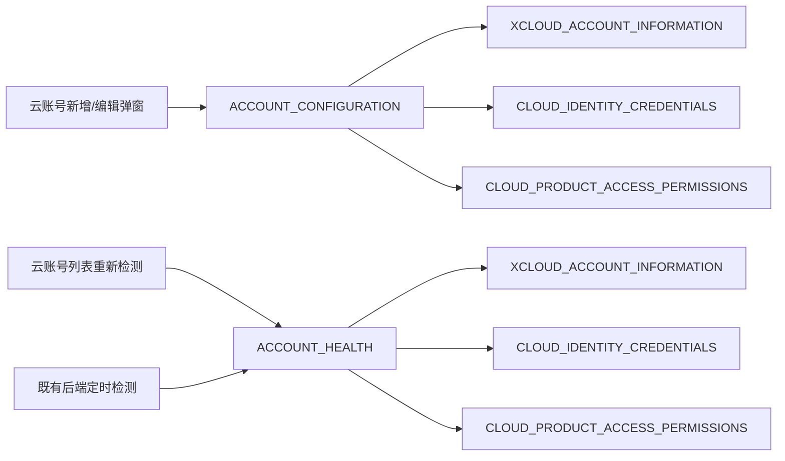
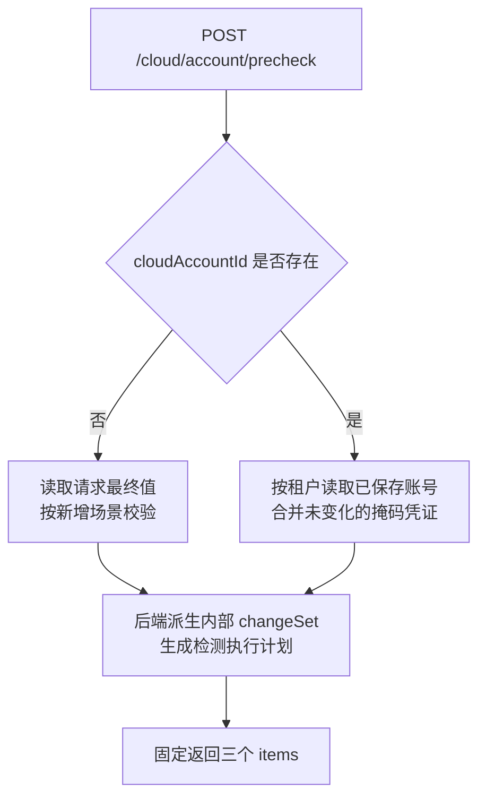
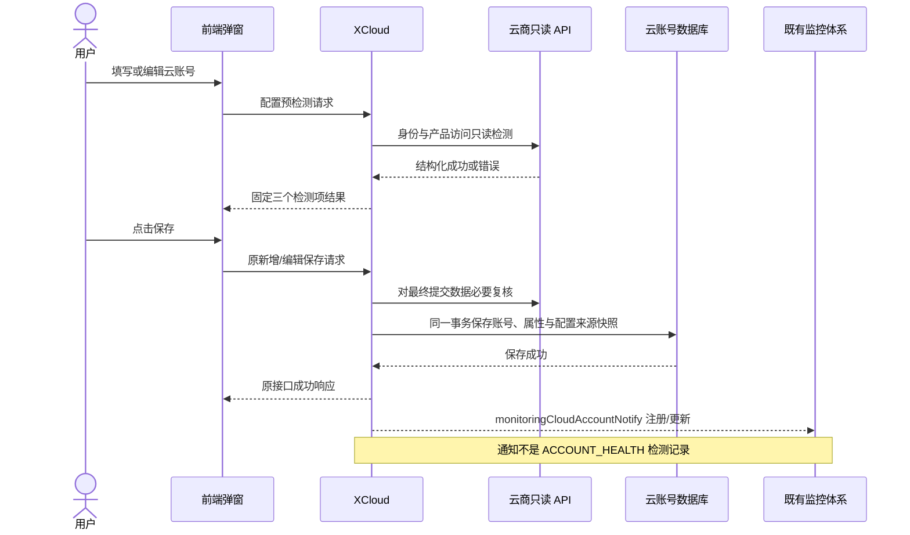
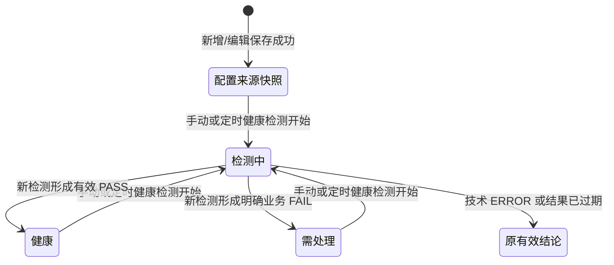

# 云账号检测阶段与统一归因架构设计

- 文档状态：已确认，可作为后端实现基线
- 最后更新：2026-08-03
- 适用系统：metis-xcloud
- 归因目录：[云账号三项检测业务归因目录](./云账号三项检测业务归因目录.md)
- 独立部署文档：[模型部署就绪性与准入归因设计](./模型部署就绪性与准入归因设计.md)

## 1. 目标与边界

本文统一云账号新增、编辑与健康检测的阶段、固定检测项、结果协议和健康快照。模型部署就绪性不属于云账号管理，已移至独立部署文档。

设计目标：

1. 检测阶段与检测项保持稳定，不把具体错误原因扩张为新的检测项。
2. 能在账号配置时安全前置的问题尽量前置，并给出明确原因和处理操作。
3. 技术执行失败也返回到实际执行它的检测项，但不伪造业务 `reasonCode`。
4. 云账号列表只展示“健康 / 需处理 / 检测中”，不暴露内部状态机。

## 2. 两个阶段与三个固定检测项

### 2.1 阶段

| `stageCode` | 触发入口 | Owner | 是否由 XCloud 统一检测接口执行 |
|---|---|---|---|
| `ACCOUNT_CONFIGURATION` | 新增或编辑云账号弹窗预检测；保存命令对最终提交数据必要复核 | XCloud | 是 |
| `ACCOUNT_HEALTH` | 云账号列表手动重新检测；后端既有定时检测 | XCloud | 是 |

新增账号保存成功后，不额外主动触发一次 `ACCOUNT_HEALTH`。保存流程继续发送已有 `monitoringCloudAccountNotify` 新增/更新通知，使既有监控体系登记或刷新账号；该通知只是监控注册信息，不是一条健康检测记录。新账号由后续既有定时检测处理。

### 2.2 固定检测项

| `checkCode` | 中文名称 | Owner |
|---|---|---|
| `XCLOUD_ACCOUNT_INFORMATION` | 账号信息 | XCloud 本地规则 |
| `CLOUD_IDENTITY_CREDENTIALS` | 云身份与凭证 | XCloud + 云商身份 API |
| `CLOUD_PRODUCT_ACCESS_PERMISSIONS` | 云产品访问与权限 | XCloud + 云商产品 API |

具体原因必须归属上述一个 `checkCode`。凭证失效、产品未开通、权限不足等都是 `reasonCode`，不是新的检测项。

### 2.3 阶段、检测项与系统边界图



阶段决定检测发生在哪个业务流程，`checkCode`决定原因归属空间。具体 `reasonCode`不能反向扩张为新的阶段或检测项。

## 3. 固定检测计划

### 3.1 `ACCOUNT_CONFIGURATION`

固定返回并按依赖顺序执行三个检测项：

```text
XCLOUD_ACCOUNT_INFORMATION
→ CLOUD_IDENTITY_CREDENTIALS
→ CLOUD_PRODUCT_ACCESS_PERMISSIONS
```

不论新增、只改名称、更新凭证或同时修改名称和凭证，前端都走同一个阶段。后端根据 `cloudAccountId`判断新增或编辑，并在合并掩码敏感字段前派生内部强类型 `CloudAccountChangeSet`；前端不生成、传入或接收 `changeSet / operationCode`，也不能改变三个固定响应槽位。

`CloudAccountChangeSet`只属于 XCloud 后端运行时决策层，不是前后端通用协议，也不持久化。它至少区分：

```text
isCreate
accountNameChanged
credentialsChanged
propertiesChanged
extensionChanged
providerChanged
effectiveChange
```

派生顺序固定为：读取租户内权威存量账号 → 识别原始请求中的凭证修改意图 → 比较非敏感配置 → 合并掩码或空凭证 → 形成规范化最终配置。不得先把 `******`替换为旧凭证再判断凭证是否变化。AK/SK作为同一凭证组更新，明确修改凭证时必须同时提交；编辑时修改 `cloudType`不属于普通更新，后端必须拒绝并要求新增另一个云账号。

内部变更集决定检测执行计划，但不改变三个检测项的稳定身份：

| 场景 | 内部变更结论 | 配置阶段执行策略 |
|---|---|---|
| 新增 | `isCreate=true` | 执行账号信息、身份凭证、云产品访问 |
| 只改名称 | `accountNameChanged=true` | 执行账号信息；身份凭证和云产品访问不重复调用云商，明确返回未执行 |
| 更新凭证或凭证相关扩展 | `credentialsChanged=true`或相关配置变化 | 执行账号信息、身份凭证和云产品访问 |
| 名称与凭证同时修改 | 两类变化同时为真 | 两类检测全部执行，成功后原子保存 |
| 无有效变化 | `effectiveChange=false` | 不调用云商、不重复持久化，保持既有成功响应 |

前项失败导致后项无法执行时，后项返回 `SKIPPED`，不能假装 `PASS`。

保存策略：

- 账号信息或身份凭证明确定失败：不允许保存。
- 技术执行失败导致身份无法确认：不允许保存，允许重新检测。
- 云产品访问或产品级授权明确失败：允许保存，但初始化为“需处理”。
- 云产品探针技术失败或当前无安全探针：不得假装通过；保存策略由检测项结果明确表达，列表不得显示“健康”。

### 3.2 `ACCOUNT_HEALTH`

同样固定返回并按依赖顺序执行三个检测项：

```text
XCLOUD_ACCOUNT_INFORMATION
→ CLOUD_IDENTITY_CREDENTIALS
→ CLOUD_PRODUCT_ACCESS_PERMISSIONS
```

入口仅有：

- 列表单账号手动重新检测；
- 后端既有定时检测任务。

健康检测读取已保存账号，不接收前端 AK/SK，不使用 Web `SecurityContext`作为异步任务上下文。保存时沿用 `monitoringCloudAccountNotify` 完成既有监控注册或信息更新，但不立即执行健康检测；后续由既有定时检测处理。

## 4. 统一检测接口

统一接口使用稳定阶段参数，不要求前端传 `operationCode`。

### 4.1 配置预检测

```http
POST /cloud/account/precheck
```

前端经现有 XCloud 网关前缀调用 `POST /general/cloud/account/precheck`。

- 请求体无 `cloudAccountId`：新增检测。
- 请求体有 `cloudAccountId`：后端读取存量账号并检测编辑后的最终值。
- 云类型只沿用已有业务字段 `cloudType`，不新增同义 `provider`字段。
- 编辑时前端掩码或空凭证由后端合并存量值，不能把掩码当真实凭证。
- 不使用 `precheckToken`、HMAC、候选版本或配置版本状态机。

### 4.2 健康重新检测

```http
POST /cloud/account/{cloudAccountId}/health-check
```

前端经现有 XCloud 网关前缀调用 `POST /general/cloud/account/{cloudAccountId}/health-check`。

后端根据 `cloudAccountId + 当前租户`读取已保存账号，阶段固定为 `ACCOUNT_HEALTH`，触发类型固定为单账号手动检测。定时任务走相同内部检测服务，但不需要前端接口。

### 4.3 统一入口路由图



前端不传 `changeSet / operationCode`控制检测计划；是否新增或编辑只由 `cloudAccountId`判断，具体变化由后端读取权威存量账号后派生。

## 5. 新增与编辑完整流程

### 5.1 弹窗阶段

```text
打开新增/编辑弹窗
→ 前端用固定三个检测项初始化“等待检测”展示
→ 调用 ACCOUNT_CONFIGURATION 预检测
→ 后端固定返回三个 items
→ 前端直接用后端 items 替换本地初始展示
```

前端初始项只是展示骨架，不是业务结果；后端返回后以后端为准。

### 5.2 保存阶段

```text
配置预检测
→ 用户提交
→ 后端对最终提交数据完成必要复核
→ 同一保存事务中写入：
   1. 云账号及属性
   2. 本次配置检测结论
   3. 账号当前健康快照
→ 新增沿用原接口返回 cloudAccountId
→ 编辑沿用原成功响应
→ 事务成功后发送已有 monitoringCloudAccountNotify 注册/更新通知
```

保存接口不需要把检测 `items`再次返回给弹窗。保存或真实云接口处理发现的问题，通过账号健康快照呈现在列表。

如果已有保存业务本身包含异步真实云接口调用，异步执行错误仍按实际发生的 `stageCode + checkCode`归因；“发生在提交之后”不等于 `ACCOUNT_HEALTH`。

### 5.3 新增/编辑与保存时序图



## 6. 配置结论与健康快照衔接

账号健康快照是列表读取的“当前有效账号结论”，不是 `ACCOUNT_HEALTH`运行记录的同义词。

配置检测结果可以初始化健康快照，但必须保留来源：

```text
sourceStageCode = ACCOUNT_CONFIGURATION
sourceCheckCode = 形成当前结论的检测项
```

例如云产品权限失败：

```text
stageCode = ACCOUNT_CONFIGURATION
checkCode = CLOUD_PRODUCT_ACCESS_PERMISSIONS
result = FAIL
reasonCode = CLOUD_PRODUCT_ACCESS_PERMISSION_MISSING

列表投影：需处理
```

后续手动或定时健康检测成功形成新结论时，覆盖快照并记录：

```text
sourceStageCode = ACCOUNT_HEALTH
```

因此不允许把配置检测记录的阶段字段改写为 `ACCOUNT_HEALTH`，也不需要为了生成列表状态额外执行一次健康检测。

## 7. 运行与检测项协议

### 7.1 运行状态

```text
runStatus: RUNNING / COMPLETED
```

同步配置检测返回 `COMPLETED`；异步或手动健康检测在执行中可投影为列表“检测中”，结束后回到“健康”或“需处理”。

### 7.2 检测项结果

```text
item.result: PASS / FAIL / ERROR / SKIPPED
```

| 结果 | 含义 | 业务 `reasonCode` | 主要字段 |
|---|---|---|---|
| `PASS` | 必要探针真实执行并通过 | 无 | `checkedAt` |
| `FAIL` | 已取得明确业务失败证据 | 有；未精确匹配时使用对应归因空间的未归因码 | `reasonCode`、`reasonParams`、`action` |
| `ERROR` | 网络、超时、SDK、解析或内部执行失败 | 无 | `errorCode`、`messageKey`、`retryable`、`action` |
| `SKIPPED` | 前项阻断或明确未执行 | 无 | `skipReason` |

技术失败仍放在发生它的检测项中，以 `stageCode + checkCode`标记执行空间，但不能包装为凭证错误、权限不足等业务原因。

示例：

```json
{
  "checkCode": "CLOUD_PRODUCT_ACCESS_PERMISSIONS",
  "result": "ERROR",
  "errorCode": "PROVIDER_REQUEST_TIMEOUT",
  "messageKey": "cloudAccount.detection.error.providerRequestTimeout",
  "retryable": true,
  "action": {
    "type": "RECHECK"
  }
}
```

不再返回独立顶层 `executionProblem`或 `policyDecision`。前端只遍历固定 `items`并按 `result`展示。

## 8. 列表状态投影

前端列表只展示：

| 列表状态 | 来源 |
|---|---|
| 健康 | 最近有效快照为健康 |
| 需处理 | 最近有效快照为明确业务失败；或新账号尚无可证明的健康结论 |
| 检测中 | 当前手动或定时健康检测正在执行 |

`ERROR`不是第四种列表状态。健康阶段发生技术失败时：

- 已有有效快照：保留旧健康/需处理结论；
- 新账号没有有效结论：保持需处理并提供重新检测；
- 记录最近一次技术尝试供后端审计，但不扩散为前端新状态。

列表时间展示“最近更新时间”，使用云账号实体已有 `updateTime`，为空时回退 `createTime`，不展示“最近检测时间”。

### 8.1 健康快照流转图



“原有效结论”只能是检测开始前已有的“健康”或“需处理”；技术失败不会生成第四种列表状态。

## 9. 最近一次有效结论规则

1. 最近一次有效业务结论一直可信，直到下一次成功检测形成新的 `PASS`或明确业务 `FAIL`。
2. 网络、超时、DNS/TLS、云商临时不可用、限流、SDK或内部失败不覆盖旧结论。
3. 即使连续技术失败，也不改变旧有效结论；只记录技术尝试和提供重试动作。
4. 单个检测项遇到可重试技术失败时，由同一次后端检测任务内部最多执行 3 次总尝试；用户点击次数不参与计数。明确业务失败不重试。
5. 健康检测开始时记录账号 `updateTime`；写回前重新读取账号。若更新时间已经变化，丢弃旧任务结果。
6. 不新增 `credentialRevision`或候选配置版本。

## 10. 云产品访问与权限范围

只检查平台真实支持产品的基础访问和产品级授权：

- 阿里云 PAI/EAS；
- AWS SageMaker；
- Google Vertex AI/Service Usage；
- 华为 ModelArts。

不扫描云商全部产品，不要求账号拥有全部管理权限。无法安全、只读、无副作用验证的能力：

- 不主动做高风险探测；
- 可以提前登记阶段、检测项、原因、Provider API、结构化错误证据和处理操作；
- 在真实业务调用取得结构化错误后归因；
- 未命中时返回当前检测项的未归因业务失败，不猜测具体原因。

Provider未实现产品探针时不得默认 `PASS`。

## 11. 后端职责

### 11.1 Request Router

- 校验租户与账号所有权；
- 根据是否存在 `cloudAccountId`识别新增或编辑；
- 读取权威存量账号，在合并掩码字段前派生内部强类型 `CloudAccountChangeSet`；
- 根据变更集生成实际执行计划，但保持三个响应槽位稳定；
- 不接收也不返回 `changeSet / operationCode`；新增或编辑只由 `cloudAccountId`判断。

### 11.2 Detection Orchestrator

- 按依赖顺序执行固定检测项；
- 负责 `PASS / FAIL / ERROR / SKIPPED`；
- 负责将技术失败放入实际检测项；
- 不生成额外检测项。

### 11.3 Provider Adapter

- 只返回结构化、安全、可证明的结果；
- 不吞异常后返回成功；
- 不用自由文本猜测业务原因；
- 未实现能力显式返回未执行或技术错误。

### 11.4 Health Snapshot

- 保存当前有效账号结论及来源阶段/检测项；
- 配置保存时初始化快照；
- 手动/定时健康检测更新快照；
- 技术失败仅记录尝试，不覆盖有效结论；
- 账号删除时删除快照。

### 11.5 既有定时检测接入契约与实现状态

XCloud统一健康服务支持两种明确触发来源：

```text
MANUAL_SINGLE：云账号列表单账号重新检测
SCHEDULED：既有监控任务按账号和租户调用
```

两者必须调用同一个健康检测服务和同一套快照写回规则。定时调用必须显式携带账号所属租户，不得读取 Web `SecurityContext`。

当前 `metis-xcloud`工作区已经提供共享健康服务并继续发送 `monitoringCloudAccountNotify`注册/更新通知；但现有工作区不包含该通知的监控消费者或定时调度实现。因此当前只能声明“XCloud接入契约已实现并通过机械测试”，不能声明“既有定时任务已经完成端到端接入”。负责监控消费者的归属仓库必须调用该服务并完成结果回读验证，才能关闭此项。

## 12. 明确取消的设计

以下设计不进入本次实现：

- `precheckToken`、HMAC检测令牌和Redis摘要；
- 候选凭证版本、`credentialRevision`、并发覆盖状态机；
- 由前端传入或面向接口返回的通用 `changeSet / changedFields`协议；后端内部强类型变更集不在取消范围；
- 顶层 `executionProblem`和 `policyDecision`；
- DetectionItem的 `PENDING/RUNNING/COMPLETED`前端协议；
- 保存成功后立即主动触发 `ACCOUNT_HEALTH`；
- 前端批量重新检测和用户可配置定时检测。

## 13. 验收条件

1. 新增与编辑预检测固定返回账号信息、身份凭证、云产品访问三个检测项。
2. 只改名称时，后端不调用云商身份和产品接口，未受影响项仍返回明确未执行结果，不由前端猜测业务状态。
3. 技术失败在对应 item 中返回 `ERROR`，无业务 `reasonCode`。
4. 云产品权限明确失败可保存，列表初始为“需处理”，快照来源为 `ACCOUNT_CONFIGURATION`。
5. 保存后只发送既有监控注册/更新通知，不主动触发 `ACCOUNT_HEALTH`。
6. 新账号通过既有监控注册机制进入后续定时检测。
7. 手动或定时检测成功后，快照来源更新为 `ACCOUNT_HEALTH`。
8. 健康技术失败不覆盖最近一次有效结论。
9. 列表只出现健康、需处理、检测中。
10. 新增接口仍返回 `cloudAccountId`，编辑接口沿用原成功响应，已有 `cloudType`业务字段不改名且不新增同义字段。
11. 可重试技术失败由单次后端检测任务内部最多执行 3 次总尝试，前端不需要连续点击。
12. 前端不传 `changeSet / operationCode`；后端能够区分新增、只改名称、更新凭证、同时修改和无有效变化。
13. 掩码或空凭证不会被判为新凭证；凭证检测失败时不覆盖旧凭证，无有效变化时不重复持久化或发送更新通知。
