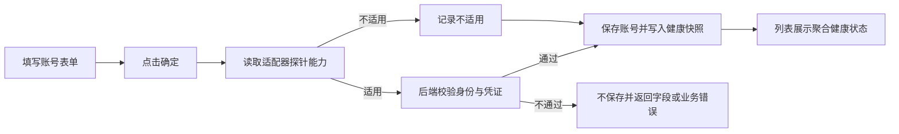
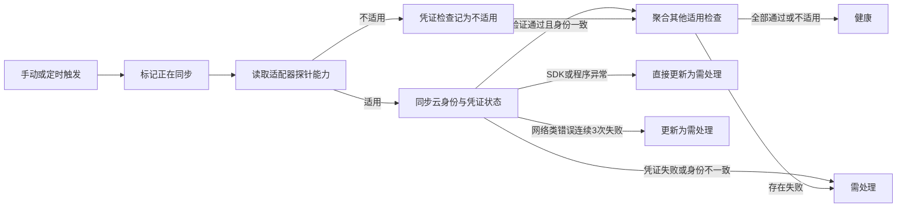

# 云账号身份凭证健康状态维护需求开发文档

## 1. 文档信息

- 文档状态：待开发
- 编制日期：2026-08-05
- 产品范围：算枢 On-Cloud 云账号管理
- 前端仓库：`project-mamba`
- 后端仓库：`metis-xcloud`
- 本文性质：替代本轮“保存前预检 + 云产品访问权限检测”方向的全新开发需求，不修改既有评估文档和原型文件

## 2. 版本与事实基线

### 2.1 后端事实基线

本需求核验并固定以下版本：

- `metis-xcloud origin/test`：`490dd78d08f6474e76c0c5fcdde6efa7748e7a59`
- `metis-xcloud xcloud-dev-xia`：`0f71270955dac9a243854b42ef062b73a361674e`

当前事实：

1. `origin/test` 已有各云商的 `validateAccount()` 身份与凭证校验实现。
2. `origin/test` 已定义 `accountNeedDisable()`，但仓内没有调用方，也没有云账号 `@HyperoneJob` 定时任务，因此不能视为已有可运行的周期检测能力。
3. `xcloud-dev-xia` 已增加健康快照、单账号健康检测服务、`MANUAL_SINGLE / SCHEDULED` 触发类型、原因码和状态字段。
4. `xcloud-dev-xia` 仍没有实际的云账号 `@HyperoneJob` 周期任务；`SCHEDULED` 当前只是枚举值。
5. `xcloud-dev-xia` 的通用 `/cloud/account` 分页查询未装配健康快照；只有终端用户查询链路装配了快照。当前目标前端实际调用通用 `/cloud/account`，因此列表状态仍缺少后端装配。
6. `xcloud-dev-xia` 同时加入了阿里云 PAI/EAS、AWS SageMaker、Google Vertex AI、华为云 ModelArts 的访问探针。本需求明确删除这些探针及其业务契约。
7. `xcloud-dev-xia` 当前对网络和部分可重试技术错误最多尝试 3 次，但同步最终产生 `ERROR` 时只记录最近尝试，不覆盖已有健康结论；该行为不符合本需求，需要改为失败后更新为 `ACTION_REQUIRED`。

### 2.2 前端事实基线

- `project-mamba origin/test`：`e174a6798fd08c83d58ede7a5489bb99ec07aad9`

当前事实：

1. 页面归属：`apps/hashrate/src/views/index/op/access/account/`。
2. 列表通过 `Api.general.cloud.account.get` 调用 `/cloud/account`。
3. 添加/编辑弹窗当前直接调用新增或编辑接口，没有接入独立预检接口。
4. 当前列表仅展示原有账号启停状态，没有健康状态、健康原因和同步状态。
5. 当前卡片已经使用账号 `createTime`，但现有新原型错误地把时间标成了“最近检测时间”。

## 3. 需求结论

本期将云账号健康能力收敛为单一语义：

> 云账号健康状态只回答“已保存凭证能否识别并访问原绑定云身份”，不回答任何云产品是否开通、是否有产品权限、是否能够部署模型。

页面保留三种用户可见状态：

- 健康
- 需处理
- 正在同步

添加和编辑不再提供独立检测步骤；用户完成表单后直接点击“确定”。列表通过保存后的健康快照、手动同步和后台定时同步维护状态。

## 4. 目标用户与页面任务

### 4.1 目标用户

已获得云平台授权、负责维护本租户云账号凭证的算枢用户。

### 4.2 页面主任务

1. 查看已接入的云账号。
2. 判断账号身份与凭证当前是否正常。
3. 对异常账号更新凭证。
4. 主动同步单个账号的最新身份凭证状态。
5. 添加、编辑或删除云账号。

### 4.3 页面主操作

页面唯一主操作为“添加云账号”。页面不提供面向全部账号的同步操作。

## 5. 本期范围

### 5.1 本期包含

- 删除添加/编辑弹窗中的检测说明、检测项和检测进度。
- 提交按钮统一为“确定”。
- 新增、编辑继续由原提交接口完成，不增加前端预检请求。
- 列表增加健康、需处理、正在同步三种状态展示和筛选。
- 列表增加身份凭证异常原因及可执行动作。
- 单账号“重新检测”统一改名为“同步状态”。
- 卡片时间展示账号创建时间，只显示时间值，不出现“最近检测时间”文案。
- 后端健康检测只执行身份与凭证校验。
- 身份凭证探针是否执行由云适配器能力声明决定：Infracube 继续执行，后续新增的其他私有云默认跳过。
- 补齐实际 `@HyperoneJob` 定时同步任务。
- 补齐通用 `/cloud/account` 列表的健康快照装配和健康状态筛选。
- SDK/程序异常直接更新为需处理；网络类错误最多尝试 3 次后仍失败也更新为需处理。

### 5.2 明确不包含

- 阿里云 PAI Workspace 或 EAS 访问检测。
- AWS SageMaker 访问检测。
- Google Vertex AI 或 Service Usage 检测。
- 华为云 ModelArts 访问检测。
- 根据列表权限判断模型是否可部署。
- 根据健康状态承诺账号具备创建服务、网络、存储、角色、配额或账务能力。
- 独立云产品开通指南、权限指南或产品修复入口。
- 新增或编辑前的独立预检接口和三项检测结果展示。
- “检测全部账号”“同步全部状态”或其他面向用户的批量同步操作。
- 本期新增全平台云身份唯一索引；相关多租户唯一性应单独决策，不与健康状态改造绑定上线。

## 6. 关键业务规则

### 6.1 添加云账号

1. 弹窗只展示账号接入所需字段。
2. 不展示检测说明条和检测项列表。
3. 不出现“检测并添加”按钮，提交按钮固定为“确定”。
4. 点击“确定”后直接调用新增接口。
5. 后端仍须在保存前完成账号信息校验和重复账号规则校验；仅当云适配器声明支持身份凭证探针时执行身份凭证校验。
6. 身份凭证校验成功，或该云类型明确不适用身份凭证探针时，保存账号并按全部适用检查项形成健康快照。
7. 校验失败时不保存，前端按标准表单提交错误展示后端文案，不进入独立检测结果页面。

### 6.2 编辑云账号

1. 编辑弹窗使用直接提交模式，按钮为“确定”。
2. 只修改账号名称等非凭证字段时，不调用云商身份接口，不改变现有健康结论。
3. 修改 AK/SK、服务账号、项目身份或其他凭证字段时，只有声明支持身份凭证探针的云适配器才重新识别云身份。
4. 执行身份识别时，新凭证必须仍属于原绑定云身份；不一致时阻止保存并返回明确错误。
5. 凭证校验成功，或该云类型明确不适用身份凭证探针时，保存并按全部适用检查项更新健康快照。
6. 编辑请求不得执行任何云产品访问或权限探针。

### 6.3 列表健康状态

| 后端状态 | 活动状态 | 页面展示 | 业务含义 |
| --- | --- | --- | --- |
| `HEALTHY` | `IDLE` | 健康 | 当前所有适用检查项均通过；不适用的身份凭证探针不参与失败判定 |
| `ACTION_REQUIRED` | `IDLE` | 需处理 | 凭证明确失败、身份不一致、尚无快照，或最近一次同步形成了业务失败/技术失败结论 |
| 任意 | `RUNNING` | 正在同步 | 当前正在执行健康状态同步，活动状态覆盖健康主状态 |

禁止把以下事实写成健康结论：

- 可用于部署模型。
- 云产品已开通。
- 已具备云产品权限。
- 已具备创建推理服务或训练任务的能力。

健康账号如需辅助文案，只允许使用“云身份与凭证正常”；不得使用“可用于部署模型”。

### 6.4 需处理原因与动作

| 场景 | 状态 | 原因文案方向 | 主要动作 |
| --- | --- | --- | --- |
| AK/SK 或凭证包认证失败 | 需处理 | 云身份与凭证认证失败 | 更新凭证 |
| Google 项目或服务账号格式错误 | 需处理 | 凭证信息不完整或格式错误 | 更新凭证 |
| 当前凭证与已绑定身份不一致 | 需处理 | 当前凭证与已绑定云账号不一致 | 更新凭证 |
| 身份认证失败但云商未提供可可靠细分的原因 | 需处理 | 云身份与凭证认证失败 | 明确属于凭证问题时更新凭证；否则不提供推测性动作 |
| 历史账号尚无健康快照 | 需处理 | 状态待同步 | 无专属处理动作；用户可使用卡片菜单中的统一“同步状态” |
| SDK、适配器或程序执行异常 | 需处理 | 按具体运行错误原因码翻译，例如检测配置缺失或内部执行错误 | 无专属处理动作；无需重试，记录脱敏错误供后端排查 |
| 网络连接、超时、DNS、限流或云商服务异常 | 需处理 | 按具体网络原因码翻译，例如连接超时、DNS 失败或云商限流 | 无专属处理动作；后端最多尝试 3 次，用户可在任务结束后再次同步 |

前端只实现一类由健康原因推荐的处理动作：

- `UPDATE_CREDENTIALS`：更新凭证。

“同步状态”不是异常原因对应的 `actionType`，而是所有账号共有的单账号菜单命令。账号处于 `IDLE` 时，无论健康、需处理或尚无快照，都允许用户主动触发；账号处于 `RUNNING` 时不得再次触发。

删除 `SYNC_STATUS`、`RESOLVE_IN_CLOUD` 以及所有面向云产品的健康动作类型。未知操作类型不得猜测执行路径。当前云商身份接口和已有 SDK 无法稳定区分 AccessKey 被禁用、IAM/RAM 用户异常、服务账号删除或云账号冻结，因此不得生成“前往云平台处理”等推测性动作。

原因码必须直接表达导致账号进入“需处理”的具体原因，不能使用 `STATUS_PENDING`、`STATUS_SYNC_ERROR`、`STATUS_SYNC_FAILED` 这类再次描述状态或失败大类的聚合码。

状态与原因的关系固定为：

| 健康状态 | 活动状态 | 当前原因码规则 |
| --- | --- | --- |
| `HEALTHY` | `IDLE` | `reasonCode=null`，健康本身不是原因码 |
| 任意 | `RUNNING` | 页面不展示原因；正在同步是活动状态，不是原因码 |
| `ACTION_REQUIRED` | `IDLE` | 必须返回能够被当前证据直接支持的具体原因码 |

本期允许形成“需处理”的具体原因码包括：

- 凭证与身份：`CREDENTIAL_FORMAT_INVALID`、`CREDENTIAL_PROJECT_MISMATCH`、`CREDENTIAL_AUTH_FAILED`、`CREDENTIAL_ACCOUNT_MISMATCH`、`CLOUD_IDENTITY_ERROR_UNCLASSIFIED`。
- 尚未检测：`HEALTH_SNAPSHOT_MISSING`，仅用于历史账号确实没有健康快照的事实，不使用 `STATUS_PENDING`。
- 网络与云商临时错误：`PROVIDER_CONNECT_TIMEOUT`、`PROVIDER_CONNECTION_FAILED`、`PROVIDER_READ_TIMEOUT`、`PROVIDER_DNS_RESOLUTION_FAILED`、`PROVIDER_RATE_LIMITED`、`PROVIDER_SERVICE_UNAVAILABLE`、`PROVIDER_REQUEST_FAILED`。
- 后端运行错误：`PROXY_UNAVAILABLE`、`TLS_HANDSHAKE_FAILED`、`DETECTION_CONFIGURATION_MISSING`、`PROVIDER_RESPONSE_INVALID`、`DETECTION_INTERNAL_ERROR`。

网络类原因码只在包含首次调用在内连续 3 次均失败后写入当前主原因；SDK、适配器或程序类原因码在首次失败后直接写入当前主原因。两类失败都必须把健康状态更新为 `ACTION_REQUIRED`。如底层只能证明“认证失败”而不能证明凭证被禁用或云账号冻结，只能返回 `CREDENTIAL_AUTH_FAILED` 或 `CLOUD_IDENTITY_ERROR_UNCLASSIFIED`，不得返回未经证据支持的原因。

### 6.5 私有云身份凭证探针规则

1. 私有云不按平台属性整体跳过身份凭证探针，是否执行由具体云适配器的能力声明决定。
2. Infracube 是 AGIOne 自身可控的私有云，具备受控网关、SDK 和只读探针，本期继续执行身份凭证检测。
3. Infracube 只有在网关返回 `401`、明确的 `AccessKeyInvalid`、`SignatureInvalid` 或等价确定性证据时，才能归因为凭证认证失败。
4. Infracube 返回 `403` 时，只有错误码明确指向凭证才能归因为凭证失败；无法证明时按未分类业务失败或技术失败处理，不得引导用户误改 AK/SK。
5. Infracube 的 DNS、连接、读取超时、`429` 和 `5xx` 按统一网络规则最多执行 3 次；响应为空或无法解析、SDK 或程序异常按统一技术失败规则处理。
6. 后续新增的其他私有云默认将 `CLOUD_IDENTITY_CREDENTIALS` 记录为 `SKIPPED + NOT_APPLICABLE`，不得调用其凭证认证探针。
7. 其他私有云只有在具备稳定只读接口、确定性错误证据和受控测试后，才可由适配器显式声明支持身份凭证探针。
8. 身份凭证探针被跳过不等于账号固定健康；账号仍参与相同的手动同步、定时任务、并发控制、快照维护、其他适用检查和状态聚合。
9. 不得使用 `if (privateCloud)` 作为跳过条件，也不得在通用服务中持续追加云类型分支；通用编排只消费适配器能力声明。

### 6.6 时间展示

1. 卡片底部时间绑定云账号记录的 `createTime`。
2. 页面只展示格式化后的时间值，不显示“最近检测时间”“创建时间”等尾随说明。
3. `lastAttemptAt`、`lastValidDetectedAt` 可作为后端任务诊断字段保留，但不得替代卡片创建时间，也不在本期列表首屏展示。

## 7. 前端需求

### 7.1 添加/编辑弹窗

需要删除：

- 检测说明条。
- 检测项列表。
- 弹窗内检测状态。
- “检测并添加”“检测并保存”等按钮文案。
- 对预检接口的调用和预检结果状态管理。

需要保留：

- 账号名称、云平台及各云商真实需要的身份凭证字段。
- 取消和确定。
- 标准字段校验、提交 loading、后端错误反馈。

实现约束：

- 表单弹层必须使用项目封装 `FormDialog.show`，不得继续扩展手写 `el-dialog + el-form`。
- 凭证继续在请求前按项目既有方式加密。
- 用户可见文案写入 `apps/hashrate` 本地中英文 locale。

### 7.2 列表卡片

每张卡片首屏只展示：

- 云平台标识、账号名称、云平台名称和公有云属性。
- 健康、需处理或正在同步状态。
- 需处理时的单行原因。
- 明确属于凭证问题时的“更新凭证”按钮。
- 账号创建时间。
- 编辑和更多操作。

健康卡片不得展示云产品或部署能力结论。

### 7.3 筛选

状态筛选改为健康状态筛选：全部状态、健康、需处理、正在同步。

该筛选不得继续复用云账号启停字段 `status`。前后端新增独立健康筛选参数，避免混淆账号启停与身份凭证健康。

### 7.4 同步操作

- 卡片更多菜单中的“重新检测”改为“同步状态”。
- 单账号同步只处理当前账号。
- 健康、需处理和历史无快照账号只要活动状态为 `IDLE`，均可主动触发“同步状态”。
- 同步开始后列表显示正在同步；完成后刷新为健康或需处理。
- 活动状态为 `RUNNING` 时，“同步状态”显示为不可点击的“同步中”或等价禁用态，不得创建并发重复同步。
- 前端禁用只用于即时反馈；后端仍必须以原子占用或等价机制拒绝并发重复触发。
- 因异常遗留的 `RUNNING` 只有在后端判定活动超时并恢复后，才能重新触发；前端不得绕过活动状态强制提交。
- 页面不展示“检测全部账号”“同步全部状态”或等价批量操作。

### 7.5 目标用户五秒自检

用户只扫标题、状态和按钮时，必须知道这里维护的是云账号、哪些账号需要处理、应更新凭证还是同步状态，以及添加账号会直接提交。

## 8. 后端需求

### 8.1 添加/编辑提交链路

```text
前端确定
  → 新增/编辑接口
  → 基础字段与重复规则校验
  → 读取云适配器身份凭证探针能力
  → 仅在新增或凭证变化且探针适用时执行身份凭证校验
  → 探针适用时校验绑定身份
  → 保存账号
  → 更新健康快照
  → 返回提交结果
```

要求：

- 删除对 `POST /cloud/account/precheck` 的产品依赖和前端契约；若该接口尚未对外发布，应直接移除。
- 复用 `CloudAccountChangeDetector` 的“名称变化不触发云商调用”能力。
- 复用 `CloudAccountIdentityDetectionService` 和 `CloudAccountBindingPolicy`，不得重新复制各云商判断。
- 复用统一的云适配器能力声明：Infracube 支持身份凭证探针，其他新增私有云默认不适用；不得按 `platformType=private` 整体跳过。
- 外部云商请求必须位于数据库事务外。
- 保存成功后更新快照失败不得静默，事务边界和补偿策略必须有单测证明。

### 8.2 身份凭证适配

| 云商 | 身份凭证检测目标 | 本期禁止调用 |
| --- | --- | --- |
| 阿里云 | 使用 STS `GetCallerIdentity` 获取 `AccountId` 和调用主体信息 | `QueryBillOverview`、PAI Workspace、EAS |
| AWS | 使用 STS `GetCallerIdentity` 获取 Account 和 ARN | SageMaker 列表接口 |
| Google Cloud | 校验凭证结构、项目与服务账号身份，并完成必要的在线认证 | Service Usage、Vertex AI Endpoint 列表 |
| 华为云 | 通过 IAM 识别 Domain/账号身份并验证凭证 | ModelArts API Key 或产品列表接口 |
| Infracube | 通过受控网关和只读接口验证 AK/SK 签名；保留确定性错误证据 | 云产品、资源和权限探针 |
| 其他新增私有云 | 默认不执行身份凭证探针，记录 `SKIPPED + NOT_APPLICABLE` | 未声明能力的认证接口 |

阿里云不得继续使用账单接口识别账号身份，避免合法 RAM 凭证因缺少账单权限被拒绝。

### 8.3 健康同步核心服务

所有触发方式必须复用同一个身份凭证健康同步服务：

- 单账号手动同步。
- 后台定时同步。

核心服务只执行：

1. 读取已保存账号、加密凭证和云适配器能力声明。
2. 标记活动状态为 `RUNNING`。
3. 探针适用时解密并调用对应云商身份凭证适配器；不适用时记录 `SKIPPED + NOT_APPLICABLE`。
4. 仅在探针适用且能够识别身份时校验识别结果与已绑定身份一致。
5. 形成健康或需处理结论。
6. 原子更新健康快照并恢复活动状态为 `IDLE`。

禁止调用 `validateCloudProductAccess()` 或任何等价产品探针。

### 8.4 实际定时任务

需要新增真实的 `@HyperoneJob` 平台任务，不能只保留 `SCHEDULED` 枚举。

任务要求：

- 任务名称全局唯一。
- `@HyperoneJob` 注册默认 cron 为 `0 0 */6 * * ?`，即每 6 小时执行一次；任务后台可按环境调整，业务方法内不得再实现第二套时间判断。
- 无需业务参数时不制造无意义默认参数。
- 只查询启用、未删除且属于本期健康维护范围的云账号；身份凭证探针不适用的私有云仍须进入任务。
- 每页最多查询 50 个账号，按稳定主键顺序分页或游标推进，禁止全量无边界加载。
- 首版单任务内串行处理账号，不自行创建线程池；后续只有在真实账号规模和云商限流证据支持时才单独评审并发化。
- 单账号失败不得中断整批账号。
- 每个账号复用健康同步核心服务。
- 记录安全的账号 ID、云类型、结果码和耗时，不记录 AK/SK、完整异常响应或凭证对象。
- 任务可重复执行，不能因重复触发写出冲突快照。
- 手动同步和定时同步并发时，同一账号只能有一个有效执行者。
- 任何异常路径都必须清除或恢复 `RUNNING`，并提供超时活动状态恢复机制。
- 单次云商身份请求最长 30 秒；网络类错误包含首次调用在内最多执行 3 次。
- `RUNNING` 持续超过 5 分钟视为活动租约过期；新的手动或定时触发可以原子接管，旧执行结果仍须通过账号版本和本次执行令牌校验，不能覆盖新结果。

### 8.5 手动同步接口

业务命名统一为“同步状态”。目标接口为：

- `POST /cloud/account/{id}/sync-status`：校验租户和账号归属后同步指定账号。

不提供当前租户全部账号同步接口，也不允许前端逐账号循环模拟批量同步。

开发分支既有 `POST /cloud/account/{id}/health-check` 尚未作为本需求正式契约，实施时删除该路径并改为 `/sync-status`，不保留两个同义入口。Swagger、权限文案、前端文案和业务方法名统一表达“同步状态”；该路径不得执行产品权限检测。

手动同步接口不再返回检测阶段、触发来源、检测项数组、跳过原因或内部分类状态。取得执行权并完成同步后，返回当前账号最终健康摘要；未取得执行权时不重复调用云商，直接返回该账号 `RUNNING` 健康摘要。前端收到 `RUNNING` 后保持“同步中”，收到 `IDLE` 后按最终状态刷新卡片。

### 8.6 列表装配与筛选

前端实际调用 `/cloud/account`，因此 `CloudAccountServiceImpl.pageQuery()` 必须补齐健康快照批量装配。

要求：

- 一次批量查询当前页账号的快照，禁止逐卡 N+1 查询。
- 无快照账号返回 `ACTION_REQUIRED + IDLE`，原因表达“状态待同步”，不返回专属健康处理动作；用户仍可使用统一菜单命令“同步状态”。
- 支持独立健康筛选参数，不复用账号启停 `status`。
- 健康筛选在后端分页前完成，不能先分页再由前端过滤造成总数和页数据不一致。
- 正在同步由 `detectionActivity=RUNNING` 判断，并覆盖健康主状态。
- 列表继续返回账号记录 `createTime`。

查询参数新增独立字段：

```text
healthViewStatus: HEALTHY | ACTION_REQUIRED | RUNNING
```

不传表示全部。映射规则：

- `HEALTHY`：`health_status=HEALTHY` 且活动状态不是 `RUNNING`。
- `ACTION_REQUIRED`：活动状态不是 `RUNNING`，并且主状态为 `ACTION_REQUIRED` 或账号没有健康快照。
- `RUNNING`：`detection_activity=RUNNING`，忽略底层保留的主健康状态。

该参数必须同时作用于 `pageQueryCount()` 和 `pageQuery()` 的数据库查询条件。禁止先分页后在 Java 或前端过滤。

### 8.7 对外健康契约

`GET /cloud/account` 继续使用现有 `ResponseMessage<PagerResult<CloudAccountVo>>` 包装，已有账号业务字段保持兼容。本期新增/收敛的健康部分固定为以下字段：

```text
healthStatus
detectionActivity
reasonCode
reasonMessage
actionType
actionLabel
createTime
```

其中 `createTime` 是账号原有字段，不属于健康快照；页面底部只使用该字段显示账号创建时间。

字段值约束：

```text
healthStatus: HEALTHY | ACTION_REQUIRED
detectionActivity: IDLE | RUNNING
actionType: UPDATE_CREDENTIALS | null
```

`actionType/actionLabel` 只表达由健康原因推荐的处理动作，不承载统一菜单命令“同步状态”。`sourceStageCode`、`sourceCheckCode`、`lastAttempt*` 可作为后端内部诊断数据保留，但不是本期页面首屏契约。前端不得依赖这些字段推导健康状态。

技术失败结束后，具体技术原因必须进入当前快照的 `reasonCode`，不能只写入 `lastAttemptErrorCode` 后继续保留历史健康主原因。`lastAttemptErrorCode` 可以继续保留为诊断字段，但不得成为列表判断当前原因的唯一来源。

列表成功响应的完整包装示例：

```json
{
  "message": null,
  "result": {
    "total": 1,
    "data": [
      {
        "id": "cloud-account-id",
        "name": "生产推理账号",
        "cloudType": "aliyun",
        "platformType": "public",
        "accountId": "provider-account-id",
        "accountName": "provider-account-name",
        "status": 1,
        "createTime": "2026-07-24 09:00:00",
        "healthStatus": "ACTION_REQUIRED",
        "detectionActivity": "IDLE",
        "reasonCode": "CREDENTIAL_AUTH_FAILED",
        "reasonMessage": "云身份与凭证认证失败",
        "reasonParams": {
          "credentialField": "CREDENTIAL_BUNDLE"
        },
        "actionType": "UPDATE_CREDENTIALS",
        "actionLabel": "更新凭证"
      }
    ]
  },
  "status": 200,
  "timestamp": "1786064400000",
  "requestId": "request-id"
}
```

示例中的账号 ID、账号名称、云商账号标识、时间戳和请求 ID 仅用于说明数据结构，不作为测试数据或固定返回值。实际 `/cloud/account` 仍可能包含已有兼容业务字段；本期前端健康展示只能依赖上面列出的健康字段和 `createTime`。

单账号“同步状态”成功或命中已有运行任务时，返回同一套健康摘要，不返回检测项数组：

```json
{
  "message": null,
  "result": {
    "cloudAccountId": "cloud-account-id",
    "healthStatus": "HEALTHY",
    "detectionActivity": "IDLE",
    "reasonCode": null,
    "reasonMessage": null,
    "reasonParams": null,
    "actionType": null,
    "actionLabel": null
  },
  "status": 200,
  "timestamp": "1786064400000",
  "requestId": "request-id"
}
```

如果同一账号已经在同步，接口不创建第二个任务，`result.detectionActivity` 返回 `RUNNING`；此时 `reasonCode/reasonMessage/reasonParams/actionType/actionLabel` 均返回 `null`，前端只展示“同步中”。底层快照可以保留同步前的历史结论，但本次对外摘要不得让前端同时展示历史原因和“同步中”。

## 9. 需要删除或收敛的后端逻辑

### 9.1 接口与检测项

- 删除 `CLOUD_PRODUCT_ACCESS_PERMISSIONS` 检测项。
- 删除 `supportsCloudProductAccessValidation()`。
- 删除 `validateCloudProductAccess()`。
- 删除保存前固定三槽位检测协议。
- 删除云产品探针参与健康状态聚合的逻辑。
- 删除前端未发布时的 `/cloud/account/precheck` 接口和相关生成契约。
- 保留身份凭证探针能力声明；该声明只决定 `CLOUD_IDENTITY_CREDENTIALS` 是否适用，不改变其他健康流程。
- Infracube 显式声明支持身份凭证探针；后续新增的其他私有云默认不适用，具备可靠证据后再显式开启。

### 9.2 原因码与动作

删除所有云产品原因码：

- `CLOUD_PRODUCT_NOT_ENABLED`
- `CLOUD_PRODUCT_ACCESS_PERMISSION_MISSING`
- `CLOUD_PRODUCT_AUTHORIZATION_NOT_CONFIGURED`
- `CLOUD_PRODUCT_AUTHORIZATION_INVALID`
- `CLOUD_PRODUCT_ACCOUNT_RESTRICTED`
- `CLOUD_PRODUCT_ERROR_UNCLASSIFIED`

删除当前云商适配器无法提供可靠证据的原因码：

- `CREDENTIAL_DISABLED`
- `CLOUD_ACCOUNT_SUSPENDED`

不得新增 `STATUS_PENDING`、`STATUS_SYNC_ERROR`、`STATUS_SYNC_FAILED` 等状态型聚合原因码；按第 6.4 节写入具体原因码。

删除所有云产品动作：

- `ENABLE_CLOUD_PRODUCT`
- `VIEW_REQUIRED_PERMISSIONS`
- `CONFIGURE_CLOUD_PRODUCT_AUTHORIZATION`
- `REPAIR_CLOUD_PRODUCT_AUTHORIZATION`
- `RESOLVE_CLOUD_ACCOUNT_RESTRICTION`

删除健康动作枚举中的 `RECHECK`、`CHANGE_ACCOUNT_NAME`、`USE_ORIGINAL_ACCOUNT_CREDENTIALS`、`VIEW_EXISTING_ACCOUNT`；如果原型或未发布契约中存在 `SYNC_STATUS`、`RESOLVE_IN_CLOUD` 也一并删除。健康维护对外动作只保留 `UPDATE_CREDENTIALS`。“同步状态”作为独立业务命令、接口权限和菜单文案保留，不进入健康原因动作枚举。

### 9.3 云商实现、配置与依赖

- 删除阿里云 PAI/EAS 探针代码及仅为其增加的 SDK 依赖。
- 删除 AWS SageMaker 探针代码及仅为其增加的 SDK 依赖。
- 删除 Google Vertex AI/Service Usage 探针代码。
- 删除华为云 ModelArts 探针代码。
- 删除 `hyperone.cloud-account.validation-region.*` 配置。
- 删除云产品检测专用错误码和中英文文案。
- 删除或重写只覆盖产品权限检测的测试。

### 9.4 数据结构边界

健康快照表可以保留最近尝试时间和错误信息作为内部诊断事实，但：

- 不再写入任何产品检测项或产品原因码。
- 不要求本期删除已存在的兼容列，避免为了字段整洁执行破坏性迁移。
- 若该表尚未进入测试环境，应直接整理为最终自包含主 DDL，不保留多份依赖执行顺序的临时 SQL。
- 云身份唯一索引不随本需求默认上线。

## 10. 前后端状态流程

### 10.1 添加或编辑



### 10.2 状态同步



## 11. 前端代码地图

| 目标 | 当前代码位置 | 目标改动 |
| --- | --- | --- |
| 云账号页面 | `apps/hashrate/src/views/index/op/access/account/index.vue` | 接入健康筛选和单账号同步后的列表刷新，不增加批量同步按钮 |
| 账号卡片 | `apps/hashrate/src/views/index/op/access/account/components/AccountCard.vue` | 展示健康状态、单行原因、动作和创建时间 |
| 添加/编辑弹窗 | `apps/hashrate/src/views/index/op/access/account/components/AddDialog.vue` | 移除检测 UI，按钮为确定，并按项目规则收敛到 `FormDialog.show` |
| 列表数据 | `apps/hashrate/src/views/index/op/access/account/useList.ts` | 使用健康筛选参数，刷新同步状态 |
| 页面动作 | `apps/hashrate/src/views/index/op/access/account/useActions.ts` | 增加单账号同步状态；保留编辑和删除 |
| 筛选 | `apps/hashrate/src/views/index/op/access/account/useFilter.ts` | 原账号启停筛选改为独立健康状态筛选 |
| 多语言 | `apps/hashrate/src/locales/zh-cn/op.ts`、`apps/hashrate/src/locales/en/op.ts` | 新增健康、需处理、正在同步、同步状态等文案，删除废弃检测文案 |
| API 类型 | `packages/api/general` | 后端 Swagger 定稿后重新生成，不手改生成文件 |

## 12. 后端代码地图

### 12.1 分支与实施边界

- 唯一目标分支：`metis-xcloud/xcloud-dev-xia`。
- 不直接修改 `origin/test`，不把 `origin/test` 合入当前分支作为本需求的前置动作。
- 不修改 `metis-hashrate`；其现有任务只能作为 `@HyperoneJob` 使用方式参考，不能承担云账号健康任务。
- 不新增数据库列。并发执行版本使用健康快照 `update_time` 对应的本次抢占时间，账号凭证版本继续使用账号 `updateTime`；完成写入时同时校验两者。
- 不提交、不推送，除非 Owner 在编码完成后另行明确要求。

### 12.2 生产代码改造清单

| 目标 | 当前代码位置 | 目标改动 |
| --- | --- | --- |
| 云账号提交 | `hyperone-account-local/.../CloudAccountServiceImpl.java` | 直接提交；新增或凭证变化时只校验身份凭证；名称变化不请求云商；通用分页装配健康快照 |
| 提交持久化 | `hyperone-account-local/.../CloudAccountConfigurationPersistenceService.java` | 新增或凭证更新成功后写入 `HEALTHY + IDLE`；保持外部云商调用在事务外 |
| 配置检测 | `hyperone-account-local/.../CloudAccountConfigurationDetectionService.java` | 删除三槽位预检和产品检测；只保留提交链路需要的账号信息、身份凭证与绑定校验 |
| 探针能力策略 | 新增身份凭证探针能力声明 | Infracube 显式支持；其他新增私有云默认不适用；通用服务不得按私有云整体硬编码 |
| 身份检测 | `CloudAccountIdentityDetectionService` | 继续作为探针适用时各触发方式的统一入口 |
| 健康检测 | `CloudAccountHealthDetectionService` | 保留适用性判断、身份凭证检测和统一状态聚合；不适用项写入 `SKIPPED + NOT_APPLICABLE` |
| 重试分类 | `CloudAccountDetectionRetryExecutor.java` | 网络类最多总计 3 次；程序、SDK、配置类错误不重试；移除产品检测错误码和 `RECHECK` 动作生成 |
| 原因分类 | `CloudAccountReasonClassifier.java` | 只保留证据可支持的身份凭证原因；身份不一致统一映射为更新凭证；删除禁用、冻结和产品权限推测归因 |
| 原因枚举 | `CloudAccountHealthReasonCode.java` | 删除产品、禁用和冻结原因；加入无快照及具体网络/运行错误原因码 |
| 动作枚举 | `CloudAccountHealthActionType.java` | 健康维护对外只保留 `UPDATE_CREDENTIALS`；删除 `RECHECK`、云平台处理和产品权限动作 |
| 健康摘要 | 新增 `CloudAccountHealthSummaryVo.java` | 作为手动同步接口返回，字段只包含账号 ID、健康状态、活动状态、具体原因及可选凭证动作 |
| 列表 VO | `CloudAccountVo.java` | 保留现有兼容字段；健康字段使用具体原因码和后端国际化文案；不让前端依赖内部最近尝试字段 |
| 查询参数 | `CloudAccountQuery.java`、新增 `CloudAccountHealthViewStatus.java` | 增加 `healthViewStatus=HEALTHY/ACTION_REQUIRED/RUNNING`，不复用账号启停 `status` |
| 健康快照服务 | `CloudAccountHealthSnapshotService.java` | 技术失败覆盖主状态；无快照映射具体原因；运行中对外抑制历史原因；完成结果按抢占版本条件写入 |
| 快照 DAO/SQL | `CloudAccountHealthSnapshotDao.java`、`CloudAccountHealthSnapshotMapper.xml` | `markChecking` 改为原子抢占并返回是否成功；支持 5 分钟超时接管；条件完成与删除保持幂等 |
| 手动同步 | `CloudAccountHealthService.java`、`CloudAccountHealthServiceImpl.java` | 方法改为 `syncStatus`；所有结束路径 `finally` 恢复活动状态；未抢到执行权直接返回 `RUNNING` 摘要 |
| 定时任务 | 新增 `hyperone-account-local/.../task/CloudAccountHealthSyncTask.java` | 注册每 6 小时任务；每页 50 个、串行、单账号失败隔离，复用 `syncStatus` 核心服务 |
| 定时查询 | `CloudAccountDao.java`、`CloudAccountMapper.xml` | 提供启用、未删除、支持适配器账号的稳定主键分页查询；列表 count/page 同步实现健康筛选 |
| Controller | `CloudAccountController.java` | 删除 `/precheck` 和 `/{id}/health-check`；新增 `POST /{id}/sync-status`，使用成对权限并返回健康摘要 |
| 后端 i18n | account api/web 中英文 `messages*.properties` | 为每个保留原因码提供中英文文案；删除产品文案；“重新检测”统一改为“同步状态” |
| 云商 SPI | `CloudAccountComponent` | 删除产品访问检测 SPI，只保留身份凭证相关能力 |
| 阿里云 | `AliyunAccountComponent` | 身份 API 改为 STS `GetCallerIdentity`，删除 PAI/EAS 探针 |
| AWS | `AwsAccountComponent` | 保留 STS 身份检测，删除 SageMaker 探针 |
| Google | `GoogleAccountComponent` | 保留身份凭证校验，删除产品访问探针 |
| 华为云 | `HuaweiAccountComponent` | 保留 IAM 身份校验，删除 ModelArts 探针 |
| Infracube | `InfracubeAccountComponent` | 保留受控网关身份凭证探针；透传可分类证据，不得把所有错误折叠成同一凭证错误 |
| 其他私有云 | 对应云适配器 | 默认不声明身份凭证探针能力；只有存在稳定只读接口、确定性错误证据和受控测试时才开启 |
| 依赖与配置 | 四个云商插件 `pom.xml`、相关配置文件 | 只删除产品探针专用依赖和 `validation-region` 配置；被其他能力使用的 SDK 依赖不得误删 |

### 12.3 明确不作为本期对外契约的对象

- `CloudAccountHealthCheckResult`、`CloudAccountDetectionItem` 可作为内部检测编排对象保留，但 Controller 不再直接返回。
- `sourceStageCode`、`sourceCheckCode`、`lastAttempt*` 只用于内部诊断或兼容，不进入前端健康判断。
- `CloudAccountPrecheckResult` 若无其他调用方，在删除 `/precheck` 后连同只服务于预检的对象和测试一并删除；若仍有内部提交链使用，则改为内部对象，不作为 Web 契约。

## 13. 权限与安全

- 查询列表继续使用现有云账号查询权限。
- 单账号“同步状态”使用独立维护权限。
- Controller 必须同时声明 `@Permission + @HasPermission`。
- 单账号同步必须校验租户归属。
- 定时任务不得读取 Web SecurityContext，账号和租户上下文必须来自任务查询结果。
- 列表和同步响应不得返回明文 secret、原始凭证对象、第三方完整响应或敏感异常详情。

## 14. 并发、失败与恢复

### 14.1 并发规则

- 同一账号的手动同步和定时同步必须互斥或幂等。
- 健康、需处理和历史无快照账号在 `IDLE` 时均允许手动同步；`RUNNING` 时拒绝新的手动或定时同步执行权。
- 后端必须通过数据库条件更新、版本号或等价原子机制取得单账号执行权，不能先查询 `IDLE` 再无条件写入 `RUNNING`。
- 手动同步未取得执行权时返回“正在同步”的稳定业务结果；定时任务未取得执行权时跳过该账号，二者都不得再次调用云商。
- 账号凭证在同步期间被更新时，旧同步结果不得覆盖新凭证对应的状态。
- 抢占成功时记录本次 `runStartedAt`，对应快照 `update_time`；完成、失败和 `finally` 恢复都必须带 `detection_activity=RUNNING and update_time=runStartedAt` 条件。
- 同步开始前记录账号 `accountUpdatedAt`；写入最终结果前再次读取账号并比较 `updateTime`，凭证或账号已更新时只结束属于本执行者的活动状态，不写入旧检测结论。
- `RUNNING` 且 `update_time` 早于当前时间 5 分钟的记录允许被新执行者原子接管；旧执行者随后完成时因 `runStartedAt` 不匹配而不能覆盖或清除新执行者状态。
- 批量任务重复触发不得重复创建冲突快照。

### 14.2 技术失败规则

- SDK、适配器或程序执行异常不重试，直接把健康主状态更新为 `ACTION_REQUIRED`，同时记录脱敏错误码供后端排查。
- 网络连接失败、请求超时、DNS、限流和云商服务异常最多尝试 3 次；这里的“3次”指包含首次调用在内最多执行 3 次。
- 网络类错误第 3 次仍失败时，把健康主状态更新为 `ACTION_REQUIRED`，不得保留原 `HEALTHY` 结论。
- 技术失败不得伪装成凭证错误或云产品权限不足；列表返回第 6.4 节定义的具体网络或运行错误原因码及后端国际化文案，不使用“状态同步异常/失败”聚合原因码。
- 所有失败路径最终必须由当前执行权持有者恢复 `detectionActivity=IDLE`；过期执行者不得清除后来任务的 `RUNNING`。

### 14.3 删除规则

删除云账号时同步删除对应健康快照；重复删除快照必须安全。

## 15. 验收标准

### 15.1 添加/编辑

- 添加和编辑弹窗没有检测说明、检测项和检测进度。
- 主提交按钮文案为“确定”。
- 前端不调用预检接口。
- 新增或修改凭证时，后端只执行身份与凭证校验。
- 只修改名称时不请求云商身份接口，原健康状态保持不变。
- 凭证识别出的账号发生变化时阻止编辑保存。
- 没有账单权限但凭证有效的阿里云 RAM 用户可以通过身份校验。

### 15.2 列表

- 列表能准确展示健康、需处理和正在同步。
- 正在同步优先于健康和需处理展示。
- 健康卡片不出现“可用于部署模型”等能力承诺。
- 需处理卡片展示身份凭证相关原因。
- 时间来自账号 `createTime`，不出现“最近检测时间”文案。
- 状态筛选不影响原账号启停字段。
- 分页、总数和健康筛选结果一致。
- `/cloud/account` 返回健康字段，不只在 `/cloud/endUser` 返回。

### 15.3 同步状态

- 单账号菜单显示“同步状态”，不显示“重新检测”。
- 健康、需处理和历史无快照账号在 `IDLE` 时都可以主动同步。
- `RUNNING` 时菜单操作进入不可点击的“同步中”状态，不能再次触发。
- 同步过程中卡片显示正在同步。
- 成功后更新为健康。
- 凭证失败或身份不一致后更新为需处理。
- 同一账号重复触发不会并发执行两份同步。
- 后端活动超时恢复前，前端不能绕过正在同步状态强制重试。
- 页面不存在“检测全部账号”“同步全部状态”或等价批量操作。

### 15.4 定时任务

- 仓库中存在可被任务平台识别的真实 `@HyperoneJob`。
- 手工触发任务可以按有界批次处理适用账号。
- 单账号失败不阻断其他账号。
- 任务不会调用 PAI/EAS、SageMaker、Vertex AI 或 ModelArts。
- 任务不输出凭证或第三方完整响应。
- 任务异常后不存在永久停留在正在同步状态的账号。

### 15.5 云产品逻辑清理

- `CloudAccountComponent` 不再暴露产品访问检测 SPI。
- 四个云商适配器不再包含产品访问探针。
- 配置中不存在 `hyperone.cloud-account.validation-region.*`。
- 不再返回产品未开通、产品权限不足或产品授权异常原因码。
- 不再存在开通产品、查看产品权限、配置产品授权、修复产品授权操作。
- 仅为这些探针增加的依赖已删除。

## 16. 测试范围

### 16.1 后端单元测试

- 新增账号身份凭证成功与失败。
- 编辑名称不触发云商调用。
- 编辑凭证身份一致与不一致。
- 各云商身份错误归因。
- 健康、需处理、正在同步状态映射。
- SDK或程序异常不重试并直接映射为需处理。
- 网络类错误最多尝试3次，最终失败后覆盖历史状态为需处理。
- 同步期间账号更新时拒绝旧结果覆盖。
- 并发同步幂等。
- 列表快照批量装配和健康筛选。
- 定时任务分页、单项失败隔离和异常恢复。
- 删除账号同步删除快照。

现有测试文件的目标调整：

| 测试文件 | 必须覆盖的目标 |
| --- | --- |
| `CloudAccountDetectionRetryExecutorTest` | 网络类总计 3 次；SDK/程序/配置异常 1 次；中断后不继续重试 |
| `CloudAccountHealthDetectionServiceTest` | Infracube 执行身份凭证探针；其他私有云写入 `SKIPPED + NOT_APPLICABLE`；每个具体失败进入对应主 `reasonCode`；不存在产品检测项 |
| `CloudAccountHealthSnapshotServiceTest` | 技术失败覆盖历史健康；无快照原因；运行中抑制历史原因；条件完成拒绝过期执行者 |
| `CloudAccountReasonClassifierTest` | 只映射有证据的凭证原因；不产生禁用、冻结或产品权限原因；动作仅为更新凭证或空 |
| `CloudAccountHealthReasonCodeTest` | 保留原因码均有中英文 key；删除原因码不能再被解析或返回 |
| `CloudAccountConfigurationDetectionServiceTest` | Infracube 新增/凭证编辑执行凭证探针，但不要求返回 `accountId` 或执行身份绑定一致性校验；其他私有云跳过凭证探针；名称编辑不调用云商；无产品探针 |

需要新增的测试：

- `CloudAccountHealthServiceImplTest`：原子抢占成功、已运行直接返回、5 分钟超时接管、`finally` 恢复、账号版本变化拒绝旧结果。
- `CloudAccountHealthSyncTaskTest`：默认任务注册、50 条分页、稳定游标、串行调用、单账号失败隔离、只处理适用账号。
- `CloudAccountHealthListQueryTest`：`HEALTHY/ACTION_REQUIRED/RUNNING` 的 count 与 page 一致，无快照进入需处理，分页后不做二次过滤。
- `CloudAccountControllerTest`：只存在 `/sync-status`，租户归属校验，已运行返回 `RUNNING` 摘要，响应不包含检测项数组。
- 四个云商身份适配定向测试：身份成功、认证失败和网络异常；阿里云断言调用 STS `GetCallerIdentity`，四个适配器断言不调用产品 API。
- Infracube 适配定向测试：成功、`401`、明确凭证错误码、非确定性 `403`、网络三次失败、响应异常和 SDK 程序异常。
- 私有云适用性测试：Infracube 显式支持身份凭证探针，其他新增私有云默认返回 `SKIPPED + NOT_APPLICABLE`，两类账号均进入手动和定时健康同步。

编码完成后的验证顺序：

1. 运行上述目标单测，显式设置 `-DskipTests=false -Dmaven.test.skip=false`。
2. 运行后端 changed strict 门禁；涉及核心状态和并发写入时带 Maven 校验。
3. 运行中英文 i18n 检查，确认所有保留原因码和动作都有资源项。
4. 运行 `git diff --check`，确认没有格式或空白错误。
5. 不启动真实云商调用测试，不使用真实 AK/SK；云商边界使用 mock/fake client。

### 16.2 前端轻量验证

- 添加、编辑弹窗字段校验和直接提交。
- 更新凭证入口能够打开编辑表单并进入凭证编辑状态。
- 三种状态及四种筛选值显示正确。
- 单账号同步后的列表刷新。
- 未识别状态和动作安全降级。
- 中英文文案完整，不出现废弃检测文案。
- 卡片时间只使用 `createTime`。

## 17. 发布与兼容

- 后端先完成目标契约并生成 Swagger，前端再重新生成 `packages/api`。
- 若 `xcloud-dev-xia` 尚未进入测试环境，可直接清理未发布预检和产品检测契约，不承担对外兼容。
- 若某环境已经接入 `/precheck` 或产品原因码，发布前必须扫描调用方并提供同版本前后端切换，不允许后端先删导致旧前端运行错误。
- 健康快照 DDL 必须提供唯一、自包含、可重复执行的主入口。
- 定时任务以每 6 小时作为注册默认值，发布后允许任务平台按环境调整；代码不读取环境特定 cron，也不实现第二套调度器。
- 本期不执行云身份唯一索引迁移。

## 18. 最终交付定义

本需求完成后，云账号页面应形成以下稳定闭环：

```text
添加/编辑直接确定
  → 后端按适配器能力校验并保存身份凭证
  → 列表展示全部适用检查项的聚合健康状态
  → 用户按需同步单个账号状态
  → 平台定时任务持续维护状态
```

该闭环不得再包含任何云产品访问与权限检测，也不得把“身份凭证健康”表达为“可以部署模型”。

## 19. 实施顺序与编码门禁

### 19.1 后端实施顺序

1. 再次确认 `xcloud-dev-xia` 与远程分支一致、工作区无用户改动；不自动合并 `origin/test`。
2. 先收敛模型与契约：原因码、动作枚举、健康摘要、列表筛选参数和 `/sync-status` Controller 契约。
3. 再收敛云商能力：删除产品 SPI/探针，阿里云改 STS；Infracube 保留受控身份凭证探针；其他新增私有云默认不适用身份凭证探针。
4. 实现核心状态机：具体原因归因、网络三次重试、程序异常一次失败、主状态覆盖和所有权条件恢复。
5. 实现快照原子抢占、5 分钟租约、账号版本校验、列表 SQL 健康筛选和批量装配。
6. 新增每 6 小时、每页 50 个、串行处理的 `@HyperoneJob`。
7. 补齐中英文 i18n、目标单测、SQL/并发测试和后端质量门禁。
8. 生成并复核 Swagger 变化，确认旧 `/precheck`、`/health-check` 和产品原因/动作不再出现在契约中。

### 19.2 前端实施前置

后端接口、Swagger 和原因码集合稳定后，前端才开始接入。前端不得根据旧生成类型提前手写 `reasonCode`、`actionType` 或同步接口；重新生成 API 后再实现页面。

### 19.3 开始编码条件

本文档定稿不等于授权修改业务代码。只有 Owner 明确回复“开始改后端代码”或等价指令后，才进入 `metis-xcloud/xcloud-dev-xia` 实施；默认不提交、不推送。
