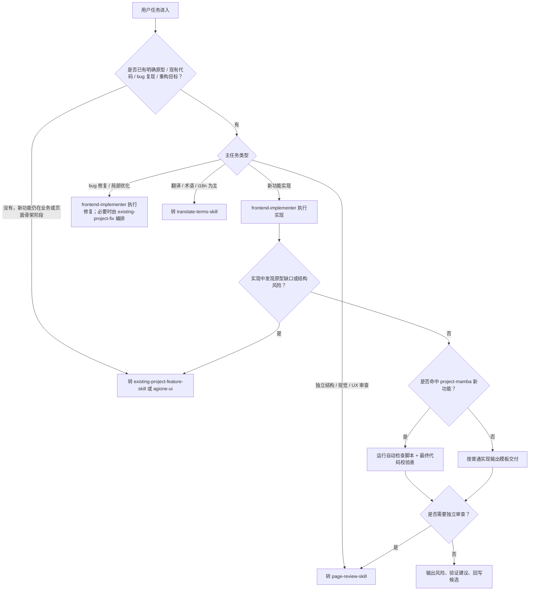

# Handoff State Machine

本文件用于快速判断 `frontend-implementer-skill` 是否继续执行，还是转交其他 skill。只有链路不清楚时读取。

## 判定口径
- 新功能但原型未确认，不进入落码。
- 实现过程中暴露翻译问题，可以叠加 `translate-terms-skill`，不必打断主链路。
- 只有当问题本身变成结构、视觉或 UX 诊断，才转 `page-review-skill`。
- 命中 `project-mamba` 时，拓扑和 route ownership 未确认之前，不进入正式组件选型。
